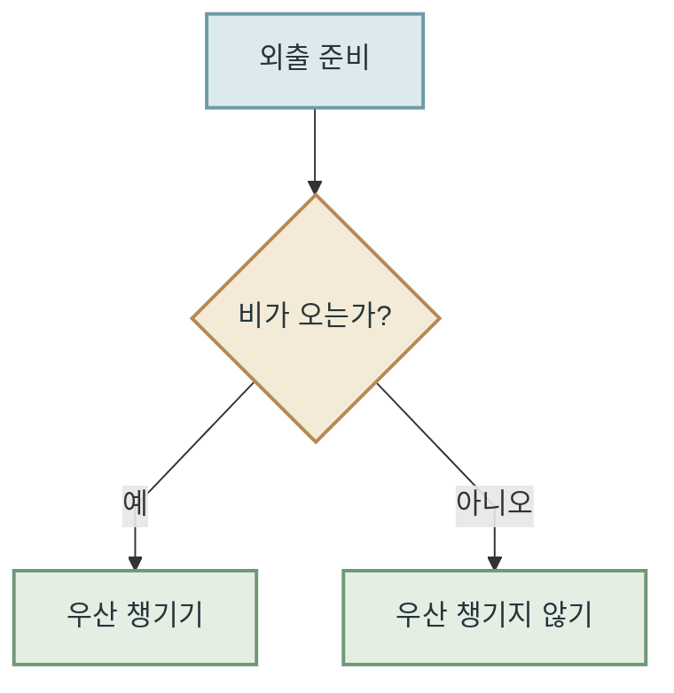
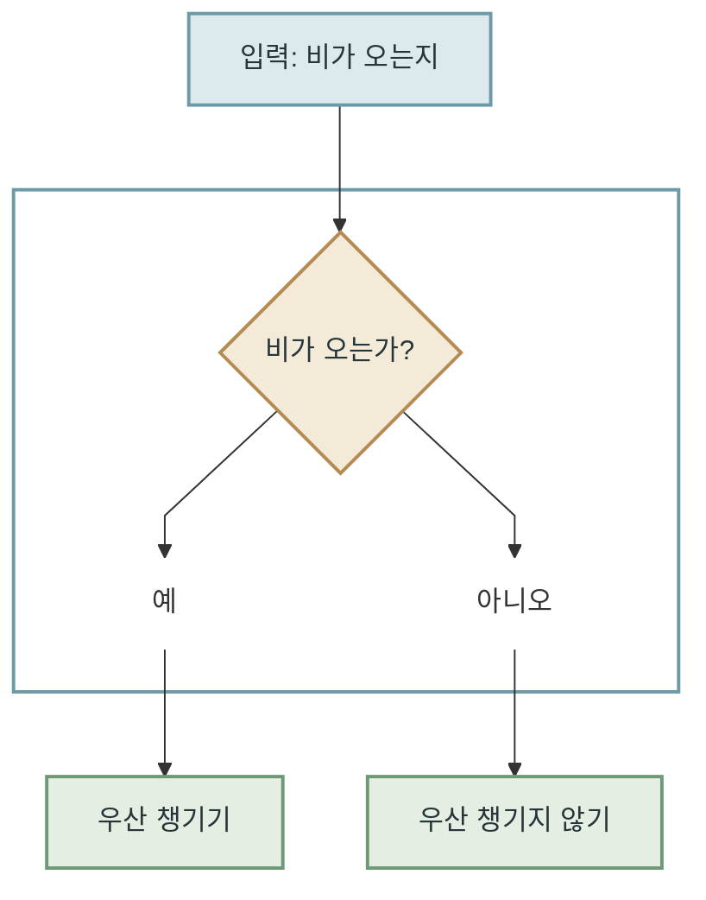
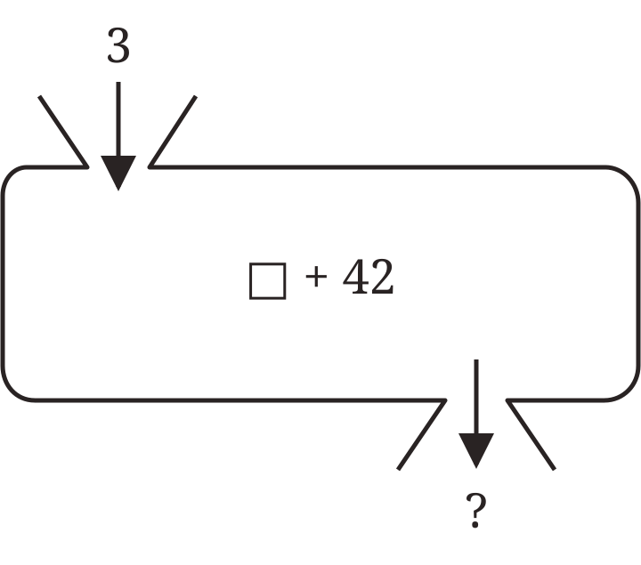
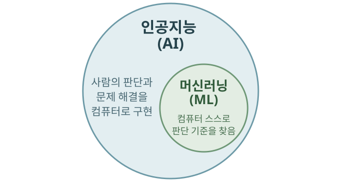
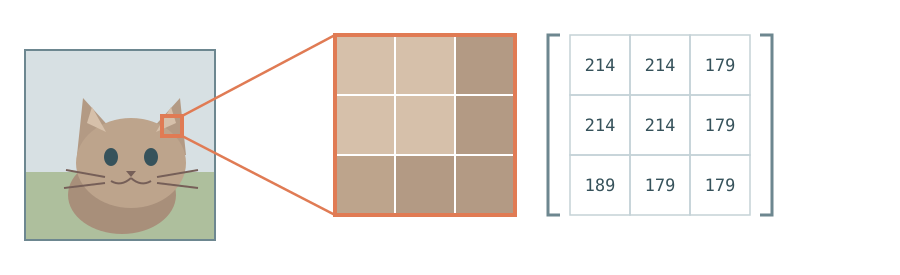
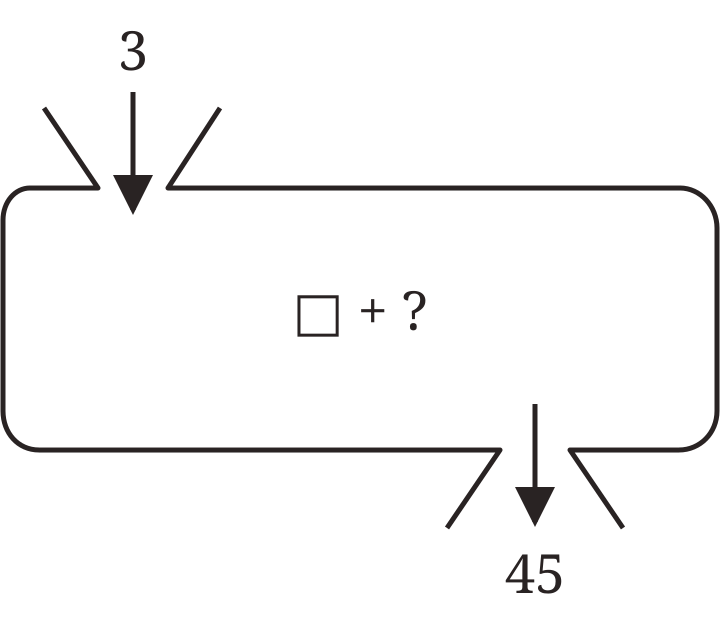

# 컴퓨터가 배우는 방법

## 컴퓨터는 규칙을 따른다 {#computers-follow-rules}

컴퓨터는 아주 성실한 도구입니다. **주어진 명령을 빠르게, 그리고 정확하게 실행**합니다. 계산기를 생각해 보면 쉽습니다. `2 + 3`을 입력하면 컴퓨터는 미리 정해진 덧셈 규칙에 따라 `5`를 돌려줍니다.

!!! info "컴퓨터의 유래"
    computer는 `계산하다`라는 뜻의 영어 단어 **compute**에서 왔습니다. 처음에는 계산을 하는 사람을 가리키는 말이었고, 이후 계산을 돕는 기계를 뜻하게 되었습니다.

    1940년대에 만들어진 ENIAC은 초기 범용 전자식 컴퓨터 가운데 하나입니다. 미국 육군의 포병이 포탄을 어느 각도로 쏘아야 하는지 알려 주는 탄도표를 빠르게 계산하기 위해 설계됐습니다. 컴퓨터는 **사람이 하기에는 너무 오래 걸리는 계산을 빠르게 처리**하기 위해 발전해 왔습니다.

따라서 전통적인 컴퓨터 프로그램에서는 사람이 문제를 해결하는 규칙을 하나씩 정리하고, 프로그래머가 그 규칙을 컴퓨터가 알아들을 수 있는 명령으로 구현하는 일이 중요했습니다. 사람이 조건과 예외를 얼마나 빠짐없이 정의하고 구현했는지가 프로그램이 처리할 수 있는 범위와 결과의 정확성을 좌우했습니다.

예를 들어 외출할 때 우산을 챙길지 알려주는 프로그램을 만든다고 해 봅시다. 다음과 같은 규칙을 정합니다.

`비가 오는가?`처럼 프로그램이 확인하는 질문을 **조건문(conditional statement)**이라고 합니다. 조건의 답에 따라 프로그램은 서로 다른 길로 나아갑니다.

컴퓨터는 이런 질문과 선택을 나뭇가지처럼 따라가며 결과를 냅니다. 이처럼 조건에 따라 선택지가 갈라지는 구조를 **결정 트리(decision tree)**라고 부릅니다. 기존 프로그래밍에서는 고려할 조건이 늘어날수록 사람이 작성해야 할 규칙과 분기도 함께 많아집니다.

## 입력과 출력: 함수 {#functions-turn-inputs-into-outputs}

방금 만든 프로그램을 조금 떨어져서 바라봅시다. 이 프로그램은 우산을 챙길지 판단하려면 비가 오는지 알아야 합니다. 비가 오는지 여부는 프로그램이 시작하기 전에 받아야 하는 정보입니다. 이런 정보를 **입력(input)**이라고 합니다. 프로그램은 이 정보를 확인한 뒤, 미리 작성된 결정 트리의 규칙을 따라 우산을 챙길지 여부를 판단해 **출력(output)**으로 냅니다.

중학교 수학에서 함수 단원을 배우며, 숫자를 상자에 넣고 결과를 꺼내는 아래와 같은 그림을 본 적이 있을 것입니다.

{ .function-mapping-image }

여기서 `3`은 입력이고, `□ + 42`는 입력을 바꾸는 규칙이며, `?`는 출력을 의미합니다. `3`을 넣으면 `45`가 나옵니다. 이처럼 **입력과 출력이 정해진 규칙으로 연결되는 관계**를 함수(function)라고 합니다.

이러한 관계는 수식으로 `y = f(x)`라고 표현합니다. 여기서 `x`는 입력, `f`는 입력을 처리하는 규칙, `y`는 출력입니다. 즉 `f(x)`는 입력 `x`를 함수 `f`에 넣어 얻은 결과이며, 그 결과가 `y`라는 뜻입니다. 따라서 위 계산 상자의 관계는 `f(x) = x + 42`로 표현할 수 있습니다. `x = 3`을 넣으면 `y = 45`가 됩니다.

위의 외출 준비 프로그램도 비가 오는지 입력을 받아, 사람이 미리 정한 결정 트리와 조건문을 거쳐 우산을 챙길지 여부를 출력합니다. 이렇게 보면 컴퓨터 프로그램도 **입력을 받아 출력을 만드는 하나의 큰 함수**라고 볼 수 있습니다.

## 모든 규칙을 미리 적을 수 있을까? {#can-we-write-every-rule}

앞에서 본 외출 준비 프로그램은 사람이 규칙을 미리 정해 둔 함수입니다. 비가 오는지라는 입력을 받으면, 결정 트리와 조건문을 따라 우산을 챙길지라는 출력을 냅니다. 이런 방식은 사람이 판단 기준과 예외를 미리 정할 수 있는 문제를 잘 해결합니다.

하지만 세상에는 사람이 규칙을 모두 적기 어려운 문제가 많습니다. 아래 사진을 보면 사람은 고양이임을 직관적으로 알아차립니다. 하지만 그 판단 기준을 빠짐없이 조건문으로 적으려면 어떻게 해야 할까요?

이것은 생각보다 쉬운 문제가 아닙니다. 뾰족한 귀가 있으면 고양이일까요? 어느 정도로 뾰족해야 할까요? 프로그램에게 사진에서 귀를 어떻게 찾아내게 하고, 그것을 ‘귀’라고 알려줄 수 있을까요?

{ .cat-dog-image }

<em><a href="https://commons.wikimedia.org/wiki/File:Surprised_Cat.jpg">Rudi Riet</a> (CC BY-SA 2.0)</em>

기존 프로그램에서는 사람이 판단 규칙을 모두 직접 적어야 했습니다. 그런데 규칙을 미리 적지 않고, 많은 예시를 통해 **컴퓨터가 스스로 판단 기준을 찾아가게 하는 프로그램**을 만들 수 있다면 어떨까요? 컴퓨터가 예시 속에서 반복되는 패턴을 살피고, 판단에 도움이 되는 특징을 찾아내게 하는 것입니다.

이처럼 컴퓨터가 예시를 바탕으로 판단 기준을 찾아가는 방법을 **머신러닝(machine learning)**이라고 합니다. 말 그대로 컴퓨터가 데이터를 통해 학습하게 한다는 뜻입니다.

## 인공지능 {#artificial-intelligence}

사실 머신러닝 이전에, 인공지능이라는 개념이 먼저 등장했습니다. 인공지능(artificial intelligence, AI)은 **사람이 하던 판단이나 문제 해결을 컴퓨터가 하도록 만드는 기술**입니다.

!!! info "인공지능의 시작"
    인공지능이라는 말은 무려 1955년, 존 매카시 등이 작성한 [다트머스 여름 연구 프로젝트 제안서](https://www-formal.stanford.edu/jmc/history/dartmouth/dartmouth.html)에서 처음 등장했습니다.

마블 영화 《아이언맨》의 JARVIS를 떠올려 봅시다. JARVIS는 토니 스타크와 대화하고, 정보를 분석하며, 슈트와 각종 장비를 제어하는 인공지능 비서로 그려집니다. 인간이 할 수 있는, 어쩌면 그보다 더 뛰어난 수준의 지적 능력을 보여줍니다.

JARVIS 수준까지는 아니지만, 스무고개를 푸는 [아키네이터(Akinator)](https://en.akinator.com/)라는 서비스가 있습니다. 질문을 차례로 던지며 사용자가 떠올린 인물을 추측하는 게임입니다. JARVIS처럼 모든 문제를 이해하고 해결할 수는 없지만, 질문과 답을 바탕으로 사람이 하던 추측과 판단을 하기 때문에 이 역시 인공지능입니다.

아키네이터의 구체적인 내부 구현은 정확히 알 수 없지만, 전통적인 방식의 스무고개 게임은 사람이 질문과 답의 흐름을 정교하게 설계한 의사결정 트리로 만들 수 있습니다. 따라서 머신러닝을 사용하지 않고도 인공지능을 만들 수 있습니다. 사람이 하던 판단이나 문제 해결을 할 수 있다면 인공지능입니다. 이처럼 정해진 범위의 문제를 해결하는 인공지능을 **약한 인공지능(weak AI)**이라고 합니다.

{ .ai-ml-venn }

따라서 모든 머신러닝은 인공지능에 속하지만, 모든 인공지능이 머신러닝인 것은 아닙니다.

## 컴퓨터의 학습은 무엇일까? {#what-machine-learning-means}

컴퓨터가 스스로 배운다는 건 무슨 말일까요? 컴퓨터의 학습은 사람이 배우는 방식과는 분명 다를 겁니다.

사람은 경험을 통해 사물의 의미와 관계를 이해하고 기억합니다. 반면 컴퓨터는 사람과 같은 방식으로 경험을 이해하지 않습니다. **컴퓨터가 모든 것을 0과 1로 처리한다**는 말을 한 번쯤 들어봤을 것입니다. 사실 컴퓨터 세계에서 글·사진·소리 같은 정보는 모두 숫자로 표현됩니다. 따라서 컴퓨터에게 학습을 시킨다는 것은, 글이나 사진처럼 다양한 정보를 숫자로 표현하고 그 숫자들을 계산해 **정답에 가까운 결과를 만드는 규칙을 찾는 일**입니다.

{ .photo-to-numbers-image }

예를 들어 사진은 아주 많은 픽셀로 이루어져 있고, 각 픽셀의 색도 숫자로 표현할 수 있습니다. 글도 컴퓨터 안에서는 숫자로 바뀌어 처리됩니다. 여기서 컴퓨터가 학습한다는 것은 고양이 사진을 숫자로 바꾼 뒤, 많은 사진에서 **고양이일 때 자주 나타나는 숫자 패턴을 찾는 일**입니다. 사람이 고양이를 구분할 수 있는 규칙을 하나씩 가르쳐 주는 것이 아니라, 컴퓨터는 많은 사진 속 숫자 배열을 비교하며 고양이를 구분하는 데 도움이 되는 패턴을 찾아갑니다.

앞에서 본 계산 상자 예시를 다시 생각해 봅시다. 앞에서는 프로그램 안에 `+42`라는 규칙을 미리 정해 두었습니다. 그래서 그 규칙에 `3`을 넣으면 `45`가 나옵니다. 그런데 머신러닝에서는 규칙을 직접 적지 않습니다. 대신 컴퓨터를 학습시킵니다.

따라서 학습을 할 때는 처음에는 `+42` 자리를 비워 두고, `3`을 넣으면 `45`, `10`을 넣으면 `52`가 나온다는 데이터를 보여 줍니다. 그러면 컴퓨터는 이 예시들을 만족하는 숫자가 무엇인지 찾고, `+42`라는 규칙을 만들어 냅니다.

{ .function-mapping-image }

## 학습의 세 가지 요소 {#three-elements-of-learning}

학습을 잘 시키려면 목적에 맞고 정확하며 다양한 데이터가 충분히 필요합니다. 만약 `3 → 45`라는 데이터 하나만 있다면 `+42`와 `×15`는 모두 이 결과를 만들 수 있습니다. 하지만 `10 → 52`까지 함께 보면 `×15`는 맞지 않는다는 것을 알 수 있습니다.

!!! info "데이터는 목적에 맞아야 합니다"
    고양이와 강아지를 구분하는 프로그램을 만들고 싶다면, 자동차 사진을 아무리 많이 모아도 도움이 되지 않습니다. 데이터는 많기만 한 것이 아니라 해결하려는 문제와 맞아야 합니다.

하지만 데이터만 준비한다고 학습이 이루어지는 것은 아닙니다. 학습을 위한 구조인 모델과, 모델이 더 나은 답을 내도록 조정하는 학습 방법도 필요합니다. 이처럼 컴퓨터를 학습시키려면 크게 세 가지가 필요합니다.

- **데이터**: 입력과 그에 맞는 정답이 짝을 이룬 예시
- **모델**: 입력을 받아 답을 만들기까지의 전체 계산 구조
- **학습 방법**: 모델이 낸 답과 정답을 비교해, 모델 안의 숫자를 어떻게 바꿀지 정하는 방법

위의 계산 상자 예시에 적용해 보면, `□ + ?`라는 전체 형태가 모델이고 `3 → 45`, `10 → 52`는 데이터입니다. 이 예시에서 학습은 `?`에 들어갈 숫자를 찾는 일입니다. 학습 방법은 그 숫자를 찾기 위해, 모델이 낸 결과와 정답을 비교하고 `?`의 값을 어떻게 바꿀지 정하는 방법입니다. 이 과정을 반복하면 `?`는 결국 `42`에 가까워집니다.

예를 들어 학습 방법은 다음 과정을 거쳐 진행됩니다.

1. 처음에는 `?`에 임의의 숫자를 넣습니다. 예를 들어 0을 넣어 봅시다.
2. <code>3 + 0 = 3</code>, <code>10 + 0 = 10</code>이라는 결과를 데이터의 정답인 `45`, `52`와 비교합니다.
3. 결과가 모두 정답보다 작으므로 `?`를 더 큰 값으로 바꿉니다. 반대로 결과가 정답보다 크다면 값을 줄입니다.
4. 이 과정을 반복해 두 결과가 정답에 가까워지도록 조정하면 결국 `42`를 찾게 됩니다.

## :material-pencil: 실습 과제 {#exercises}

다음 문장이 맞으면 O, 틀리면 X를 선택하세요.

1. 함수는 입력과 출력이 정해진 규칙으로 연결되는 관계다.
2. 모든 인공지능은 반드시 머신러닝을 사용한다.
3. 머신러닝은 사람이 모든 판단 규칙을 직접 적는 대신, 많은 예시에서 반복되는 패턴을 찾아 판단 기준을 만드는 방법이다.
4. 학습 방법은 모델이 낸 결과와 정답을 비교해, 모델 안의 숫자를 어떻게 바꿀지 정하는 방법이다.
5. `□ + ?` 예시에서 학습을 통해 찾은 `42` 자체가 모델이다.

??? success "정답·해설"
    1. **O** — 함수는 입력을 받아 정해진 규칙으로 출력을 만드는 관계입니다.
    2. **X** — 사람이 미리 설계한 규칙이나 의사결정 트리만으로도 인공지능을 만들 수 있습니다.
    3. **O** — 머신러닝은 예시 데이터에서 반복되는 패턴을 찾아 판단 기준을 만들어 갑니다.
    4. **O** — 학습 방법은 결과와 정답의 차이를 바탕으로 모델 안의 숫자를 조정하는 방법입니다.
    5. **X** — `□ + ?`라는 전체 계산 구조가 모델이고, `42`는 모델 안에 학습되어 저장된 숫자입니다.
