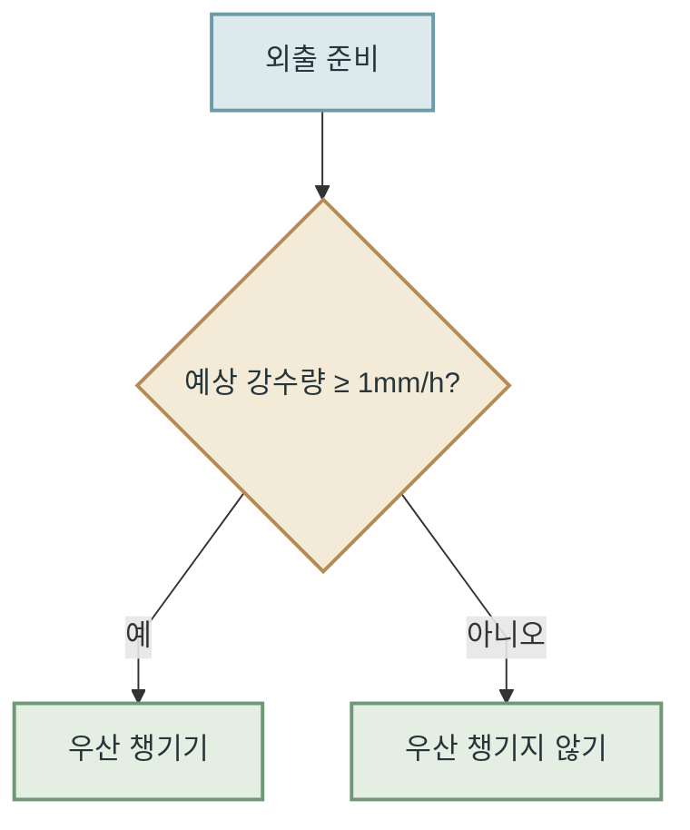
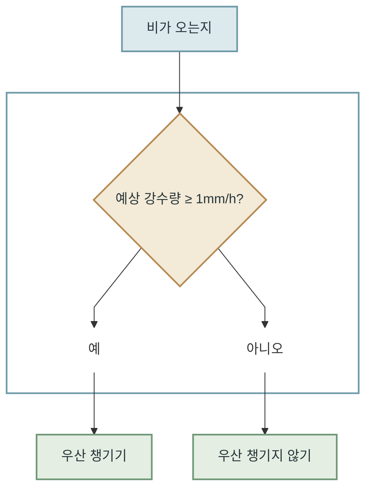

# 컴퓨터가 배우는 방법

## 컴퓨터는 규칙을 따른다 {#rule-based-computing}

컴퓨터는 아주 성실한 도구입니다. **주어진 명령을 빠르게, 그리고 정확하게 실행**합니다. 컴퓨터에 내장된 계산기 프로그램을 떠올려 보면 이해하기 쉽습니다. 계산기에 `2 + 3`을 입력하면 `5`라는 결과를 보여줍니다. 이때 컴퓨터 내부에서는 어떤 일이 일어날까요?

먼저 컴퓨터는 입력된 내용을 순서대로 읽습니다. 숫자 `2`를 읽으면, 뒤에 어떤 연산이 나올지 아직 모르기 때문에 값을 임시로 저장합니다. 이어서 덧셈 기호(`+`)를 읽으면, 앞서 저장한 숫자와 다음 숫자를 더하라는 명령을 실행하기 위해 다음 숫자가 입력되기를 기다립니다. 마지막으로 숫자 `3`을 읽으면 앞서 저장해 둔 `2`와 더해 `5`라는 결과를 얻고, 이를 화면에 표시합니다. 뺄셈이나 곱셈, 나눗셈과 같은 다른 연산도 미리 정해진 규칙에 따라 비슷한 방식으로 처리합니다. 따라서 계산기와 같은 프로그램을 구현할 때는 컴퓨터가 어떤 상황에서 무엇을 해야 하는지, 그 규칙과 실행 순서를 명확하게 정의하는 것이 중요합니다.

이처럼 전통적인 컴퓨터 프로그램은 **사람이 문제를 해결하는 규칙과 절차를 미리 정하고, 이를 컴퓨터가 실행할 수 있는 명령으로 구현하는 방식**으로 만들어졌습니다. 어떤 상황에서 어떻게 동작해야 하는지, 예상치 못한 상황에는 어떻게 대응해야 하는지를 얼마나 꼼꼼하게 정의했느냐에 따라 프로그램이 처리할 수 있는 범위와 결과의 정확성이 달라졌습니다. 따라서 프로그래머에게는 프로그램이 마주할 수 있는 다양한 상황을 예측하고, 빠짐없이 대비하는 능력이 중요했습니다.

!!! info "컴퓨터의 유래"
    computer는 `계산하다`라는 뜻의 영어 단어 **compute**에서 왔습니다. 처음에는 계산을 하는 사람을 가리키는 말이었고, 이후 계산을 돕는 기계를 뜻하게 되었습니다.

    1940년대에 만들어진 ENIAC은 초기 범용 전자식 컴퓨터 가운데 하나입니다. 미국 육군의 포병이 포탄을 어느 각도로 쏘아야 하는지 알려 주는 탄도표를 빠르게 계산하기 위해 설계됐습니다. 컴퓨터는 **사람이 하기에는 너무 오래 걸리는 계산을 빠르게 처리**하기 위해 발전해 왔습니다.

앞서 계산기 프로그램에서는 이미 정해진 덧셈 규칙을 사용했습니다. 하지만 모든 문제가 수학처럼 명확한 규칙을 가지고 있는 것은 아닙니다. 예를 들어 외출할 때 우산을 챙겨야 할지 알려주는 프로그램을 만든다고 해 봅시다. 이를 위해 다음과 같은 규칙을 직접 정하겠습니다.

위의 도식은 우산을 챙길지 결정하는 프로그램의 실행 흐름을 나타낸 것입니다. 이 프로그램은 예상 강수량을 기준으로 우산을 챙길지 판단합니다. 시간당 예상 강수량이 1mm 이상이면 우산을 챙기고, 그렇지 않으면 챙기지 않도록 되어 있습니다.

여기서 중요한 점은 **판단의 기준을 사람이 미리 정한다는 것**입니다. 예를 들어 과거의 강수량과 우산 사용 기록을 분석하거나, 비를 맞았던 경험을 바탕으로 시간당 강수량이 1mm 이상이면 우산을 챙기는 것이 좋겠다고 판단할 수 있습니다. 그리고 이러한 판단 기준을 프로그램의 규칙으로 구현합니다. 컴퓨터는 그 기준이 적절한지 스스로 판단하지 않고, 미리 정해진 규칙에 따라 동작합니다.

이처럼 조건에 따라 판단이 여러 갈래로 나뉘는 과정을 나무 모양으로 표현한 것을 **결정 트리(decision tree)**라고 합니다. 결정 트리를 이용하면 어떤 조건에서 어떤 판단이 이루어지는지 한눈에 파악할 수 있습니다.

다만 고려해야 할 조건이 늘어날수록 결정 트리의 가지도 많아지고 구조도 복잡해집니다. 전통적인 규칙 기반 프로그래밍에서는 이러한 조건과 규칙을 사람이 직접 정의해야 하므로, 다양한 상황에 적절히 대응하도록 프로그램을 설계하는 일도 점점 어려워집니다.

## 입력과 출력: 함수 {#functions-turn-inputs-into-outputs}

중학교 수학 시간에 함수를 배우면서, 숫자를 상자에 넣으면 정해진 규칙에 따라 다른 숫자가 나오는 그림을 본 적이 있을 것입니다.

어떤 숫자를 넣든 항상 42를 더해주는 상자가 있다고 해봅시다. 이 상자에 `3`을 넣으면 `45`가 나오고, `10`을 넣으면 `52`가 나옵니다. 이때 상자에 넣는 값을 **입력(input)**, 상자에서 나오는 값을 **출력(output)**이라고 합니다. 그리고 이처럼 입력값에 따라 정해진 규칙으로 출력값이 결정되는 관계를 **함수(function)**라고 합니다.

{ .function-mapping-image }

함수의 장점은 **입력값이 달라져도 같은 규칙을 적용할 수 있다**는 것입니다. 앞서 살펴본 상자처럼 `3`을 넣든 `10`을 넣든 항상 42를 더한다는 규칙은 변하지 않습니다. 따라서 가능한 모든 입력과 출력을 하나하나 나열하지 않고도, 하나의 규칙으로 다양한 입력값에 대한 출력값을 설명할 수 있습니다.

이러한 관계는 수학에서 `y = f(x)`로 표현합니다. 여기서 `x`는 입력값, `f`는 입력값에 적용되는 함수, `y`는 그 결과로 나오는 출력값을 의미합니다. 따라서 위 계산 상자의 관계는 `f(x) = x + 42`로 표현할 수 있습니다. 이는 어떤 숫자를 입력하든 42를 더한 값을 출력한다는 규칙을 수식으로 나타낸 것입니다.

이제 앞서 만든 우산을 챙길지 결정하는 프로그램을 다시 살펴봅시다. 이 프로그램은 시간당 예상 강수량을 이용해 우산을 챙길지 여부를 결정합니다. 이때 함수와 마찬가지로 시간당 예상 강수량이 입력값이 되고, 우산을 챙길지 여부가 출력값이 됩니다. 이처럼 컴퓨터 프로그램도 입력을 받아 정해진 규칙에 따라 처리하고 결과를 출력한다는 점에서 함수와 비슷한 구조로 이해할 수 있습니다.

이를 앞서 배운 함수의 형태로 표현하면 `우산을 챙길지 여부 = f(시간당 예상 강수량)`로 나타낼 수 있습니다. 여기서 `f`는 시간당 예상 강수량이 1mm 이상인지 확인하고, 그 결과에 따라 우산을 챙길지 결정하는 규칙을 나타냅니다.

\[
f(x)=
\begin{cases}
\text{우산 챙기기}, & x \geq 1\\
\text{우산 챙기지 않기}, & x < 1
\end{cases}
\]

여기서 `x`는 시간당 예상 강수량을 의미합니다. 따라서 함수 `f`에 `x`를 입력하면, 그 값이 1mm 이상일 때는 ‘우산 챙기기’를, 1mm 미만일 때는 ‘우산 챙기지 않기’를 결과로 내놓습니다. 이는 앞서 살펴본 결정 트리의 판단 규칙을 함수의 형태로 표현한 것입니다.

## 모든 규칙을 미리 적을 수 있을까? {#can-we-write-every-rule}

앞서 살펴본 우산 프로그램은 사람이 판단 기준을 미리 정해 놓은 프로그램입니다. 시간당 예상 강수량을 입력받아, 미리 정해진 규칙에 따라 우산을 챙길지 여부를 출력합니다. 이처럼 사람이 판단 기준과 다양한 상황에 대한 규칙을 명확하게 정의할 수 있는 문제는 전통적인 규칙 기반 프로그래밍으로 효과적으로 해결할 수 있습니다.

하지만 세상에는 사람이 판단 기준을 일일이 정하기 어려운 문제도 많습니다. 아래 사진을 보면 우리는 별다른 고민 없이 고양이라는 사실을 알아차립니다. 그렇다면 컴퓨터도 고양이를 알아볼 수 있도록 판단 기준을 직접 정해 준다면 어떨까요?

이는 생각보다 어려운 일입니다. 뾰족한 귀가 있으면 고양이라고 판단하면 될까요? 그렇다면 귀는 얼마나 뾰족해야 할까요? 그보다 먼저, 컴퓨터가 사진 속에서 귀를 찾아내고 그것을 귀라고 인식하게 하려면 어떤 규칙이 필요할까요?

{ .cat-dog-image }

<em><a href="https://commons.wikimedia.org/wiki/File:Surprised_Cat.jpg">Rudi Riet</a> (CC BY-SA 2.0)</em>

전통적인 규칙 기반 프로그래밍에서는 사람이 이러한 판단 규칙을 직접 정의해야 했습니다. 그런데 규칙을 일일이 정하는 대신, 컴퓨터가 많은 예시를 통해 **스스로 판단 기준을 찾아내도록 할 수 있다면** 어떨까요?

수많은 고양이 사진을 보여주고, 그 속에서 반복되는 패턴과 특징을 학습하게 하는 것입니다. 이렇게 하면 사람이 사진 속에서 귀를 찾는 방법이나 귀가 얼마나 뾰족해야 하는지 일일이 알려주지 않아도 됩니다. 컴퓨터가 데이터를 통해 고양이를 구별하는 데 도움이 되는 특징을 학습하고, 이를 바탕으로 처음 보는 사진에서도 고양이인지 판단할 수 있습니다.

물론 컴퓨터가 이러한 특징을 학습하도록 만드는 것 역시 쉬운 일은 아닙니다. 하지만 사람이 모든 판단 규칙을 직접 정의하는 대신 **데이터를 통해 컴퓨터가 스스로 규칙을 찾아내도록 한다**는 점에서 큰 차이가 있습니다.

이처럼 컴퓨터가 데이터를 통해 패턴과 규칙을 학습하고, 이를 새로운 데이터에 적용하는 방법을 **머신러닝(machine learning)**이라고 합니다. 말 그대로 컴퓨터가 데이터를 바탕으로 학습한다는 뜻입니다.

## 인공지능 {#artificial-intelligence}

사실 머신러닝이 등장하기 전부터 **인공지능(artificial intelligence, AI)**이라는 개념은 존재했습니다. 인공지능은 사람이 수행하던 판단이나 문제 해결과 같은 지적 활동을 컴퓨터가 할 수 있도록 만드는 기술을 말합니다.

!!! info "인공지능의 시작"
    인공지능이라는 말은 무려 1955년, 존 매카시 등이 작성한 [다트머스 여름 연구 프로젝트 제안서](https://www-formal.stanford.edu/jmc/history/dartmouth/dartmouth.html)에서 처음 등장했습니다.

마블 영화 《아이언맨》에 등장하는 JARVIS를 떠올려 봅시다. JARVIS는 토니 스타크와 자연스럽게 대화하고, 정보를 분석하며, 슈트와 각종 장비를 제어하는 인공지능 비서입니다. 영화 속 JARVIS는 인간과 비슷한 수준을 넘어, 때로는 인간보다 뛰어난 지적 능력까지 보여줍니다.

인공지능 연구는 **인간처럼 생각하고, 학습하고, 문제를 해결하는 기계를 만들 수 있을까?**라는 질문에서 출발했습니다. 인간의 지능이 어떻게 작동하는지 이해하고, 그 능력을 컴퓨터로 구현하려는 것이었습니다. 이러한 목표 아래 다양한 방법이 연구되었으며, 그중 하나가 앞서 살펴본 머신러닝입니다. 인공지능이 이루고자 하는 목표라면, 머신러닝은 그 목표에 다가가기 위한 방법 중 하나라고 할 수 있습니다.

하지만 모든 인공지능이 머신러닝을 사용하는 것은 아닙니다. 인공지능을 구현하는 방법에는 머신러닝 외에도 여러 가지가 있습니다. JARVIS만큼 뛰어나지는 않지만, 우리에게 친숙한 사례로 [아키네이터(Akinator)](https://en.akinator.com/)라는 서비스가 있습니다. 아키네이터는 스무고개처럼 질문을 하나씩 던지고, 사용자의 답변을 바탕으로 머릿속에 떠올린 인물을 추측하는 게임입니다. JARVIS처럼 다양한 문제를 해결하지는 못하지만, 질문과 답변을 바탕으로 가능성을 좁혀 가며 사람이 하던 추측과 판단을 수행한다는 점에서 이 역시 인공지능의 한 사례라고 할 수 있습니다.

아키네이터의 구체적인 내부 구현 방식은 알 수 없지만, 전통적인 스무고개 게임은 사람이 질문과 답변의 흐름을 미리 설계한 결정 트리만으로도 만들 수 있습니다. 즉, 머신러닝을 사용하지 않고도 인공지능을 구현할 수 있습니다.

인공지능이라고 해서 반드시 사람처럼 모든 문제를 해결할 수 있어야 하는 것은 아닙니다. 특정한 문제에 대해 사람의 판단이나 문제 해결 능력을 구현하는 것 역시 인공지능에 해당합니다. 이처럼 특정한 범위의 문제를 해결하도록 만들어진 인공지능을 **좁은 인공지능(narrow AI)**이라고 합니다. 따라서 머신러닝은 인공지능의 한 분야이지만, 모든 인공지능이 머신러닝을 사용하는 것은 아닙니다.

{ .ai-ml-venn }

## 컴퓨터의 학습은 무엇일까? {#what-machine-learning-means}

컴퓨터가 스스로 배운다는 것은 무슨 뜻일까요? 컴퓨터의 학습은 사람이 배우는 방식과는 분명 다를 것입니다.

사람은 경험을 통해 사물의 의미와 관계를 이해하고 기억합니다. 반면 컴퓨터는 사람과 같은 방식으로 경험을 이해하지 않습니다. "컴퓨터는 모든 정보를 0과 1로 처리한다"는 말을 한 번쯤 들어봤을 것입니다. 실제로 컴퓨터에서 글, 사진, 소리와 같은 정보는 모두 숫자로 표현됩니다.

여기서 중요한 점은 **현실 세계의 다양한 정보를 숫자로 표현하면, 컴퓨터가 이를 계산하고 분석할 수 있다는 것**입니다. 사진이든 글이든 소리든 숫자로 표현할 수 있다면, 컴퓨터는 그 안에서 반복되는 패턴이나 규칙을 찾아볼 수 있습니다.

{ .photo-to-numbers-image }

예를 들어 어떤 고양이 사진이 있다고 해봅시다. 이 사진은 수많은 픽셀로 이루어져 있으며, 각 픽셀의 색상을 숫자로 표현하면 사진 전체를 숫자의 배열로 나타낼 수 있습니다.

컴퓨터는 수많은 사진에서 이러한 숫자 배열을 분석하면서, 고양이를 다른 동물과 구별하는 데 도움이 되는 패턴을 찾아낼 수 있습니다. 이러한 과정이 바로 머신러닝에서 말하는 학습입니다.

‘학습’이라는 말이 어렵게 느껴질 수도 있지만, **다양한 정보를 숫자로 표현하고 이를 이용해 복잡한 수학 문제를 풀어가는 과정**이라고 이해할 수 있습니다. 컴퓨터는 수많은 계산을 빠르고 반복적으로 수행하는 데 뛰어나며, 이를 통해 데이터 속에 숨어 있는 패턴과 규칙을 찾아낼 수 있습니다.

머신러닝은 바로 이러한 원리를 활용합니다. 사람이 판단 규칙을 일일이 알려주는 대신, 컴퓨터가 숫자로 표현된 수많은 데이터를 분석하고 그 속에서 유용한 패턴을 스스로 찾아내도록 하는 것입니다.

머신러닝을 통해 고양이를 구별하도록 학습시킨 프로그램이 있다고 해봅시다. 이 프로그램은 사진을 입력하면 고양이인지 아닌지를 판단합니다. 여기서 앞서 살펴본 함수를 다시 떠올려 봅시다. 이 프로그램이 사진을 입력받아 고양이인지 판단하는 과정 역시 하나의 함수로 표현할 수 있습니다.

\[
\text{고양이 판별 결과} = f(\text{사진})
\]

실제로는 훨씬 복잡하지만, 이해를 돕기 위해 고양이를 판별하는 함수를 `f(x) = ax + b`라고 가정해 보겠습니다. 여기서 `x`는 고양이인지 판단하려는 사진을 숫자로 표현한 값이고, `a`와 `b`는 함수의 결과를 결정하는 숫자입니다. 함수 `f`에 사진을 입력하면 `a`와 `b`를 이용해 계산하고, 그 결과를 바탕으로 고양이인지 아닌지를 판단하는 방식입니다.

만약 이 함수가 고양이를 구별하는 데 적합하고, 적절한 `a`와 `b`의 값을 찾아낼 수 있다면 이후에는 처음 보는 사진도 함수의 계산 결과를 바탕으로 고양이인지 아닌지 판단할 수 있습니다. 이를 위해 머신러닝은 수많은 사진과 정답을 비교하면서 함수를 결정하는 `a`와 `b`의 값을 스스로 찾아내도록 합니다.

## 어떻게 학습할까? {#how-computers-learn}

앞에서 살펴본 계산 상자를 다시 떠올려 봅시다. 기존에는 함수 안에 +42라는 규칙을 미리 정해 두었습니다. 따라서 `3`을 입력하면 `45`가 나옵니다. 반면 머신러닝에서는 더해야 할 숫자를 미리 알려주지 않고, 컴퓨터가 데이터를 통해 그 값을 찾아내도록 합니다.

{ .function-mapping-image }

그렇다면 컴퓨터는 어떻게 이 숫자를 스스로 찾아낼 수 있을까요? 아무런 정보 없이 정답을 알아낼 수는 없으므로, 숫자를 찾아낼 수 있는 단서가 필요합니다. 핵심은 **입력값과 그에 따른 정답을 함께 보여주는 것**입니다.

예를 들어 `3`을 입력하면 `45`, `10`을 입력하면 `52`가 나와야 한다는 데이터를 제공하는 것입니다. 컴퓨터는 이러한 데이터를 바탕으로 자신이 계산한 결과와 정답을 비교하면서, 더해야 할 숫자를 조금씩 조정해 나갑니다.

구체적인 학습 과정은 다음과 같습니다.

1. 처음에는 `?`에 임의의 숫자를 넣습니다. 예를 들어 0을 넣어 봅시다.
2. <code>3 + 0</code>, <code>10 + 0</code>의 계산 결과인 `3`과 `10`을 각각의 정답인 `45`, `52`와 비교합니다.
3. 계산 결과가 모두 정답보다 작으므로 ?의 값을 늘립니다. 반대로 결과가 정답보다 크다면 값을 줄입니다.
4. 이 과정을 반복하면서 계산 결과와 정답의 차이를 줄여 나가면, 결국 `42`라는 값을 찾아낼 수 있습니다.

## 학습의 세 가지 요소 {#three-elements-of-learning}

지금까지 살펴본 내용을 정리하면, 머신러닝의 학습에는 크게 **데이터, 모델, 학습 방법**이라는 세 가지 요소가 필요합니다.

- **데이터**: 입력과 그에 맞는 정답이 짝을 이룬 예시
- **모델**: 입력을 받아 답을 만들기까지의 전체 계산 구조
- **학습 방법**: 모델이 낸 답과 정답을 비교해, 모델 안의 숫자를 어떻게 바꿀지 정하는 방법

앞서 살펴본 계산 상자에 적용하면 다음과 같습니다.

- 데이터: `3 → 45`, `10 → 52`라는 입력과 정답의 쌍
- 모델: 입력값에 어떤 숫자를 더하는 `f(x) = x + ?`라는 함수
- 학습 방법: 계산 결과가 정답보다 작으면 ?의 값을 늘리고, 크면 줄이는 과정을 반복하는 방법

따라서 머신러닝은 **데이터를 바탕으로 학습 방법에 따라 모델 안의 숫자를 반복해서 조정하여, 모델이 원하는 결과를 만들어 내도록 학습시키는 기술**이라고 할 수 있습니다.

이때 모델 안에서 학습을 통해 조정되는 값들을 **파라미터(parameter, 매개변수)**라고 부릅니다. 수학에서 유래한 용어로 함수의 형태나 계산 결과를 결정하는 값을 뜻합니다. 앞서 살펴본 `f(x) = ax + b`에서는 `a`와 `b`가 파라미터에 해당합니다.

!!! info "데이터는 목적에 맞아야 합니다"
    고양이와 강아지를 구분하는 프로그램을 만들고 싶다면, 자동차 사진을 아무리 많이 모아도 도움이 되지 않습니다. 데이터는 많기만 한 것이 아니라 해결하려는 문제와 맞아야 합니다.

## :material-pencil: 실습 과제 {#exercises}

다음 문장이 맞으면 O, 틀리면 X를 선택하세요.

1. 함수는 입력과 출력이 정해진 규칙으로 연결되는 관계다.
2. 모든 인공지능은 반드시 머신러닝을 사용한다.
3. 머신러닝은 사람이 모든 판단 규칙을 직접 적는 대신, 많은 예시에서 반복되는 패턴을 찾아 판단 기준을 만드는 방법이다.
4. 학습 방법은 모델이 낸 결과와 정답을 비교해, 모델 안의 숫자를 어떻게 바꿀지 정하는 방법이다.
5. `□ + ?` 예시에서 학습을 통해 찾은 `42`가 모델이다.

??? success "정답·해설"
    1. **O** — 함수는 입력을 받아 정해진 규칙으로 출력을 만드는 관계입니다.
    2. **X** — 사람이 미리 설계한 규칙이나 의사결정 트리만으로도 인공지능을 만들 수 있습니다.
    3. **O** — 머신러닝은 예시 데이터에서 반복되는 패턴을 찾아 판단 기준을 만들어 갑니다.
    4. **O** — 학습 방법은 결과와 정답의 차이를 바탕으로 모델 안의 숫자를 조정하는 방법입니다.
    5. **X** — 모델은 `□ + ?`라는 계산 구조 전체를 의미하며, 학습을 통해 찾아낸 `42`는 모델 안의 파라미터에 해당합니다.
