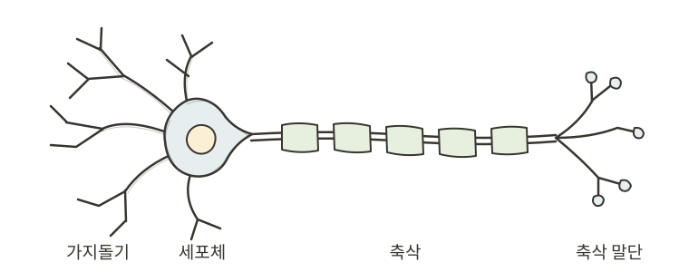
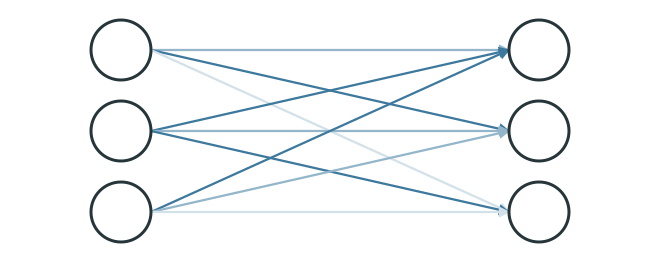
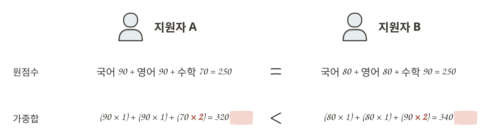
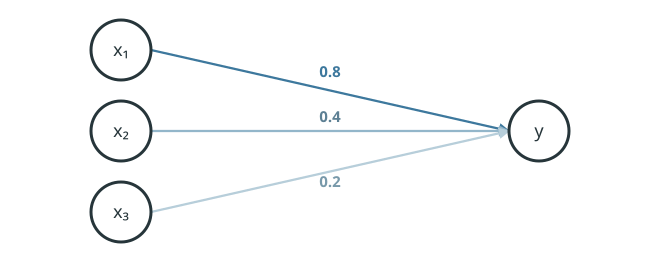
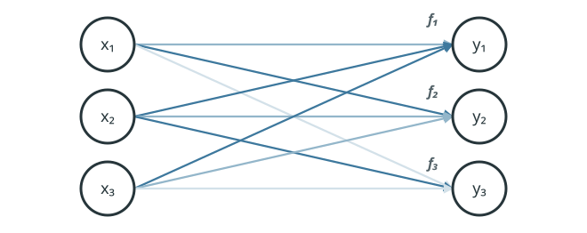
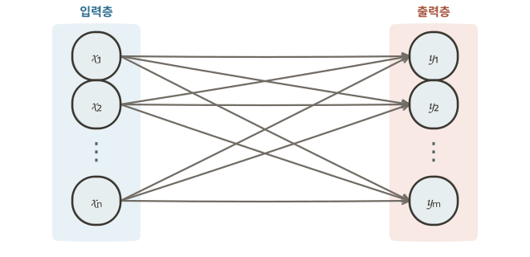
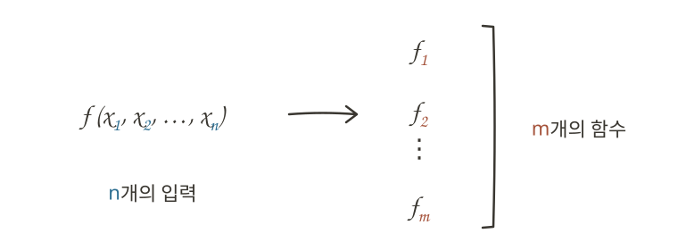
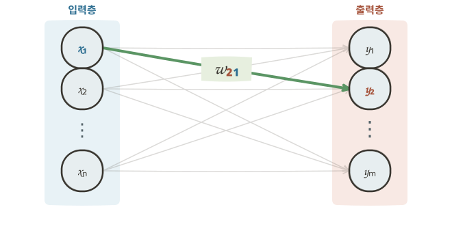
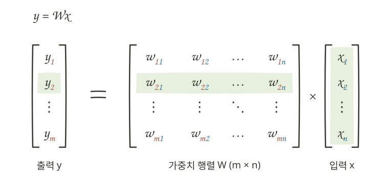

# 인공 신경망의 발명

## 뉴런과 가중치 {#neurons-and-weights}

머신러닝에서 컴퓨터는 다양한 예시 데이터를 통해 판단 기준을 스스로 학습한다고 했습니다. 그렇다면 컴퓨터가 이런 판단 기준을 찾아가려면, 입력을 어떤 방식으로 처리해 답을 만들도록 해야 할까요? 연구자들은 이 질문에 답하기 위해 다양한 수학적·통계적 모델을 제안했습니다. 그 가운데 지금의 AI 발전에 가장 큰 영향을 준 모델 중 하나가 **인공 신경망(artificial neural network)**입니다. 인공 신경망은 인간의 뇌를 이루는 **뉴런(neuron)**에서 착안했습니다. 이는 뉴런들이 서로 신호를 주고받으며 복잡한 정보를 처리하는 방식을 컴퓨터 안에서 계산과 연결 구조로 구현하려는 시도였습니다.

{ .drawing-diagram style="width: min(100%, 30rem);" }

!!! info "뉴런의 구조"
    뉴런은 크게 **가지돌기(dendrite)**, **세포체(soma)**, **축삭(axon)**, **축삭 말단(axon terminal)**으로 이루어져 있습니다.

    - **가지돌기**: 다른 뉴런으로부터 신호를 받아들입니다.
    - **세포체**: 받아들인 신호를 통합하고, 세포의 생명 활동을 유지합니다.
    - **축삭**: 전기 신호를 축삭 말단까지 전달합니다.
    - **축삭 말단**: 신경전달물질을 방출해 다른 뉴런에 신호를 전달합니다.

    이처럼 뉴런은 다른 뉴런으로부터 신호를 받아들이고, 이를 통합한 뒤, 축삭을 통해 전달하고, 최종적으로 다음 뉴런에 신호를 보냅니다.

    이 과정을 단순화하면 **입력 → 통합 → 전달 → 출력**이라는 구조로 이해할 수 있습니다. 인공 신경망은 이러한 뉴런의 정보 처리 방식에서 아이디어를 얻어 만들어졌습니다.

우리 몸 안에서는 수없이 많은 뉴런들이 서로 신호를 주고받으며, 감각을 느끼고 움직임을 조절하는 등 다양한 정보를 처리합니다. 예를 들어 뜨거운 냄비를 만졌다고 해 봅시다. 손의 피부가 뜨거움을 감지하면, 그 정보는 전기 신호로 변환되어 여러 뉴런을 거쳐 전달됩니다. 이어서 손과 팔의 근육으로 신호가 전달되고, 우리는 즉각적으로 손을 뗍니다.

{ .neuron-signal-flow-image }

모든 뉴런이 모든 행동에 똑같이 관여하는 것은 아닙니다. 어떤 뉴런들의 연결은 손을 움직이는 일에 더 많이 관여하고, 다른 연결은 소리나 시각 정보를 처리하는 일에 더 많이 관여합니다. 반복적인 경험을 통해 자주 함께 쓰이는 뉴런 사이의 연결은 더 강해질 수도 있습니다.

인공 신경망도 이 아이디어를 빌립니다. 인공 신경망에서는 뉴런 사이 연결이 결과에 미치는 정도를 숫자로 표현하며, 이 숫자를 **가중치(weight)**라고 합니다. 가중치는 특정 뉴런 사이의 연결이 **다음 뉴런에 얼마나 강하게 영향을 주는지**를 나타내는 값이라고 보면 됩니다.

{ .neural-network-image }

위 뉴런 사이의 연결에서 선의 색이 진할수록 가중치가 커서, 그 연결의 신호가 다음 뉴런에 더 큰 영향을 준다는 뜻입니다. 하나의 뉴런은 여러 뉴런과 서로 다른 강도로 연결될 수 있으며, 동시에 여러 뉴런으로부터 영향을 받을 수 있습니다.

## 가중합 {#weighted-sum}

{ .neural-network-image }

뉴런 사이에서 신호가 전달될 때, 가중치는 다음처럼 신호에 반영됩니다. 먼저 뉴런 안의 값은 해당 뉴런이 다음 뉴런으로 전달하는 **신호의 세기**를 나타냅니다. 이때 신호를 받는 뉴런은 앞선 뉴런에서 전달된 신호에 각 연결의 가중치를 곱한 뒤, 그 결과를 모두 더합니다. 그 결과 이 뉴런이 여러 연결로부터 받는 신호의 세기는 `(0.2 × 0.8) + (0.4 × 0.4) + (0.5 × 0.2) = 0.42`가 됩니다. 이러한 계산 방식을 **가중합(weighted sum)**이라고 합니다.

국어·영어·수학 점수로 합격자를 뽑는다고 생각해 봅시다. 세 과목 중 수학을 더 중요하게 평가하고 싶다면, 국어와 영어 점수에는 `1`을 곱하고 수학 점수에는 `2`를 곱할 수 있습니다. 그러면 수학 점수는 최종 결과에 두 배 더 크게 반영됩니다.

{ .drawing-diagram style="width: 100%;" }

두 지원자의 원점수 합은 모두 `250`점이지만, 수학 점수에 더 큰 가중치를 적용하면 수학 점수가 더 높은 B의 최종 점수가 더 높습니다.

## 함수로 보는 신경망 {#neural-networks-as-functions}

{ .neural-network-image }

이러한 뉴런 사이의 관계도 [함수](01-machine-learning.md#functions-turn-inputs-into-outputs)로 볼 수 있습니다. 1장에서 함수는 입력과 출력이 규칙으로 연결되는 관계라고 배웠습니다. 앞쪽에서 신호를 전달하는 뉴런을 입력, 신호를 받는 뉴런을 출력으로 보고, 가중치를 적용해 신호를 계산하는 과정을 이들을 연결하는 규칙으로 보면 뉴런 간의 관계 역시 하나의 함수 구조를 따릅니다.

그래서 위와 같이 세 개의 입력으로 하나의 출력을 만들어 내는 연결 관계를 함수 표기법에 따라 수식으로 나타내면 `y = f(x₁, x₂, x₃)`입니다. 이를 해석하면, 입력 `x₁`, `x₂`, `x₃`을 관계식 `f`에 넣어 출력값 `y`를 계산한다는 뜻입니다.

여기서 함수 `f(x₁, x₂, x₃)` 안에는 각 입력이 출력에 얼마나 영향을 미칠지 나타내는 가중치가 곱해집니다. 따라서 위 신경망은 다음과 같이 나타낼 수 있습니다.

⇒ <code>f(x₁, x₂, x₃) = (0.8x₁) + (0.4x₂) + (0.2x₃)</code>

!!! tip "수식 읽는 법"
    - `f(x₁, x₂, x₃)`: 세 개의 입력값 `x₁`, `x₂`, `x₃`를 받아 하나의 결과를 계산하는 함수입니다.
    - `0.8x₁`, `0.4x₂`, `0.2x₃`: 각 입력에 연결의 세기를 나타내는 가중치가 곱해집니다.
    - `+`: 가중치가 적용된 값들을 모두 더해 하나의 결과를 만듭니다.

{ .neural-network-image }

이제 출력 뉴런의 개수를 다시 3개로 늘려 봅시다. 각 출력 뉴런은 자신에게 연결된 입력값과 가중치를 이용해 하나의 출력값을 계산합니다. 따라서 출력 뉴런이 3개라면, 각 뉴런의 출력값을 계산하는 함수도 3개로 표현할 수 있습니다.

하지만 세 함수 `f₁`, `f₂`, `f₃`이 모두 같은 것은 아닙니다. 동일한 입력값 `x₁`, `x₂`, `x₃`을 받더라도 각 출력 뉴런에 연결된 가중치가 다르기 때문에 **서로 다른 함수식**을 갖습니다.

예를 들어 다음과 같이 세 함수를 정의할 수 있습니다.

  
<code>y₁ = f₁(x₁, x₂, x₃) = (0.4x₁) + (0.8x₂) + (0.1x₃)</code>

  
<code>y₂ = f₂(x₁, x₂, x₃) = (0.9x₁) + (0.3x₂) + (0.7x₃)</code>

  
<code>y₃ = f₃(x₁, x₂, x₃) = (0.8x₁) + (0.4x₂) + (0.2x₃)</code>

## 신경망의 확장 {#expanding-neural-networks}

우리 몸에는 수없이 많은 뉴런이 연결되어 있습니다. 지금까지는 이해를 위해 규모가 작은 신경망을 살펴봤지만, 실제 인공 신경망은 훨씬 많은 뉴런을 연결합니다.

이제 입력 뉴런의 수를 <code>n</code>개, 출력 뉴런의 수를 <code>m</code>개로 늘린 신경망을 살펴봅시다.

신경망에서는 같은 단계에 있는 뉴런들을 하나의 **층(layer)**이라고 부릅니다. 바깥에서 들어온 신호를 처음 받는 뉴런들을 **입력층(input layer)**, 계산한 결과를 내보내는 뉴런들을 **출력층(output layer)**이라고 합니다.

{ .neural-network-image }

많은 뉴런과 연결이 얽힌 관계를 함수로 표현할 수 있습니다. 이때 입력값은 `x`, 각 뉴런 사이의 연결 강도를 나타내는 가중치는 `w`로 표시합니다.

  
<code>f₁(x₁, x₂, …, xₙ) = (w₁₁ × x₁) + (w₁₂ × x₂) + … + (w₁ₙ × xₙ)</code>

  
<code>f₂(x₁, x₂, …, xₙ) = (w₂₁ × x₁) + (w₂₂ × x₂) + … + (w₂ₙ × xₙ)</code>

  
⋮

  
<code>fₘ(x₁, x₂, …, xₙ) = (wₘ₁ × x₁) + (wₘ₂ × x₂) + … + (wₘₙ × xₙ)</code>

이처럼 일반화한 신경망은 다음과 같은 특징을 갖습니다. 입력 뉴런이 <code>n</code>개라면 각 출력 뉴런은 <code>n</code>개의 입력값을 받아 계산하고, 출력 뉴런이 <code>m</code>개라면 각각의 출력을 계산하는 <code>m</code>개의 함수로 표현할 수 있습니다.

{ .drawing-diagram }

즉, n개의 입력값으로부터 <code>m</code>개의 출력값을 만들어 내는 구조입니다.

이때 수식의 <code>wij</code>는 입력 <code>xj</code>가 출력 <code>yi</code>에 얼마나 큰 영향을 미치는지를 결정하는 가중치입니다. 앞의 <code>i</code>는 어느 출력 뉴런에 연결되는지를, 뒤의 <code>j</code>는 어느 입력 뉴런에서 온 신호인지를 나타냅니다.
예를 들어 <code>w21</code>은 첫 번째 입력 뉴런 <code>x1</code>과 두 번째 출력 뉴런 <code>y2</code> 사이의 연결 가중치를 의미합니다.

{ .neural-network-image }

그런데 <code>n</code>개의 입력을 받는 <code>m</code>개의 함수를 모두 풀어 쓰려면 식이 너무 길어집니다. 이를 간단하게 표현하기 위해 먼저 하나의 함수를 다음과 같이 줄여서 나타내 보겠습니다.

  
<code>f(x) = w · x</code>

여기서 <code>x</code>는 <code>x₁</code>, <code>x₂</code>, …, <code>xₙ</code>을 묶어 부르는 입력값이고, <code>w</code>는 각 입력에 곱하는 가중치를 묶어 부르는 표기입니다. 가운데 점 <code>·</code>은 각 입력과 가중치를 곱한 뒤 모두 더한다는 뜻입니다. 따라서 `f(x) = w · x`는 **하나의 출력 뉴런에 대한 가중합**을 간단하게 표현한 것으로, 수식이 짧아졌을 뿐 계산 방식은 동일합니다.

그런데 출력 뉴런이 <code>m</code>개라면 함수도 <code>m</code>개이고, 각 함수는 서로 다른 가중치를 갖습니다. 따라서 각 함수의 가중치 묶음인 `w₁`, `w₂`, …, `wₘ`을 하나의 **행렬(matrix) W**로 표현할 수 있습니다. 이를 이용하면 여러 출력값 `y₁`, `y₂`, …, `yₘ`도 다음과 같이 하나의 수식으로 나타낼 수 있습니다.

{ .drawing-diagram }

이는 입력값 묶음 `x`에 가중치 행렬 `W`를 곱하면, 여러 출력값을 묶은 `y`가 만들어진다는 뜻입니다. 따라서 `y = Wx`는 **서로 연결된 두 층 사이에서 여러 입력 신호에 가중치를 적용해 여러 출력 신호를 만들어 내는 관계**를 나타낸 수식이라고 이해하면 됩니다.

예를 들어 `y₂`를 계산할 때는 가중치 행렬 `W`의 두 번째 행에 있는 가중치들을 사용합니다. 각 가중치에 대응하는 입력값을 하나씩 곱한 뒤, 그 결과를 모두 더하면 `y₂`가 됩니다. 표현만 행렬로 바뀌었을 뿐, `y₂`는 앞서 살펴본 것처럼 각 입력값에 가중치를 곱한 뒤 모두 더한 결과입니다.

!!! info "행렬(matrix)"
    행렬은 숫자를 가로와 세로로 정리한 표입니다. 이때 `W`의 한 줄은 함수 하나에 쓰이는 가중치 묶음 하나와 같습니다.

    예를 들어 앞에서 살펴본 세 함수의 가중치를 모으면 `W`는 아래와 같습니다.

    
<code>W = ⎡ 0.4   0.8   0.1 ⎤
        ⎢ 0.9   0.3   0.7 ⎥
        ⎣ 0.8   0.4   0.2 ⎦</code>

    첫 번째 줄의 `0.4`, `0.8`, `0.1`은 첫 번째 함수 `f₁`에 쓰이는 가중치입니다. 마찬가지로 두 번째와 세 번째 줄은 각각 `f₂`, `f₃`의 가중치입니다.

## :material-pencil: 실습 과제 {#exercises}

다음 문장이 맞으면 O, 틀리면 X를 선택하세요.

1. 신경망의 가중치는 두 뉴런 사이의 연결이 결과에 미치는 정도를 나타낸다.
2. 가중치가 크다는 것은 해당 뉴런 자체가 항상 더 활발하다는 뜻이다.
3. 바깥에서 들어온 신호를 처음 받는 뉴런들의 묶음을 출력층이라고 한다.
4. `w₂₁`은 첫 번째 입력 뉴런 `x₁`에서 두 번째 출력 뉴런 `y₂`으로 이어지는 연결의 가중치다.
5. `y = Wx`는 여러 입력 신호에 가중치를 적용해 여러 출력 신호를 만드는 신경망의 한 층을 나타낼 수 있다.

??? success "정답·해설"
    1. **O** — 가중치는 특정 뉴런 하나의 성질이 아니라, 두 뉴런을 잇는 연결이 결과에 미치는 정도를 나타냅니다.
    2. **X** — 가중치는 뉴런 자체가 아니라 뉴런 사이 연결의 세기를 나타냅니다.
    3. **X** — 바깥 신호를 처음 받는 뉴런들의 묶음은 입력층입니다.
    4. **O** — 앞의 `2`는 두 번째 출력 뉴런, 뒤의 `1`은 첫 번째 입력 뉴런을 가리킵니다.
    5. **O** — `W`에는 각 출력 뉴런으로 이어지는 연결의 가중치가 모여 있으며, `y = Wx`는 이를 한 번에 계산한 표기입니다.
