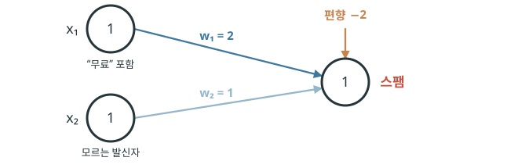
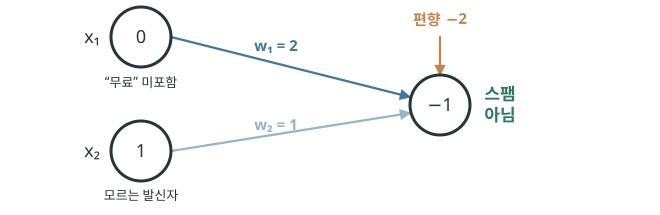
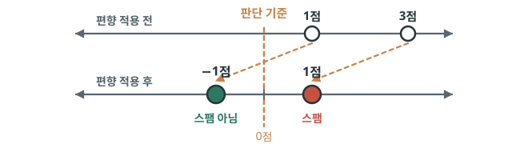
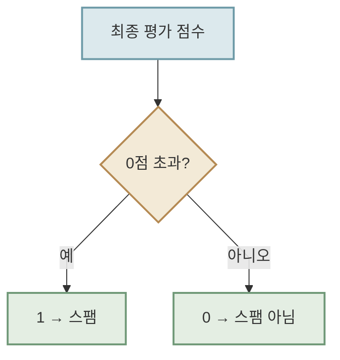
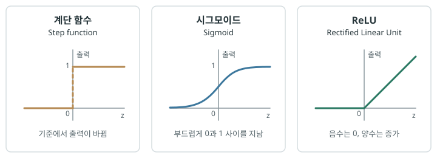
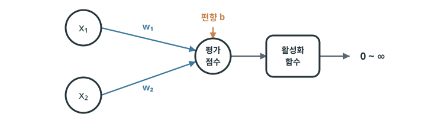
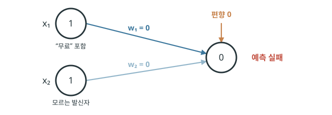
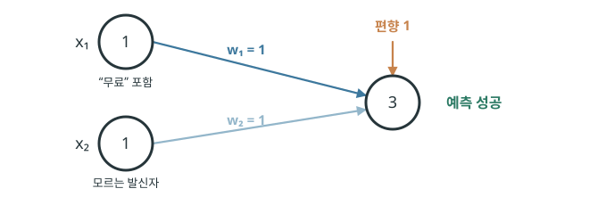

# 판단하는 장치, 퍼셉트론

인공 신경망은 여러 입력이 결과에 미치는 영향을 가중치로 표현하고, 데이터에 맞게 그 가중치를 조정하며 입력과 결과 사이의 관계를 찾아갈 수 있다는 데 의미가 있습니다. 하지만 입력과 가중치의 가중 합만으로 계산한 값에는 한계가 있습니다. 계산 결과는 단지 하나의 숫자일 뿐이어서, 어떤 대상을 분류하거나 선택하는 것처럼 “맞다”와 “아니다” 사이에서 판단을 내려야 하는 문제에 바로 답하기는 어렵습니다.

우리가 머신러닝을 통해 만들고자 하는 것은 데이터를 바탕으로 사람이 하던 판단의 일부를 수행할 수 있는 장치입니다. 하지만 지금까지 살펴본 구조만으로는 아직 계산 결과를 판단으로 바꾸는 과정이 빠져 있습니다. 그래서 **계산 결과를 기준으로 하나의 판단을 내리는 장치**가 필요합니다. 이러한 아이디어에서 등장한 모델이 **퍼셉트론(perceptron)**입니다.

## 판단 기준 정하기 {#bias}

퍼셉트론 역시 여러 입력값에 각각의 가중치를 곱한 뒤 그 결과를 모두 더합니다. 이 계산 결과는 각 입력이 판단에 얼마나 유리하거나 불리하게 작용하는지를 모두 합친 점수라고 볼 수 있습니다. 하지만 점수 자체가 곧 판단은 아닙니다. 퍼셉트론은 이 점수를 바탕으로 하나의 결과를 선택합니다.

이때 필요한 값이 **편향(bias)**입니다. 편향은 판단의 기준을 조절하는 값입니다. 같은 가중 합이 계산되더라도 편향 값에 따라 특정 결과를 더 쉽게 선택하게 하거나, 더 높은 점수가 나와야 그 결과를 선택하도록 만들 수 있습니다. 가중 합에 편향을 더한 값은 퍼셉트론이 최종 판단을 내리기 전의 값이 됩니다.

스팸 메일을 가려내는 간단한 퍼셉트론을 만든다고 해 봅시다. 스팸 메일을 판단할 때는 메일 속 단서들을 종합한 평가 점수를 만듭니다. 평가 점수는 각 단서에 가중치를 적용해 더하고, 편향을 반영해 계산합니다. 이 평가 점수가 `0`점을 넘으면 스팸으로, `0`점 이하이면 스팸이 아닌 것으로 판단하겠습니다.

평가 점수를 만들려면, 먼저 메일에서 어떤 단서를 확인할지 정해야 합니다. 여기에서는 “무료”라는 표현이 있는지와 모르는 발신자가 보낸 메일인지를 단서로 사용하겠습니다. 메일에 “무료”라는 표현이 있으면 입력 `x₁`은 `1`, 없으면 `0`입니다. 모르는 발신자가 보낸 메일이면 입력 `x₂`는 `1`, 아니면 `0`입니다. 퍼셉트론은 “무료”라는 표현을 더 중요한 단서로 보고 `x₁`의 가중치를 `2`, `x₂`의 가중치를 `1`로 정할 수 있습니다.

“무료”라는 표현이 있고 모르는 발신자가 보낸 메일이라면, 가중 합은 `(1 × 2) + (1 × 1) = 3`입니다. 여기에 편향 `-2`를 더하면 최종 평가 점수는 `1`이 되고, 이 메일은 스팸으로 판단합니다.

{ .neural-network-image }

반대로 모르는 발신자가 보냈지만 “무료”라는 표현이 없다면, 가중 합은 `(0 × 2) + (1 × 1) = 1`이고 편향을 더한 최종 평가 점수는 `-1`이기 때문에 이 메일은 스팸이 아닙니다.

{ .neural-network-image }

편향은 평가 점수에 더해, 스팸으로 판단하기 위한 기준을 조절하는 값입니다. 이 예시에서 모르는 발신자라는 단서만 있으면 가중 합은 `1`점이고, “무료”라는 표현까지 있으면 `3`점입니다.

편향이 없다면 두 점수는 모두 `0`점을 넘습니다. 즉, 모르는 발신자라는 단서 하나만으로도 스팸으로 판단하게 됩니다. 하지만 편향 `-2`를 더하면 두 점수에서 모두 `2`점이 빠집니다. 모르는 발신자만 있는 메일의 최종 평가 점수는 `-1`점이 되어 스팸이 아니게 됩니다. 반면 “무료”라는 표현까지 있는 메일의 최종 평가 점수는 `1`점이므로 스팸으로 판단합니다.

{ .neural-network-image }

결국 이 예시의 편향 `-2`는 “단서 하나만으로는 스팸이라고 하지 말고, 가중 합이 `2`점을 초과할 때만 스팸으로 판단하자”라는 기준을 만드는 역할입니다. 편향은 **같은 단서들이 주어졌을 때, 퍼셉트론이 얼마나 엄격하게 판단할지**를 조절합니다.

## 기계적으로 판단하기 {#mechanical-decision-making}

방금 예시에서는 우리가 최종 평가 점수가 `0`점을 넘는지 직접 확인해 스팸 여부를 판단했습니다. 하지만 퍼셉트론은 평가 점수를 계산하는 데서 끝나지 않고, 그 점수를 바탕으로 스팸인지 아닌지 최종 결과까지 결정할 수 있습니다. 퍼셉트론 안에서 평가 점수를 최종 결과로 바꾸는 역할을 하는 것이 **활성화 함수(activation function)**입니다.

활성화 함수가 하는 일은 단순합니다. 입력으로 받은 평가 점수를 기준점인 `0`점과 비교해 판단 기준을 넘었는지 확인합니다. 평가 점수가 `1`점처럼 `0`점보다 크면 `1`을 출력하고, `-1`점처럼 `0`점 이하이면 `0`을 출력합니다.

활성화 함수의 동작을 결정 트리처럼 나타내면 다음과 같습니다.

이처럼 기준점을 넘는 순간 결과를 `0`과 `1`로 나누는 방식은 판단이 분명하다는 장점이 있습니다. 하지만 이 방식의 단점은 평가 점수가 `-0.01`점에서 `0.01`점으로 아주 조금만 달라져도, 출력은 `0`에서 `1`로 갑자기 바뀝니다. 두 점수가 거의 비슷하더라도 결과는 완전히 달라지는 것입니다. 또한 `0` 또는 `1`만으로는 모델이 판단에 얼마나 가까웠는지, 어느 정도 확신하는지 표현하기 어렵습니다.

따라서 더 복잡한 문제를 다루고 가중치를 효율적으로 조정하려면, 입력값의 변화에 더 부드럽게 반응하거나 다양한 값을 출력하는 활성화 함수가 필요합니다. 그래서 여러 형태의 활성화 함수가 연구되었고, 아래와 같은 함수들은 입력값을 서로 다른 방식으로 바꿉니다.

{ .neural-network-image }

그래프의 가로축 `z`는 평가 점수를 의미합니다. 지금까지 스팸 메일 예시에서는 `z`가 `0`점을 넘는지에 따라 `0` 또는 `1`을 출력하는 **계단 함수** 방식의 활성화 함수를 사용했습니다.

한편 평가 점수의 변화에 더 부드럽게 반응하는 **시그모이드 함수**나, 일정한 기준 이후에는 점수에 비례해 출력하는 **ReLU 함수**처럼 다른 방식의 활성화 함수도 있습니다. 문제의 특성과 학습 방식에 따라 적절한 활성화 함수는 달라집니다. 최근의 많은 딥러닝 모델은 계산이 단순하고 안정적으로 학습할 수 있는 ReLU 계열을 활성화 함수로 많이 사용합니다.

지금까지 배운 내용을 모두 적용하면, 퍼셉트론은 다음과 같은 형태가 됩니다. 입력값에 가중치를 곱해 더하고 편향을 더해 평가 점수를 만듭니다. 이어서 활성화 함수가 이 점수를 바탕으로 기계적으로 결과를 선택합니다. 두 입력을 사용하는 퍼셉트론의 전체 계산은 `y = activation(w₁x₁ + w₂x₂ + b)`로 나타낼 수 있습니다. 그림으로 나타내면 다음과 같습니다.

{ .neural-network-image }

## 틀리면서 배우기 {#learning-from-mistakes}

스팸 메일 예시에서는 `w₁`을 `2`, `w₂`를 `1`, 편향 `b`를 `-2`로 미리 정했습니다. 어떤 단서에 얼마만큼의 점수를 줄지, 스팸으로 판단할 기준을 모두 알려 준 셈입니다. 이처럼 사람이 미리 규칙을 정해 둔 것은 머신러닝이라기보다 규칙에 따라 계산하는 프로그램에 가깝습니다.

머신러닝에서는 사람이 가중치와 편향의 값을 정답처럼 알려 주지 않습니다. 대신 퍼셉트론에 다양한 입력값과 스팸 메일인지 아닌지가 표시된 여러 예시를 보여 줍니다. 퍼셉트론은 이 예시를 바탕으로 어떤 기준으로 판단할지 스스로 찾아갑니다.

원리는 간단합니다. 먼저 현재의 가중치와 편향으로 **결과를 예측하고, 그 결과를 실제 정답과 비교**합니다. 예측이 틀렸다면 가중치와 편향을 조금 조정해 다음에는 정답에 더 가까운 결과가 나오게 합니다. 이 과정을 반복하면서 퍼셉트론은 틀린 판단을 줄여 갑니다.

### 학습 목표 {#learning-goal}

이때 모델이 얼마나 틀렸는지를 하나의 숫자로 나타낸 값을 **손실(loss)**​이라고 합니다. 그리고 예측값과 정답을 바탕으로 이러한 손실을 계산하는 함수를 손실 함수(loss function)​라고 합니다. 손실 함수에는 여러 종류가 있으며, 문제의 특성에 따라 적절한 함수를 선택해 사용합니다.

가장 간단한 손실 함수의 예로 제곱 오차(squared error)가 있습니다. 정답을 `t`, 모델의 예측을 `y`라고 하면 다음과 같이 계산합니다.

  
<code>L = (y − t)²</code>

두 값의 차이를 제곱하기 때문에 예측이 정답에서 멀어질수록 손실이 커집니다. 차이를 제곱하는 이유는 오차의 부호가 달라 서로 상쇄되는 것을 막기 위해서입니다. 예를 들어 정답이 `1`일 때 예측이 `0.8`이면 손실은 `0.04`이고, 예측이 `0.2`이면 손실은 `0.64`입니다.

실제 문제에서는 목적에 따라 다양한 손실 함수를 사용하지만, 학습의 목표는 같습니다. **가중치와 편향을 조정해 손실을 줄이는 것**입니다.

### 학습 과정 {#learning-process}

앞에서 사용한 두 단서를 기준으로, 각각 `100`개의 메일을 모았다고 가정해 봅시다. “무료”라는 표현이 있고 모르는 발신자가 보낸 메일은 스팸인 비율이 가장 높고, 두 단서가 모두 없는 메일은 가장 낮습니다.

| “무료” 포함 (`x₁`) | 모르는 발신자 (`x₂`) | 스팸 메일 수 | 스팸 비율 |
| :---: | :---: | :---: | :---: |
| `1` | `1` | 91 / 100 | 91% |
| `1` | `0` | 42 / 100 | 42% |
| `0` | `1` | 18 / 100 | 18% |
| `0` | `0` | 3 / 100 | 3% |

이 비율 자체를 퍼셉트론에 넣는 것은 아닙니다. 퍼셉트론은 메일 하나하나의 입력값과 실제 정답을 보며 학습합니다. 다만 같은 유형의 메일을 많이 살펴볼수록, “무료”와 모르는 발신자가 함께 나타날 때 스팸일 가능성이 높다는 패턴을 찾아낼 수 있습니다.

학습을 시작할 때는 `w₁`, `w₂`, `b`에 임의의 값을 넣습니다. 여기에서는 모두 `0`으로 놓고 시작해 보겠습니다.

먼저 “무료”라는 표현이 있고 모르는 발신자가 보낸 실제 스팸 메일을 봅시다. 평가 점수는 `0`이고 스팸이 아니라고 예측합니다. 정답은 스팸이므로 틀린 판단입니다.

{ .neural-network-image }

이 메일은 실제로는 스팸인데 스팸이 아니라고 예측했으므로, 다음에는 평가 점수가 더 커지는 방향으로 값을 조정해야 합니다. 이 메일에서는 `x₁`과 `x₂`가 모두 `1`이므로 `w₁`과 `w₂`가 평가 점수 계산에 반영됩니다. 편향은 모든 평가 점수에 더해지는 값이므로 함께 조정합니다. 따라서 `w₁`, `w₂`, 편향을 각각 `1`로 바꾸고, 같은 메일의 평가 점수는 `3`이 됩니다. 이제 퍼셉트론은 스팸으로 예측합니다.

{ .neural-network-image }

이번에는 두 단서가 모두 없는 실제 정상 메일을 보겠습니다. 현재 편향이 `1`이므로 평가 점수는 `1`이 되고, 퍼셉트론은 이 메일을 스팸으로 잘못 예측합니다. 이 오류를 반영해 편향을 `0`으로 낮추면 평가 점수도 `0`이 되어, 단서가 없는 메일은 더 이상 스팸으로 판단하지 않습니다.

{ .neural-network-image }

이처럼 데이터셋의 여러 예시를 통해 예측 오류를 바로잡는 과정을 반복하면, 앞서 스팸 메일 예시에서 사용했던 `w₁=2`, `w₂=1`, `b=-2`와 같은 값의 조합을 찾게 됩니다.

!!! info "계단 함수의 한계"
    예시로 든 `w₁=2`, `w₂=1`, `b=-2`는 이 데이터에 맞는 한 가지 조합일 뿐, 유일한 해는 아닙니다. 모든 값을 같은 비율로 키운 `w₁=4`, `w₂=2`, `b=-4` 역시 네 입력 조합에서 동일한 결과를 냅니다. 계산되는 평가 점수는 두 배가 되지만, 계단 함수는 그 크기가 아니라 기준점인 `0`을 넘는지만 판단하기 때문입니다.

### 학습에 영향을 주는 값들 {#learning-factors}

이처럼 각 메일에 대해 틀린 예측을 바로잡는 방향으로 값을 조금씩 수정하면서, 퍼셉트론은 데이터에 맞는 `w₁`, `w₂`, `b`를 찾아갑니다. 데이터셋의 모든 예시를 한 번씩 사용해 학습하는 한 바퀴를 **에포크(epoch)**라고 합니다. 실제 학습에서는 에포크를 여러 번 반복합니다. 이때 에포크가 끝날 때마다 틀린 예측이 몇 번 있었는지 확인하는데 에포크를 반복해도 틀린 예측이 더 이상 줄어들지 않거나 미리 정한 횟수만큼 학습했다면 멈춥니다.

위 학습 과정 예시에서는 계산을 쉽게 하려고 가중치와 편향을 한 번에 `1`씩 바꿨습니다. 실제 학습에서는 **학습률(learning rate)**이라는 값이 한 번에 얼마나 조정할지를 결정합니다. 학습률이 `0.1`이면 `0.1`씩, `0.5`이면 `0.5`씩 값을 바꾸며 학습합니다. 학습률은 학습의 속도와 안정성에 영향을 줍니다. 값이 너무 크면 적절한 값을 지나쳐 판단 기준이 흔들릴 수 있고, 너무 작으면 학습에 오랜 시간이 걸립니다.

신경망이 데이터를 통해 찾아가야 하는 가중치와 편향 같은 값들을 **파라미터(parameter)**라고 합니다. 2020년에 공개된 OpenAI의 GPT-3는 무려 1,750억 개의 파라미터를 학습했습니다. 이 숫자만으로도 대규모 언어 모델이 얼마나 많은 값을 찾아야 하는지 짐작할 수 있습니다. 최근 모델들은 정확한 파라미터 수를 공개하지 않기 때문에 정확히는 알 수 없지만, 인공지능은 점점 더 복잡한 구조와 더 큰 규모로 발전하고 있습니다.

반면 학습률처럼 학습 과정과 결과에 영향을 주지만, 모델이 데이터에서 스스로 찾지 않고 사람이 미리 정하는 값을 **하이퍼파라미터(hyperparameter)**라고 합니다. 하이퍼파라미터는 학습의 속도와 최종 결과에 큰 영향을 줍니다. 보통 여러 값을 직접 시도해 보고, 더 좋은 결과를 만드는 값을 선택하는 과정을 거쳐 정합니다. 문제와 데이터에 맞는 하이퍼파라미터 값을 찾아내는 일은 모델을 잘 학습시키기 위한 중요한 노하우이며, 이를 하이퍼파라미터 튜닝이라고 합니다.

## :material-pencil: 실습 과제 {#exercises}

다음 문장이 맞으면 O, 틀리면 X를 선택하세요.

1. 편향은 퍼셉트론이 결과를 선택하는 판단 기준을 조절하는 값이다.
2. 손실이 작을수록 모델의 예측이 정답에 가깝다는 뜻이다.
3. 데이터셋의 모든 예시를 한 번씩 사용해 학습하는 한 바퀴를 에포크라고 한다.
4. 학습률이 클수록 학습은 언제나 더 안정적이다.
5. 가중치와 편향은 사람이 미리 정하는 하이퍼파라미터다.

??? success "정답·해설"
    1. **O** — 편향은 평가 점수에 더해져 퍼셉트론이 결과를 선택하는 기준을 조절합니다.
    2. **O** — 손실은 모델의 예측이 정답과 얼마나 차이 나는지를 나타내는 값입니다.
    3. **O** — 한 에포크는 데이터셋 전체를 한 번 사용해 학습하는 단위입니다.
    4. **X** — 학습률이 너무 크면 적절한 값을 지나쳐 판단 기준이 흔들릴 수 있습니다.
    5. **X** — 가중치와 편향은 데이터에서 찾아가는 파라미터입니다. 학습률처럼 사람이 정하는 값이 하이퍼파라미터입니다.
