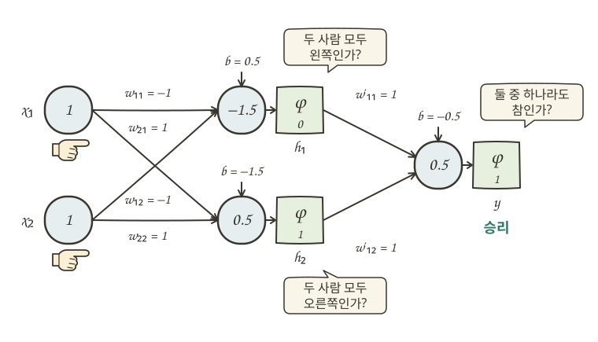
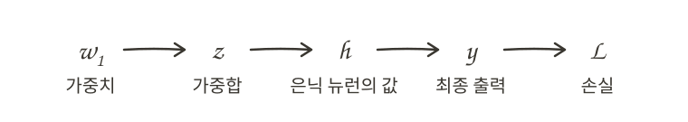
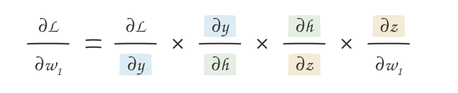
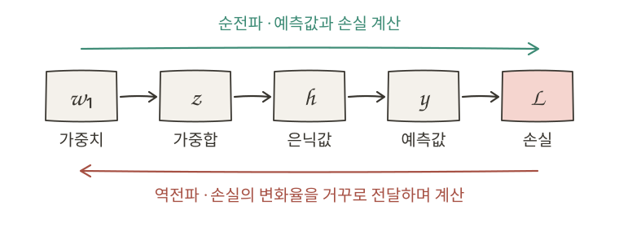

# 거꾸로 계산하는 다층 신경망

## 단층 신경망의 한계 {#single-layer-limitations}

단층 신경망은 입력값이 바로 출력으로 전달되는 구조입니다. 각 입력에는 고정된 가중치가 붙고, 이를 한 번 모두 더한 평가 점수로 결과를 선택합니다. 입력이 두 개든 수백 개든, 결국 “각 단서가 준 점수를 모두 합쳤을 때 기준을 넘는가?”라는 한 번의 판단만 합니다.

이 구조에서는 한 단서가 평가 점수에 기여하는 정도가 다른 단서의 존재에 따라 달라지지 않습니다. “무료”라는 표현의 가중치가 정해지면, 모르는 발신자가 함께 있든 없든 그 가중치는 항상 같은 방식으로 평가 점수에 더해집니다. 단순히 점수를 더해 판단할 수 있는 패턴에는 잘 작동하지만, **여러 조건 사이의 복잡한 관계를 고려해야 하는 문제**에는 한계가 생깁니다.

예를 들어 두 사람이 각각 왼쪽과 오른쪽 중 하나를 선택하는 협동 게임을 생각해 봅시다. 두 사람이 같은 방향을 선택하면 승리하고, 서로 다른 방향을 선택하면 패배하는 규칙입니다.

두 사람이 모두 왼쪽을 선택하거나 모두 오른쪽을 선택하면 승리하고, 서로 다른 방향을 선택하면 패배해야 합니다. 하지만 단층 신경망에서는 가중치와 편향을 어떻게 조절하더라도 이 규칙을 표현할 수 없습니다. 왜 그런지 살펴보겠습니다.

{ .neural-network-image .multilayer-perceptron-image }

여기서 왼쪽을 선택하면 `0`, 오른쪽을 선택하면 `1`로 표현하고, 평가 점수가 `0` 이상이면 승리한다고 가정하겠습니다.

먼저 두 사람이 모두 왼쪽(`0`)을 선택했을 때 승리하려면, 두 입력값이 모두 `0`이므로 편향만으로 평가 점수가 `0` 이상이 되어야 합니다. 따라서 편향은 `0` 이상의 값이어야 합니다. (`b ≥ 0`)

반면 한 사람만 오른쪽(`1`)을 선택했을 때는 패배해야 하므로, 각 가중치는 편향으로 더해진 점수를 `0` 아래로 낮출 만큼 충분히 작은 음수여야 합니다. (`w₁ < −b, w₂ < −b`)

그런데 두 사람이 모두 오른쪽(`1`)을 선택하면 두 가중치가 함께 더해지면서 평가 점수가 더욱 낮아집니다. 따라서 평가 점수는 `0`보다 작아지지만 (`w₁ + w₂ + b < 0`), 실제로는 승리해야 하므로 `0` 이상이어야 합니다.

결국 **어떤 가중치와 편향을 설정하더라도 네 가지 경우를 모두 올바르게 판단할 수 없습니다.**

## 층을 쌓아 해결한다 {#stacking-perceptrons}

이는 학습이 부족해서가 아니라 단층 신경망의 구조적인 한계입니다. 따라서 학습을 아무리 계속해도 이 규칙을 표현할 수 없습니다.

이러한 한계를 극복하기 위해 퍼셉트론을 여러 층으로 연결할 수 있습니다. 첫 번째 층의 퍼셉트론들은 입력값을 받아 각각 서로 다른 패턴을 찾아내고, 그 결과를 다음 층으로 전달합니다. 다음 층은 앞선 층의 결과를 새로운 입력값으로 받아 다시 조합합니다. 이러한 과정이 반복되면서 여러 조건 사이의 복잡한 관계를 표현할 수 있게 됩니다.

이처럼 퍼셉트론을 여러 층으로 연결한 구조를 **다층 퍼셉트론(multilayer perceptron, MLP)**이라고 합니다.

{ .neural-network-image .multilayer-perceptron-image }

위 그림은 퍼셉트론을 여러 층으로 연결한 구조를 나타냅니다. 앞선 층의 퍼셉트론이 입력값을 받아 결과를 만들고, 그 결과가 다음 층의 퍼셉트론으로 전달됩니다. 그림에서는 연결 구조에 집중하기 위해 생략했지만, 각 퍼셉트론에는 가중치와 편향으로 값을 계산하고 활성화 함수를 적용하는 과정이 포함됩니다.

이때 입력층과 출력층 사이에 놓인 중간 층을 **은닉층(hidden layer)**이라고 합니다. 은닉층에는 `h₁`, `h₂`, `h₃`처럼 여러 뉴런이 있으며, 이 뉴런들도 앞에서 살펴본 퍼셉트론과 같은 방식으로 값을 계산합니다.

이 층을 “은닉”이라고 부르는 이유는 입력값이나 최종 결과처럼 외부에서 직접 주어지거나 관찰되는 값이 아니라, 모델 내부에서 만들어지는 중간 결과이기 때문입니다.

!!! info "신경망의 크기"
    입력층과 출력층의 뉴런 수는 데이터 한 건에 입력값이 몇 개 있는지, 모델이 어떤 결과를 내야 하는지에 따라 정해집니다. 예를 들어 스팸 여부처럼 두 가지 중 하나로 분류하는 문제는 출력 뉴런 하나로 표현할 수 있지만, 숫자 `0`부터 `9`까지 구분하는 문제는 보통 출력 뉴런 열 개를 둡니다. 반면 은닉층의 층 수와 뉴런 수는 문제와 데이터에 맞춰 조정합니다. 너무 적으면 필요한 패턴을 찾기 어렵고, 너무 많으면 학습에 필요한 계산량과 시간이 늘어납니다.

이제 앞에서 단층 신경망만으로는 풀 수 없었던 협동 게임의 규칙도 해결할 수 있습니다. 우리가 원하는 것은 두 사람이 같은 방향을 선택했을 때 승리하는 것입니다.

첫 번째 은닉 뉴런(`h₁`)은 “두 사람 모두 왼쪽을 선택함”이라는 패턴을 찾도록 만들 수 있습니다. 두 번째 은닉 뉴런(`h₂`)은 반대로 “두 사람 모두 오른쪽을 선택함”이라는 패턴을 찾습니다. 마지막 출력 뉴런은 두 은닉 뉴런의 결과를 받아, 둘 중 하나라도 활성화되었으면 승리로 판단합니다.

따라서 두 사람이 모두 왼쪽을 선택하거나 모두 오른쪽을 선택했을 때는 승리하고, 서로 다른 방향을 선택했을 때는 패배합니다. 이처럼 다층 신경망은 복잡한 규칙을 한 번에 판단하는 대신, **은닉층에서 작은 조합 패턴으로 나눈 뒤 출력층에서 그 결과를 다시 조합해 최종 판단을 내립니다.**

가중치와 편향에 실제 값을 넣고, 두 사람이 모두 오른쪽을 선택한 `x₁=1`, `x₂=1`인 경우를 계산해 보면 다음과 같습니다.

{ .neural-network-image .multilayer-perceptron-image style="width: min(100%, 42rem);" }

  
<code>h₁ = φ((−1 × 1) + (−1 × 1) + 0.5) = φ(−1.5) = 0</code>

  
<code>h₂ = φ((1 × 1) + (1 × 1) − 1.5) = φ(0.5) = 1</code>

  
<code>y = φ((1 × 0) + (1 × 1) − 0.5) = φ(0.5) = 1</code>

여기서 [활성화 함수(φ)](03-perceptron.md#mechanical-decision-making)는 평가 점수가 `0`보다 크면 `1`, 그렇지 않으면 `0`을 출력하는 계단 함수입니다.

## 학습의 어려움 {#learning-challenges}

단층 퍼셉트론에서는 예측이 틀렸을 때 어떤 입력이 판단에 참여했는지 바로 알 수 있습니다. 스팸으로 판단해야 하는 메일을 스팸이 아니라고 예측했다면, 그 메일의 입력값과 연결된 가중치를 정답 쪽으로 조금 조정하면 됩니다.

그런데 다층 퍼셉트론의 학습은 훨씬 복잡합니다. 학습 데이터는 최종 출력 `y`의 정답만 알려 줄 뿐, 은닉 뉴런 `h₁`, `h₂`가 어떤 값을 내야 하는지는 알려 주지 않습니다. 따라서 최종 판단이 틀렸을 때 **어느 가중치를 얼마나 바꿔야 하는지, 그 변화가 결과를 더 나아지게 하는 방향인지** 바로 알기 어렵습니다. 층이 많아질수록 예측과 정답 사이의 차이가 앞선 수많은 가중치와 어떻게 연결되는지 파악하기는 더욱 복잡해집니다.

자동 커피 머신을 생각해 봅시다. 커피가 너무 쓰게 나왔을 때, 원두 분쇄도·물 온도·추출 시간·물의 양 중 하나를 조금 바꾸면 최종 맛이 크게 달라질 수 있습니다. 하지만 “쓰다”는 최종 결과만으로는 어느 설정이 원인인지, 어떤 값을 얼마나 바꿔야 더 좋아지는지 바로 알 수 없습니다. 다층 퍼셉트론도 마찬가지로, 최종 판단이 틀렸다는 사실은 알지만 수많은 가중치 중 어느 값을 어떻게 조정해야 하는지는 바로 드러나지 않습니다.

그런데 다행히도 이 관계를 계산할 수 있는 방법이 있습니다. **미분의 연쇄 법칙(chain rule)**을 이용하면, 손실에서 각 가중치까지 이어지는 변화율을 단계별로 계산할 수 있습니다. 이를 통해 최종 손실이 각 가중치에 얼마나 영향을 받는지 거꾸로 계산할 수 있습니다.

## 미분이란? {#what-is-differentiation}

미분(differentiation)이라는 말이 낯설어도 어렵게 생각할 필요는 없습니다. 쉽게 설명해 보겠습니다.

미분은 **어떤 값이 아주 조금 변할 때, 그에 따라 다른 값이 변하는 정도를 비율로 나타내는 방법**입니다. 즉, 두 값 사이의 변화 관계를 살펴보는 것입니다.

예를 들어 움직이는 자동차는 시간이 흐르면서 위치가 변합니다. 이때 시간이 아주 조금 변하는 동안 위치가 얼마나 변하는지를 살펴보면 특정 순간의 속도를 알 수 있습니다. 이를 위치를 시간에 대해 미분한다고 표현합니다. 위치를 `x`, 시간을 `t`라고 하면 `dx/dt`처럼 씁니다. 이는 시간의 변화에 따른 위치의 변화율을 나타냅니다.

신경망에서는 가중치 `w`를 조금 바꿨을 때 손실 `L`이 어떻게 달라지는지 알고 싶습니다. 이를 `dL/dw`로 나타냅니다. 이 값은 가중치 변화에 따른 손실의 변화율을 의미하며, **가중치를 조금 바꿨을 때 최종 손실이 어느 방향으로, 얼마나 가파르게 변하는지** 알려 줍니다. 손실이 줄어드는 방향으로 가중치를 조정하면 모델의 예측을 개선할 수 있습니다.

앞에서 살펴본 다층 퍼셉트론에서는 특정 가중치 `w₁`이 먼저 가중합 `z`를 바꾸고, 활성화 함수를 거쳐 은닉 뉴런의 값 `h`를 바꿉니다. 이어서 `h`는 최종 출력 `y`에 영향을 주고, `y`는 손실 `L`을 바꿉니다.

{ .drawing-diagram }

이처럼 다층 퍼셉트론에서는 하나의 가중치가 여러 계산 단계를 거쳐 최종 손실에 영향을 미칩니다. 따라서 가중치의 변화가 최종 손실에 미치는 영향을 알려면 중간 단계의 변화까지 고려해야 합니다. 이때 사용하는 것이 앞서 소개한 미분의 연쇄 법칙입니다. 핵심 아이디어는 **각 단계의 변화율을 곱해 전체 변화율을 구하는 것**입니다.

다행히 각 단계는 가중합 계산이나 활성화 함수 적용처럼 비교적 단순한 수식으로 이루어져 있어, 개별 변화율은 비교적 쉽게 계산할 수 있습니다. 이렇게 구한 변화율들을 차례로 곱하면 복잡한 전체 관계의 변화율도 구할 수 있습니다.

이를 수식으로 나타내면 다음과 같습니다.

{ .drawing-diagram }

수식의 왼쪽은 가중치 `w₁`을 조금 바꿨을 때 최종 손실 `L`이 얼마나 변하는지를 나타냅니다. 오른쪽은 가중치의 변화가 가중합 `z`, 은닉 뉴런의 값 `h`, 최종 출력 `y`를 거쳐 손실 `L`까지 **연쇄적으로 영향을 미치는 과정**을 각 단계의 변화율로 나타낸 것입니다.

앞에서는 미분을 `d`로 표현했지만, 여기서는 `∂`를 사용했습니다. `∂`는 편미분(partial derivative)을 나타내는 기호입니다. 편미분은 여러 변수가 결과에 영향을 미칠 때, 다른 변수들은 고정하고 특정 변수 하나에 따른 결과의 변화율을 구하는 방법입니다. 신경망에서는 수많은 가중치와 편향이 함께 손실을 결정하므로, **각각의 값이 손실에 미치는 영향을 따로 알아보기 위해** 편미분을 사용합니다.

## 거꾸로 계산하기 {#backpropagation}

지금까지 신경망의 작동 원리를 살펴보면서, 입력층에서 은닉층과 출력층을 거쳐 예측값을 구하는 과정을 확인했습니다. 이를 **순전파(forward propagation)**라고 합니다. 순전파를 통해 구한 예측값을 정답과 비교하면 손실을 계산할 수 있으며, 이 손실을 바탕으로 신경망의 가중치와 편향을 조정할 수 있습니다.

신경망 학습의 목표는 손실 `L`을 줄이는 것입니다. 그러려면 수많은 가중치와 편향 각각이 손실에 얼마나 영향을 미치는지, 즉 각 값에 대한 미분값을 알아야 합니다. 이러한 미분값은 앞에서 살펴본 미분의 연쇄 법칙을 이용해 계산할 수 있습니다.

그런데 신경망의 여러 가중치는 서로 다른 위치에 있더라도 최종 손실에 이르는 계산 과정의 일부를 공유합니다. 따라서 가중치마다 미분값을 처음부터 계산하면 같은 부분을 여러 번 계산해야 합니다. 이를 해결하기 위해 순전파와 반대로, 손실에서 시작해 출력층과 은닉층을 거슬러 올라가며 계산합니다. 이렇게 하면 뒤 단계에서 구한 미분값을 앞 단계의 계산에 다시 사용할 수 있어 불필요한 반복 계산을 줄일 수 있습니다.

이처럼 미분의 연쇄 법칙을 이용해 손실에서부터 거꾸로 계산하며 각 가중치의 미분값을 효율적으로 구하는 방법을 **역전파(backpropagation)**라고 합니다.

역전파는 가중치를 직접 수정하는 것이 아니라, 각 가중치를 조정하는 데 필요한 미분값을 계산하는 역할을 합니다. 역전파 덕분에 수많은 가중치가 복잡하게 연결된 신경망에서도 각 가중치가 손실에 미치는 영향을 효율적으로 계산할 수 있게 되었습니다. 이는 여러 은닉층을 가진 깊은 신경망을 학습시키는 데 중요한 기반이 되었습니다.

{ .drawing-diagram }

!!! info "제프리 힌튼과 역전파"
    

      

        
      

      

        
1986년 제프리 힌튼(Geoffrey Hinton)은 데이비드 럼멜하트, 로널드 윌리엄스와 함께 역전파를 사용해 은닉층을 가진 신경망을 학습시키는 방법을 널리 알렸습니다. 이후 볼츠만 머신과 여러 딥러닝 모델 연구로 딥러닝의 발전에 큰 영향을 주었습니다. 이러한 인공 신경망 기반 머신러닝의 기초적 발견과 발명에 대한 공로로, 그는 2024년 존 홉필드와 함께 <a href="https://www.nobelprize.org/prizes/physics/2024/summary/">노벨 물리학상</a>을 받았습니다.

        
사진: <em><a href="https://commons.wikimedia.org/wiki/File:SD_2025_-_Geoffrey_Hinton_01.jpg">Xuthoria</a> · CC BY-SA 4.0</em>

      

    

## :material-pencil: 실습 과제 {#exercises}

다음 문장이 맞으면 O, 틀리면 X를 선택하세요.

1. 단층 퍼셉트론은 여러 조건의 조합에 따라 결과가 달라지는 모든 규칙을 표현할 수 있다.
2. 은닉층의 값은 모델 내부에서 만들어져 다음 층으로 전달되는 중간 결과다.
3. ReLU는 입력값이 `0`보다 작으면 `0`을 출력한다.
4. 미분의 연쇄 법칙은 여러 단계로 이어진 계산의 변화율을 차례로 곱해 구할 수 있게 해 준다.
5. 역전파는 각 가중치의 미분값을 입력층에서 출력층 방향으로 계산한다.

??? success "정답·해설"
    1. **X** — 단층 퍼셉트론은 모든 입력의 점수를 한 번 합산해 판단하므로, 여러 조건의 조합 자체가 중요한 규칙에는 한계가 있습니다.
    2. **O** — 은닉층의 뉴런이 만든 값은 밖에서 직접 보이는 입력이나 최종 결과가 아니라, 다음 층에 전달되는 중간 결과입니다.
    3. **O** — ReLU는 음수를 `0`으로 바꾸고, `0` 이상인 값은 그대로 통과시킵니다.
    4. **O** — 각 단계의 변화율을 곱하면 앞선 값이 마지막 결과에 미치는 영향을 계산할 수 있습니다.
    5. **X** — 역전파는 손실에서 시작해 출력층, 은닉층, 입력층 방향으로 거꾸로 미분값을 계산합니다.
