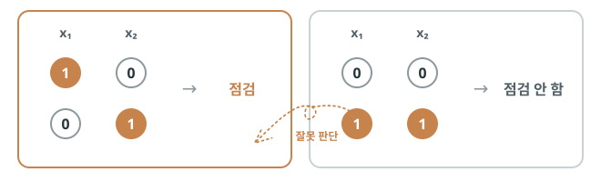
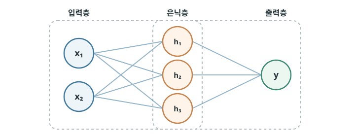
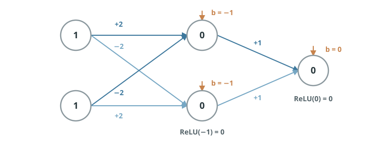

# 거꾸로 계산하는 다층 신경망

## 단층 신경망의 한계 {#single-layer-limitations}

단층 신경망은 입력값이 바로 출력으로 전달되는 구조입니다. 각 입력에는 고정된 가중치가 붙고, 이를 한 번 모두 더한 평가 점수로 결과를 선택합니다. 입력이 두 개든 수백 개든, 결국 “각 단서가 준 점수를 모두 합쳤을 때 기준을 넘는가?”라는 한 번의 판단만 합니다.

이 구조에서는 한 단서가 결과에 미치는 영향이 다른 단서가 함께 있더라도 달라지지 않습니다. “무료”라는 표현의 가중치가 정해지면, 모르는 발신자가 함께 있든 없든 그 가중치는 항상 같은 방식으로 평가 점수에 더해집니다. 단순히 점수를 더해 판단할 수 있는 패턴에는 잘 작동하지만, **여러 조건의 조합에 따라 결과가 달라지는 문제**에는 한계가 생깁니다.

예를 들어 두 경고 신호 `x₁`, `x₂`가 있을 때, 둘 중 정확히 하나만 켜지면 점검하고 둘 다 켜지거나 둘 다 꺼지면 점검하지 않는 규칙을 생각해 봅시다. `x₁`만 켜졌을 때와 `x₂`만 켜졌을 때 모두 점수가 기준을 넘어야 합니다. 그런데 두 신호가 함께 켜지면 두 점수가 더해지므로 기준을 더 크게 넘게 됩니다. 하지만 우리가 원하는 결과는 점검하지 않는 것입니다. 가중치와 편향을 어떻게 바꿔도, 점수를 한 번 합산하는 구조만으로는 이 규칙을 표현할 수 없습니다.

{ .neural-network-image }

## 층을 쌓아 해결한다 {#stacking-perceptrons}

이는 학습이 부족해서가 아니라 단층 신경망의 구조적인 한계입니다. 따라서 학습을 아무리 계속해도 이 규칙을 표현할 수 없습니다. 이 한계를 넘기 위해 퍼셉트론을 여러 개 연결할 수 있습니다. 첫 번째 층의 퍼셉트론은 입력값을 받아 작은 조합 패턴을 각각 찾아내고, 그 결과를 다음 층으로 넘깁니다. 다음 층은 앞선 층의 결과를 새로운 입력값으로 받아 다시 조합한 뒤, 그 결과를 또 다음 층으로 전달합니다. 이런 과정이 층마다 이어지고, 마지막 층이 최종 판단을 내립니다. 이렇게 퍼셉트론을 여러 층으로 쌓은 구조를 **다층 퍼셉트론(multilayer perceptron, MLP)**이라고 합니다.

{ .neural-network-image }

위 그림은 퍼셉트론 두 개를 연결해 층을 쌓은 구조를 나타냅니다. 첫 번째 퍼셉트론이 입력값을 받아 결과를 만들고, 그 결과가 두 번째 퍼셉트론의 입력값으로 전달됩니다. 그림에서는 연결 구조에 집중하기 위해 생략했지만, 각 퍼셉트론에는 가중치와 편향으로 값을 계산하고 활성화 함수를 적용하는 과정이 포함됩니다.

이때 두 퍼셉트론 사이에 놓여, 앞 단계에서는 출력이고 다음 단계에서는 입력이 되는 중간 층을 **은닉층(hidden layer)**이라고 합니다. 은닉층에는 `h₁`, `h₂`, `h₃`처럼 여러 뉴런이 있고, 이 뉴런들도 앞에서 살펴본 퍼셉트론과 같은 방식으로 값을 계산합니다. 이 층을 ‘은닉’이라고 부르는 이유는 입력값이나 최종 결과처럼 밖에서 직접 보이는 값이 아니라, 모델 내부에서 만들어지는 중간 결과이기 때문입니다.

!!! info "신경망의 크기"
    입력층과 출력층의 뉴런 수는 데이터 한 건에 입력값이 몇 개 있는지, 모델이 어떤 결과를 내야 하는지에 따라 정해집니다. 예를 들어 스팸 여부처럼 둘 중 하나를 고르는 문제는 출력 뉴런 하나로 표현할 수 있지만, 숫자 `0`부터 `9`까지 구분하는 문제는 보통 출력 뉴런 열 개를 둡니다. 반면 은닉층의 층 수와 뉴런 수는 문제와 데이터에 맞춰 조정합니다. 너무 적으면 필요한 패턴을 찾기 어렵고, 너무 많으면 학습해야 할 값과 계산량이 불필요하게 늘어납니다.

이제 앞에서 단층 신경망만으로는 풀 수 없었던 경고 신호 규칙도 해결할 수 있습니다. 우리가 원하는 것은 `x₁`과 `x₂` 중 정확히 하나만 켜졌을 때 점검하는 것입니다.

첫 번째 은닉 뉴런(h₁)은 “`x₁`은 켜지고 `x₂`는 꺼짐”이라는 패턴을 찾도록 만들 수 있습니다. 두 번째 은닉 뉴런(h₂)은 반대로 “`x₁`은 꺼지고 `x₂`는 켜짐”이라는 패턴을 찾습니다. 마지막 출력 뉴런은 두 은닉 뉴런의 결과를 받아, 둘 중 하나라도 활성화되었으면 점검으로 판단합니다.

따라서 `x₁`만 켜졌거나 `x₂`만 켜졌을 때는 점검하고, 둘 다 켜졌거나 둘 다 꺼졌을 때는 점검하지 않습니다. 이처럼 다층 신경망은 복잡한 규칙을 한 번에 판단하지 않습니다. 은닉층에서 작은 조합 패턴으로 나눈 뒤, 출력층에서 그 패턴들을 다시 조합해 최종 결과를 만듭니다.

가중치와 편향에 실제 값을 넣고, `x₁=1`, `x₂=1`인 경우를 계산해 보면 다음과 같습니다.

{ .neural-network-image }

  
<code>h₁ = ReLU((2 × 1) + (−2 × 1) − 1) = ReLU(−1) = 0</code>

  
<code>h₂ = ReLU((−2 × 1) + (2 × 1) − 1) = ReLU(−1) = 0</code>

  
<code>y = ReLU((1 × 0) + (1 × 0) + 0) = ReLU(0) = 0</code>

여기에서는 [활성화 함수](03-perceptron.md#mechanical-decision-making)로 ReLU를 사용했습니다. ReLU는 입력값이 `0`보다 작으면 `0`으로 바꾸고, `0` 이상이면 값을 그대로 통과시킵니다.

## 학습의 어려움 {#learning-challenges}

단층 퍼셉트론에서는 예측이 틀렸을 때 어떤 입력이 판단에 참여했는지 바로 알 수 있습니다. 스팸으로 판단해야 하는 메일을 스팸이 아니라고 예측했다면, 그 메일의 입력값과 연결된 가중치를 정답 쪽으로 조금 조정하면 됩니다.

그런데 다층 퍼셉트론의 학습은 훨씬 복잡합니다. 학습 데이터는 최종 출력 `y`의 정답만 알려 줄 뿐, 은닉 뉴런 `h₁`, `h₂`가 어떤 값을 내야 하는지는 알려 주지 않습니다. 따라서 최종 판단이 틀렸을 때 **어느 가중치를 얼마나 바꿔야 하는지, 그 변화가 결과를 더 나아지게 하는 방향인지** 바로 알기 어렵습니다. 층이 많아질수록 예측과 정답 사이의 차이가 앞선 수많은 가중치와 어떻게 연결되는지 파악하기는 더욱 복잡해집니다.

자동 커피 머신을 생각해 봅시다. 커피가 너무 쓰게 나왔을 때, 원두 분쇄도·물 온도·추출 시간·물의 양 중 하나를 조금 바꾸면 최종 맛이 크게 달라질 수 있습니다. 하지만 “쓰다”는 최종 결과만으로는 어느 설정이 원인인지, 어떤 값을 얼마나 바꿔야 더 좋아지는지 바로 알 수 없습니다. 다층 퍼셉트론도 마찬가지로, 최종 판단이 틀렸다는 사실은 알지만 수많은 가중치 중 어느 값을 어떻게 조정해야 하는지는 바로 드러나지 않습니다.

그런데 다행히도 이 관계를 계산할 수 있는 방법이 있습니다. **미분의 연쇄 법칙(chain rule)**을 이용하면, 손실에서 각 가중치까지 이어지는 변화율을 단계별로 계산할 수 있습니다. 이를 통해 최종 손실이 각 가중치에 얼마나 영향을 받는지 거꾸로 계산할 수 있습니다.

## 미분이란? {#what-is-differentiation}

미분(differentiation)이라는 말이 낯설어도 겁먹지 마세요. 쉽게 설명해 보겠습니다.

미분은 **어떤 값이 아주 조금 변했을 때, 다른 값이 얼마나 변하는지**를 알아보는 방법​입니다. 즉, 두 값 사이의 변화 관계를 살펴보는 것입니다.

예를 들어 시간이 흐르면 위치가 변합니다. 이때 시간이 아주 조금 변하는 동안 위치가 얼마나 변하는지를 살펴보면 특정 순간의 속도를 알 수 있습니다. 이를 위치를 시간에 대해 미분한다고 표현합니다. 위치를 `x`, 시간을 `t`라고 하면 위치를 시간에 대해 미분한다는 것은 `dx/dt`처럼 씁니다. 이는 시간이 아주 조금 변할 때 위치가 얼마나 변하는지를 나타냅니다.

신경망에서는 가중치 `w`를 조금 바꿨을 때 손실 `L`이 어떻게 달라지는지 알고 싶습니다. 이를 `dL/dw`로 나타냅니다. 값이 양수라면 `w`를 키울수록 손실이 커진다는 뜻이므로 `w`를 줄이는 쪽이 좋습니다. 반대로 값이 음수라면 `w`를 키울수록 손실이 줄어든다는 뜻이므로 `w`를 늘리는 쪽이 좋습니다. `dL/dw`는 가중치 변화량에 대한 손실 변화량의 비율이므로, 절댓값이 클수록 손실 변화가 가파릅니다.

미분의 연쇄 법칙은 여러 단계로 이어진 계산에서, **앞의 값이 마지막 결과에 미치는 영향을 단계별 변화율**로 나누어 계산하는 방법입니다.

앞에서 살펴본 다층 퍼셉트론에서는 특정 가중치 `w₁`은 먼저 가중합 `z`를 바꾸고, 활성화 함수를 거쳐 은닉 뉴런의 값 `h`를 바꿉니다. 이어서 `h`는 최종 출력 `y`에 영향을 주고, `y`는 손실 `L`을 바꿉니다.

`w₁ → z → h → y → L`

  

    ∂L∂w₁
    =
    ∂L∂y
    ×
    ∂y∂h
    ×
    ∂h∂z
    ×
    ∂z∂w₁
  

!!! info "편미분 기호 ∂"
    여기에서는 `d` 대신 `∂(partial)`를 썼습니다. `∂`는 편미분(partial derivative) 기호입니다. 신경망의 손실은 여러 가중치와 편향에 함께 영향을 받으므로, 그중 하나의 값만 바꾸고 나머지는 그대로 둔 채 변화를 계산한다는 의미입니다.

`w₁ → z → h → y → L`로 이어지는 각 단계는 가중합 계산, 활성화 함수 적용, 손실 계산처럼 식이 정해진 단순한 계산입니다. 따라서 `w₁`이 `z`를 얼마나 바꾸는지, `z`가 `h`를 얼마나 바꾸는지처럼 각 단계의 변화율을 각각 구할 수 있습니다. 이 단계들이 앞선 결과를 다음 단계의 입력으로 받으며 이어져 있으므로, 변화율을 차례로 곱하는 연쇄 법칙을 적용할 수 있습니다.

## 거꾸로 계산하기 {#backpropagation}

신경망 학습의 목표는 손실 `L`을 줄이는 것입니다. 그러려면 하나의 손실이 수많은 가중치와 편향에 대해 얼마나 변하는지, 즉 각 값에 대한 미분값을 알아야 합니다. 이 미분값은 앞에서 살펴본 미분의 연쇄 법칙을 이용해 계산할 수 있습니다.

이때 각 가중치에 대해 손실까지의 미분값을 따로 계산하는 것보다, 손실에서 시작해 출력층, 은닉층, 입력층 방향으로 **거꾸로 계산하는 편이 효율적**입니다. 이는 바로 뒤 단계에서 구한 미분값을 앞 단계의 계산에 다시 사용할 수 있어 같은 계산을 가중치마다 처음부터 반복하지 않아도 되기 때문입니다.

이처럼 미분의 연쇄 법칙이 변화율을 차례로 이어 계산할 수 있다는 특성을 활용해, 손실에서 시작하여 뒤에서부터 각 가중치의 미분값을 구하는 방법을 **역전파(backpropagation)**라고 합니다. 이 방법을 사용하면 여러 층과 수많은 가중치가 있는 신경망에서도 각 값을 어느 방향으로 조정해야 손실이 줄어드는지 효율적으로 알아낼 수 있습니다.

!!! info "제프리 힌튼과 역전파"
    

      

        
      

      

        
1986년 제프리 힌튼(Geoffrey Hinton)은 데이비드 럼멜하트, 로널드 윌리엄스와 함께 역전파를 사용해 은닉층을 가진 신경망을 학습시키는 방법을 널리 알렸습니다. 이후 볼츠만 머신과 여러 딥러닝 모델 연구로 딥러닝의 발전에 큰 영향을 주었습니다. 이러한 인공 신경망 기반 머신러닝의 기초적 발견과 발명에 대한 공로로, 그는 2024년 존 홉필드와 함께 <a href="https://www.nobelprize.org/prizes/physics/2024/summary/">노벨 물리학상</a>을 받았습니다.

        
사진: <em><a href="https://commons.wikimedia.org/wiki/File:SD_2025_-_Geoffrey_Hinton_01.jpg">Xuthoria</a> · CC BY-SA 4.0</em>

      

    

## :material-pencil: 실습 과제 {#exercises}

다음 문장이 맞으면 O, 틀리면 X를 선택하세요.

1. 단층 퍼셉트론은 여러 조건의 조합에 따라 결과가 달라지는 모든 규칙을 표현할 수 있다.
2. 은닉층의 값은 모델 내부에서 만들어져 다음 층으로 전달되는 중간 결과다.
3. ReLU는 입력값이 `0`보다 작으면 `0`을 출력한다.
4. 미분의 연쇄 법칙은 여러 단계로 이어진 계산의 변화율을 차례로 곱해 구할 수 있게 해 준다.
5. 역전파는 각 가중치의 미분값을 입력층에서 출력층 방향으로 계산한다.

??? success "정답·해설"
    1. **X** — 단층 퍼셉트론은 모든 입력의 점수를 한 번 합산해 판단하므로, 여러 조건의 조합 자체가 중요한 규칙에는 한계가 있습니다.
    2. **O** — 은닉층의 뉴런이 만든 값은 밖에서 직접 보이는 입력이나 최종 결과가 아니라, 다음 층에 전달되는 중간 결과입니다.
    3. **O** — ReLU는 음수를 `0`으로 바꾸고, `0` 이상인 값은 그대로 통과시킵니다.
    4. **O** — 각 단계의 변화율을 곱하면 앞선 값이 마지막 결과에 미치는 영향을 계산할 수 있습니다.
    5. **X** — 역전파는 손실에서 시작해 출력층, 은닉층, 입력층 방향으로 거꾸로 미분값을 계산합니다.
