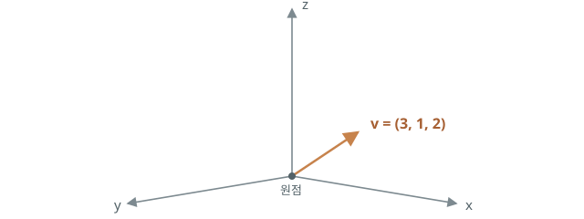
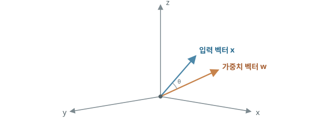
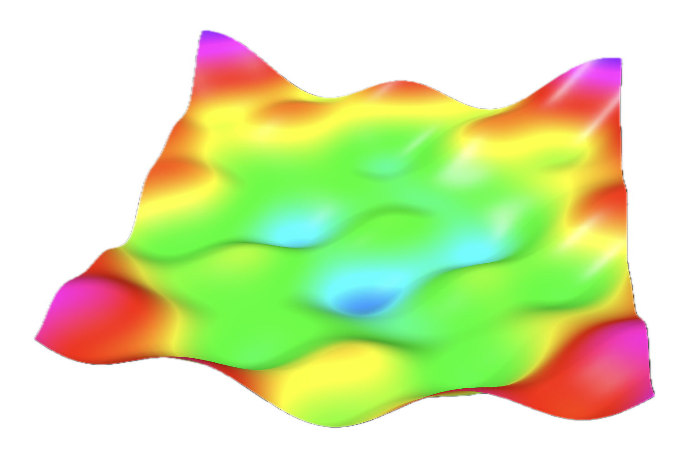
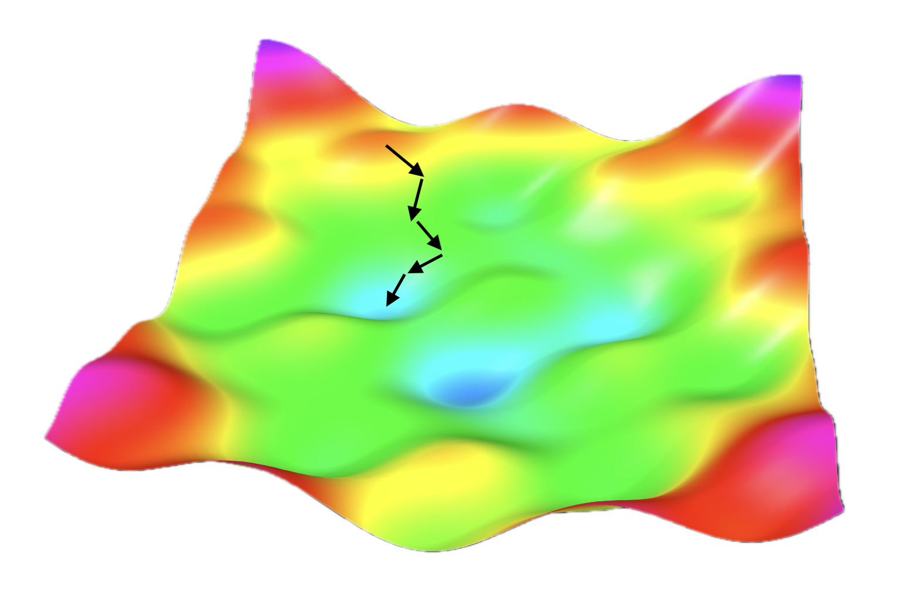
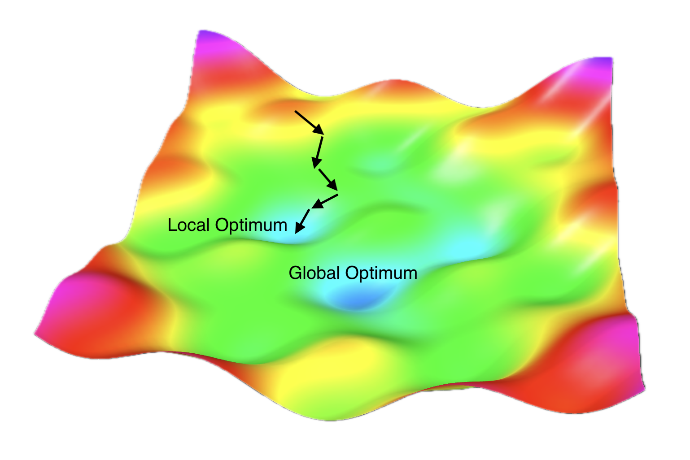

# 고차원 공간에서의 학습

## 공간에서 보는 벡터 {#vectors}

지금까지 신경망에서 입력값, 가중치, 편향, 출력값처럼 많은 숫자를 사용했습니다. 이 가운데 입력값이나 가중치처럼 같은 종류의 숫자가 여러 개 있을 때, 우리는 이들을 하나의 묶음으로 다룰 수 있습니다. 예를 들어 세 입력값 `x₁`, `x₂`, `x₃`은 모두 입력이라는 같은 역할을 하는 값이므로 `(x₁, x₂, x₃)`처럼 묶어 표현할 수 있습니다. 마찬가지로 가중치 `w₁`, `w₂`, `w₃`은 각 입력값이 판단에 미치는 영향을 정하는 값들이므로 `(w₁, w₂, w₃)`처럼 묶을 수 있습니다. 이처럼 여러 숫자를 정해진 순서로 묶어 하나의 값처럼 다루는 것을 **벡터(vector)**라고 합니다.

벡터를 이루는 각각의 값을 성분(component)이라고 합니다. 예를 들어 (x₁, x₂, x₃)이라는 벡터는 x₁, x₂, x₃이라는 세 개의 성분으로 이루어져 있습니다. 이때 벡터가 가진 성분의 개수를 **차원(dimension)**이라고 하며, 이 벡터는 성분이 세 개이므로 3차원 벡터라고 합니다. 일반적으로 입력값이 `n`개라면 `n`차원 벡터가 됩니다.

벡터의 중요한 특징은 좌표 공간에 놓고 기하학적으로 해석할 수 있다는 점입니다. 벡터를 크기와 방향을 가진 화살표로 생각하면, 각 벡터가 공간의 어느 위치를 가리키는지와 벡터 사이의 관계를 그림으로 살펴볼 수 있습니다.

{ .neural-network-image .coordinate-image }

실제 컴퓨터는 이것이 벡터인지 따로 이해하는 것이 아니라, 여러 숫자를 배열 형태로 저장하고 정해진 연산을 수행할 뿐입니다. 하지만 이 숫자들을 벡터로 바라보면, 수많은 값을 한 덩어리로 이해하고 계산 결과를 더 쉽게 해석할 수 있습니다. 그래서 우리는 벡터를 어떤 `n`차원 공간 위의 위치나 방향으로 생각합니다.

다만 4차원 이상은 사람이 공간적으로 직접 떠올리기 어렵기 때문에 그대로 시각화할 수 없습니다. 그래서 설명할 때는 보통 2차원이나 3차원 그림으로 단순화합니다. 그렇지만 벡터와 공간에 관한 같은 수학적 개념은 차원이 늘어나도 그대로 확장해 적용할 수 있습니다.

## 학습과 벡터 {#learning-and-vectors}

이제 학습 과정에서 가중치가 어떻게 바뀌는지 살펴봅시다. 앞에서 여러 숫자를 벡터로 묶어 다룬 것처럼, 가중치와 편향도 하나의 벡터로 묶어 표현할 수 있습니다. 가중치를 학습시킨다는 것은 이 벡터의 성분을 조금씩 바꾸는 일입니다. 벡터의 성분이 바뀌면 좌표계에서 벡터가 나타내는 위치도 달라집니다. 학습은 손실이 더 작아지는 방향을 찾아 이 벡터를 새로운 위치로 계속 이동시키는 과정입니다.

그런데 가중치 벡터가 바뀌면 입력 벡터와의 **내적(dot product)** 값도 달라집니다. 내적은 두 벡터에서 같은 위치에 있는 성분끼리 곱한 뒤, 그 결과를 모두 더하는 계산입니다. 기하학적으로는 **두 벡터가 얼마나 같은 방향을 향하는지**를 크기까지 함께 반영해 나타내는 값입니다. 두 벡터의 방향이 비슷할수록 내적은 커지고, 서로 수직이면 `0`이 되며, 반대 방향에 가까울수록 음수가 됩니다.

{ .neural-network-image .coordinate-image }

그렇다면 이 두 벡터를 실제 계산에 어떻게 사용할까요? 입력 벡터와 가중치 벡터를 내적하면, 앞에서 살펴본 가중 합 `w₁x₁ + w₂x₂ + w₃x₃`을 얻습니다.

퍼셉트론에서 이 값은 주어진 입력을 가중치라는 판단 기준으로 평가한 점수라고 볼 수 있습니다. 따라서 가중치를 조정해 가중치 벡터를 바꾼다는 것은 같은 입력을 평가하는 기준을 바꾸는 것입니다. 그 결과 계산되는 점수가 달라지고, 최종 판단도 달라질 수 있습니다.

학습은 정답과 관련 있는 입력의 특징이 더 높은 평가 점수를 만들고, 관련 없는 특징은 낮은 점수를 만들도록 가중치를 조정하는 과정입니다.

## 손실이 낮은 곳 찾기 {#loss-landscape}

가중치와 편향의 값이 하나 정해지면, 그 값으로 데이터셋 전체를 예측했을 때의 손실도 하나로 정해집니다. 이를 공간에 표현하면 하나의 파라미터 조합은 하나의 위치가 되고, 그때의 손실값은 높이가 됩니다.

가능한 모든 파라미터 조합을 같은 방식으로 공간에 펼쳐 놓으면, 손실이 큰 곳은 높고 손실이 작은 곳은 낮은 하나의 지형으로 표현할 수 있습니다. 이를 통해 파라미터의 값에 따라 손실이 어떻게 달라지는지를 시각적으로 확인할 수 있습니다. 이렇게 손실의 높낮이로 나타낸 공간을 **손실 공간(loss landscape)**이라고 합니다.

실제 신경망에는 수많은 파라미터가 있기 때문에 이 공간은 훨씬 높은 차원을 가집니다. 하지만 고차원 공간은 직접 그릴 수 없기 때문에, 여기서는 이해를 돕기 위해 파라미터가 두 개라고 가정하고 손실을 높이로 나타낸 3차원 공간으로 단순화해 살펴보겠습니다.

{ .neural-network-image .loss-landscape-image }

신경망을 학습시키는 일은 단순히 손실 함수를 계산하는 데서 끝나지 않습니다. 현재 위치의 손실을 확인하고, 더 낮은 손실을 만드는 파라미터 위치를 찾아 이동하는 문제입니다. 이처럼 손실이 가장 낮은 지점, 또는 충분히 낮은 지점을 찾는 것을 **최적화(optimization)**라고 합니다.

{ .neural-network-image .loss-landscape-image }

## 가파른 내리막길 찾기 {#gradient-descent}

최적화를 위해 어느 방향으로 움직여야 하는지는 이미 알고 있습니다. [역전파](04-multilayer-perceptron.md#backpropagation)를 통해 각 가중치와 편향에 대한 손실의 미분값을 구할 수 있기 때문입니다. 이 미분값을 모은 것을 **기울기(gradient)**라고 합니다. 예를 들어 가중치 `w₁`, `w₂`와 편향 `b`가 있다면, 기울기는 `(∂L/∂w₁, ∂L/∂w₂, ∂L/∂b)`처럼 각 값을 조금 바꿨을 때 손실이 얼마나 변하는지를 순서대로 묶은 벡터입니다.

기울기는 손실이 가장 빠르게 커지는 방향을 가리킵니다. 따라서 학습에서는 **그 반대 방향으로 가중치와 편향을 수정**하면 손실을 줄일 수 있습니다.

이처럼 현재 위치에서 손실이 가장 가파르게 줄어드는 방향을 계산해 그쪽으로 조금씩 이동하는 방법을 **경사 하강법(gradient descent)**이라고 합니다. 산을 내려갈 때 발밑의 경사를 살펴보고 가장 낮아지는 방향으로 한 걸음씩 걷는 것과 같은 원리입니다.

다만 실제 손실 공간은 매끈한 하나의 그릇 모양이 아닐 수 있습니다. 주변보다 낮지만 전체에서 가장 낮지는 않은 골짜기도 있는데, 이를 **지역 최적점(local optimum)**이라고 합니다. 지역 최적점은 말 그대로 주변 범위에서는 어느 정도 최적화가 이루어진 상태입니다.

문제는 지역 최적점 바로 주변에서는 어느 방향으로 조금 움직여도 손실이 커진다는 점입니다. 경사 하강법은 현재 위치에서 손실이 줄어드는 방향만 선택하므로, 손실이 먼저 높아지는 길을 지나 이 주변을 벗어나기 어렵습니다. 하지만 전체적으로 보면 멀리 떨어진 곳에 손실이 가장 낮은 **전역 최적점(global optimum)**이 있을 수 있습니다. 학습 과정에서는 이런 지역 최적점에 너무 일찍 머무르지 않으면서 더 좋은 위치를 찾아가야 합니다.

{ .neural-network-image .loss-landscape-image }

이런 문제를 줄이기 위해 경사 하강법을 보완한 여러 **최적화 알고리즘(optimizer)**이 사용됩니다. 대표적으로 **모멘텀(momentum)**은 이전에 움직이던 방향을 일부 유지해 관성처럼 활용합니다. 덕분에 얕은 지역 최적점이나 울퉁불퉁한 구간에서 멈추지 않고 지나갈 가능성을 높입니다.

예를 들어 공을 굴린다고 생각해 봅시다. 공은 굴러 내려가며 속도가 붙어 운동량이 생기고, 얕은 골짜기나 완만한 오르막은 관성으로 넘어갈 수 있습니다. 모멘텀도 이전 이동의 방향을 일부 유지해 이와 비슷한 효과를 냅니다. 다만 이런 방식이 지역 최적점을 반드시 벗어나게 해 주는 것은 아닙니다.

최근 딥러닝에서는 모멘텀을 활용하면서 파라미터마다 이동 크기도 조절하는 **Adam(Adaptive Moment Estimation)** 계열을 많이 사용합니다. Adam은 최근 기울기의 방향과 크기를 함께 참고해, 각 파라미터가 얼마나 크게 움직일지를 다르게 정합니다.

## 가장 낮은 곳이 답일까? {#global-optimum}

모델을 학습할 때는 손실이 가장 낮은 전역 최적점까지 반드시 내려가야 할 것 같지만, 꼭 그렇지는 않습니다.

먼저 지역 최적점과 전역 최적점의 손실 차이가 매우 작을 수 있기 때문입니다. 이 경우 전역 최적점을 찾기 위해 더 많은 계산 비용을 들이는 것보다, 이미 얻은 지역 최적점에서 학습을 마치는 편이 실용적일 수 있습니다.

더 중요한 것은 학습 데이터의 손실을 가장 낮추는 것 자체가 학습의 궁극적인 목표는 아니라는 점입니다. 실제 목표는 학습에 사용하지 않은 새로운 데이터에서도 좋은 성능을 내는 모델을 만드는 것입니다. 이러한 능력을 **일반화(generalization)**라고 합니다.

학습 데이터에서 손실이 가장 낮은 위치라도 데이터의 세부적인 특징까지 지나치게 외워 버리면 새로운 데이터에서는 잘 작동하지 않을 수 있습니다. 반대로 전역 최적점이 아니더라도 손실이 충분히 낮고 새로운 데이터에서도 좋은 성능을 보인다면 좋은 모델이 될 수 있습니다.

따라서 실제 학습에서는 전역 최적점에 도달했는지만 보는 것이 아니라, 별도로 준비한 검증 데이터에서도 충분히 좋은 성능을 보이는지 함께 확인합니다.

## :material-pencil: 실습 과제 {#exercises}

다음 문장이 맞으면 O, 틀리면 X를 선택하세요.

1. 벡터의 성분이 세 개라면 3차원 벡터라고 한다.
2. 입력 벡터와 가중치 벡터의 내적은 같은 위치의 성분끼리 곱한 뒤 모두 더해 구한다.
3. 경사 하강법은 기울기가 가리키는 방향으로 파라미터를 움직인다.
4. 지역 최적점에 도달했다면 학습에 실패한 것이다.
5. 모멘텀을 사용하면 모든 지역 최적점에서 반드시 벗어날 수 있다.

??? success "정답·해설"
    1. **O** — 벡터의 차원은 성분의 개수로 정합니다.
    2. **O** — 각 성분을 곱해 더한 값이 내적이며, 퍼셉트론에서는 가중 합이 됩니다.
    3. **X** — 경사 하강법은 기울기의 반대 방향으로 파라미터를 움직입니다.
    4. **X** — 지역 최적점이라도 손실이 충분히 낮고 새로운 데이터에서도 좋은 성능을 보이면 좋은 모델이 될 수 있습니다.
    5. **X** — 모멘텀은 얕은 구간을 지나갈 가능성을 높일 뿐, 지역 최적점 탈출을 보장하지는 않습니다.
