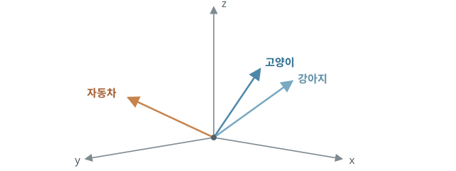
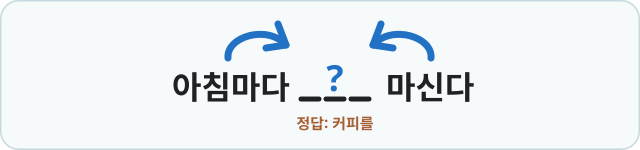
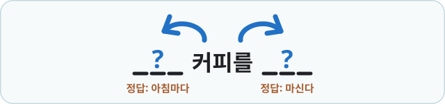
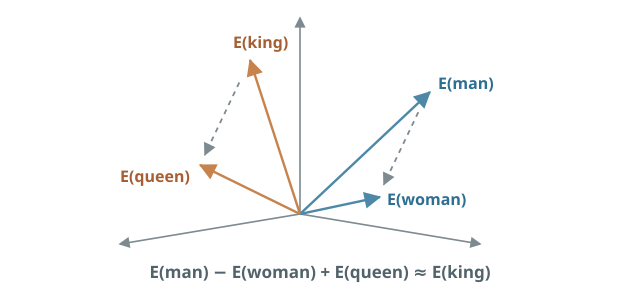

# 언어를 벡터로 표현하기

지금까지 인공 신경망의 구조를 살펴보며, 모델이 가중치와 편향을 조정해 학습하고 손실이 낮아지는 방향으로 답을 찾아가는 과정을 배웠습니다. 하지만 우리의 최종 목표인 거대 언어 모델의 구조를 이해하려면 아직 중요한 문제가 하나 남아 있습니다.

언어 모델은 입력으로 언어를 받고 다시 언어를 출력합니다. 반면 지금까지 살펴본 신경망은 숫자와 벡터를 입력으로 받아 계산합니다. 결국 신경망이 언어를 처리하려면 먼저 단어나 문장을 신경망이 계산할 수 있는 숫자로 바꾸어야 합니다.

그렇다면 언어를 어떻게 숫자로 표현할 수 있을까요? 언어를 벡터로 표현하기 위해 어떤 방법들을 시도해 왔는지 살펴보겠습니다.

## 단어를 숫자로 바꾸는 방법 {#words-as-numbers}

가장 단순한 방법은 단어마다 고유한 번호를 붙이는 것입니다. 이런 방식을 **정수 인코딩(integer encoding)**이라고 합니다. 인코딩(encoding)은 ‘어떤 정보를 일정한 규칙에 따라 코드로 변환한다’는 의미입니다. 여기서는 단어를 신경망이 처리할 수 있는 숫자 코드로 바꾸는 것을 말합니다.
 예를 들어 “고양이”에는 `1`, “강아지”에는 `2`, “자동차”에는 `3`을 붙일 수 있습니다.

그런데 이 방식은 숫자의 크기 차이 때문에 단어 사이에 원래 없던 관계가 생긴다는 문제가 있습니다. `2`가 `1`보다 크다고 해서 “강아지”와 “고양이” 사이에 크기나 순서의 관계가 있는 것은 아닙니다. 이 숫자는 단어를 구분하기 위해 임의로 붙인 이름표일 뿐이지만, 그대로 신경망에 입력하면 숫자의 크기와 차이까지 계산에 반영됩니다.

이러한 문제를 피하기 위해 등장한 방법 중 하나가 **원-핫 인코딩(one-hot encoding)**​입니다. 원-핫 인코딩은 전체 단어 목록에서 해당 단어의 위치만 `1`로 표시하고, 나머지는 모두 `0`으로 만드는 방식입니다. 단어 목록이 다음과 같다고 해 봅시다.

| 단어 | 원-핫 벡터 |
| --- | --- |
| 고양이 | `(1, 0, 0, 0, 0)` |
| 강아지 | `(0, 1, 0, 0, 0)` |
| 자동차 | `(0, 0, 1, 0, 0)` |
| 사과 | `(0, 0, 0, 1, 0)` |
| 책 | `(0, 0, 0, 0, 1)` |

원-핫 인코딩을 사용하면 숫자의 크기 때문에 원래 없던 순서나 관계가 생기는 문제를 피하면서 각 단어를 서로 독립적으로 구분할 수 있습니다. 다만 원-핫 인코딩은 **단어의 의미를 표현하지 못합니다.** “고양이”와 “강아지”가 둘 다 동물이라는 점이나, “고양이”가 “자동차”보다 “강아지”와 의미적으로 더 가깝다는 정보는 벡터에 담겨 있지 않습니다.

또 다른 문제는 단어의 수가 많아질수록 **벡터의 차원도 함께 커진다**는 것입니다. 예를 들어 단어가 10만 개라면 하나의 단어를 표현하기 위해 10만 차원의 벡터가 필요합니다. 그중 단 하나만 `1`이고 나머지는 모두 `0`이므로, 불필요한 저장 공간과 계산을 많이 필요로 합니다.

## 의미를 담는 벡터 {#meaningful-vectors}

이 한계를 해결하는 방법이 **단어 임베딩(word embedding)**입니다. embed는 ‘끼워 넣다’라는 뜻으로, 여기서는 각각의 단어를 숫자로 이루어진 벡터 공간의 한 위치에 대응시켜 표현한다는 의미입니다. 임베딩 벡터의 차원은 전체 단어 개수와 관계없이 독립적으로 정할 수 있습니다. 예를 들어 단어가 10만 개여도 각 단어를 300개의 성분으로 이루어진 벡터로 표현할 수 있습니다. 이렇게 하면 원-핫 벡터보다 **낮은 차원의 밀집된 벡터**로 단어를 표현하면서 단어 사이의 의미적 관계도 벡터에 담을 수 있습니다.

앞에서는 단어가 다섯 개였기 때문에 5차원 원-핫 벡터가 필요했습니다. 반면 임베딩에서는 같은 단어들을 3차원으로 표현할 수 있습니다.

| 단어 | 임베딩 벡터 |
| --- | --- |
| 고양이 | `(0.8, 0.3, -0.1)` |
| 강아지 | `(0.7, 0.4, -0.2)` |
| 자동차 | `(-0.3, 0.1, 0.9)` |
| 사과 | `(0.1, -0.8, 0.3)` |
| 책 | `(-0.5, 0.6, 0.2)` |

이렇게 단어를 임베딩해 벡터로 바꿨을 때, 단어 사이의 의미나 관계가 잘 반영되었다고 가정해 봅시다. “고양이”와 “강아지”처럼 비슷한 의미를 가진 단어의 벡터는 비슷한 방향을 향하고, “자동차”처럼 관계가 먼 단어의 벡터는 다른 방향을 향합니다. 이처럼 벡터의 위치와 방향을 이용해 단어 사이의 의미와 관계를 표현하는 것이 임베딩의 핵심입니다. 따라서 벡터의 [내적](05-high-dimensional-learning.md#learning-and-vectors)을 활용하면 두 단어의 벡터가 얼마나 비슷한지 수치로 비교할 수 있습니다.

{ .neural-network-image .coordinate-image }

다만 이 때 벡터의 각 성분이 (‘생물인지’, ‘크기가 큰지’, ‘움직이는지’)처럼 각각 하나의 의미를 나타내는 것은 아닙니다. 여러 성분이 함께 작용해 단어의 의미와 관계를 표현합니다. 따라서 각각의 숫자를 따로 해석하기보다, 벡터 전체가 다른 단어의 벡터와 어떤 관계를 이루는지가 중요합니다.

## 문맥으로 단어를 배우기 {#learning-from-context}

임베딩 역시 신경망을 통해 학습할 수 있습니다. 임베딩 모델은 단어들이 문장에서 함께 사용되는 패턴을 학습하면서 비슷한 맥락에서 등장하는 단어들이 벡터 공간에서도 가까운 위치에 놓이도록 각 단어의 벡터를 조정해 나갑니다.

문제는 **단어 사이의 관계를 어떻게 벡터에 담을 것인가**입니다. “자동차”와 “고양이”보다 “고양이”와 “강아지”를 더 비슷한 방향에 놓으려면, 모델이 단어의 의미와 관계를 알아야 합니다. 하지만 사람이 모든 단어의 의미와 관계를 일일이 알려 주기는 어렵습니다.

이 문제는 **문맥(context)**을 이용해 해결할 수 있습니다. 단어가 문장 속에서 어떤 단어들과 함께 쓰이는지를 보면, 그 단어가 가진 의미의 단서를 얻을 수 있습니다. 예를 들어 “고양이가 창가에서 잔다”, “강아지가 마당에서 논다” 같은 문장을 많이 보면 “고양이”와 “강아지”는 비슷한 종류의 주변 단어와 함께 등장합니다. 반면 “자동차가 도로를 달린다”는 다른 문맥에 더 자주 나타납니다.

이런 아이디어를 바탕으로 만든 대표적인 임베딩 모델이 **Word2Vec**입니다. Word2Vec의 핵심은 비슷한 문맥에서 사용되는 단어들을 벡터 공간에서 가까운 위치에 놓는 것입니다. 이를 위한 대표적인 학습 방식에는 두 가지가 있습니다.

### CBOW {#cbow}

첫 번째 방법은 **CBOW(Continuous Bag of Words)**입니다. CBOW는 주변에 있는 단어들을 하나의 묶음으로 보고, 그 가운데에 들어갈 단어를 예측합니다. 이름의 Bag of Words는 단어의 순서를 엄격하게 구분하지 않고 하나의 묶음으로 다룬다는 뜻입니다. Continuous는 문장에서 연속적으로 이어지는 주변 단어들을 문맥으로 사용한다는 의미입니다.

{ .neural-network-image }

### Skip-gram {#skip-gram}

두 번째 방법은 **Skip-gram**입니다. Skip-gram은 가운데 단어 하나를 보고 일정 범위 안에 있는 주변 단어들을 각각 예측합니다. 이름의 gram은 단어로 이루어진 짧은 단위를 의미하고, skip은 바로 옆에 붙어 있는 단어뿐만 아니라 일정 범위 안에서 떨어져 있는 단어와의 관계도 학습한다는 의미입니다.

{ .neural-network-image }

CBOW와 Skip-gram은 각각 장단점이 있기 때문에 학습 목적과 데이터의 특성에 따라 적절한 방식을 선택합니다. Skip-gram은 하나의 가운데 단어로 주변 단어를 각각 예측하기 때문에 단어와 문맥의 관계를 더 세밀하게 학습하는 편입니다. 특히 데이터가 적거나 등장 빈도가 낮은 단어에서도 좋은 임베딩을 얻는 데 유리한 경향이 있습니다. 다만 예측해야 할 대상이 많아 계산량이 크고 학습 속도는 상대적으로 느립니다.

반면 CBOW는 여러 주변 단어의 정보를 한 번에 묶어 가운데 단어 하나를 예측하므로 계산이 비교적 단순하고 학습 속도가 빠른 편입니다. 다만 여러 단어의 정보가 하나로 합쳐지는 과정에서 개별 단어와 문맥 사이의 관계를 세밀하게 학습하는 데에는 상대적으로 불리할 수 있습니다.

## 스스로 의미를 학습한다 {#representation-learning}

Word2Vec은 주변 단어를 맞히는 과정을 반복하면서, 예측에 도움이 되도록 각 단어의 벡터를 조금씩 조정합니다. 그 결과 비슷한 문맥에서 쓰이는 “고양이”와 “강아지”는 가까워지고, “자동차”처럼 다른 문맥에서 쓰이는 단어는 멀어집니다. 단어 사이의 관계도 벡터 공간에 자연스럽게 나타납니다.

여기서 놀라운 점은 사람이 단어마다 “동물”, “국가”, “직업”처럼 의미적 특징을 하나씩 알려 주지 않았음에도, 모델은 이러한 차이를 주변 단어 예측에 필요한 표현으로 바꾸어 벡터에 담는다는 것입니다. 즉, 사람이 따로 가르치지 않은 **의미와 관계가 단어 벡터 속에 자연스럽게 녹아드는 것**입니다.

{ .neural-network-image .coordinate-image }

위와 같이 단어를 벡터 공간에 표현해 보았습니다. `E`는 단어를 임베딩 벡터로 표현한다는 뜻입니다. 회색 점선 화살표는 두 임베딩 벡터 사이의 차이, 즉 한 벡터에서 다른 벡터로 이동하는 방향과 크기를 나타냅니다.

단어 임베딩은 단어 사이의 의미와 관계를 반영하도록 학습되기 때문에 벡터의 차이도 하나의 관계를 나타낼 수 있습니다. 따라서 `E(man) − E(woman)`의 차이를 `E(queen)`에 더하면 `E(king)`과 유사한 값을 얻을 수 있습니다. 마찬가지로 `E(aunt)`에 같은 차이를 더하면 `E(uncle)`과 유사한 값에 도달합니다.

이처럼 사람이 특징을 정해 주는 대신 모델이 데이터에서 유용한 표현을 찾아가게 하는 접근을 **표현 학습(representation learning)**이라고 합니다. 표현 학습은 이후 이미지·음성·언어를 다루는 다양한 딥러닝 모델의 중요한 기반이 되었습니다.

표현 학습은 이미지 분류 과정에서도 확인할 수 있습니다. 이미지 분류 모델의 각 층이 어떤 패턴에 강하게 반응하는지 살펴보면, 앞쪽 층에서는 가장자리나 색처럼 단순한 특징에 반응하고, 뒤쪽 층으로 갈수록 질감이나 형태, 물체의 일부처럼 더 복잡한 특징에 반응하는 모습을 볼 수 있습니다.

중요한 점은 모델에게 이런 특징을 학습하라고 직접 지정하지 않았다는 것입니다. 모델은 이미지를 올바르게 분류하도록 학습하는 과정에서 문제 해결에 유용한 특징을 스스로 찾아냅니다. 이를 통해 모델이 문제를 풀기 위한 유용한 표현을 스스로 만들어가는 표현 학습​을 시각적으로 확인할 수 있습니다.

{ .neural-network-image }

<em><a href="https://cs.nyu.edu/~fergus/papers/zeilerECCV2014.pdf">Zeiler & Fergus (2014), “Visualizing and Understanding Convolutional Networks”</a></em>

다만 표현 학습이 Word2Vec에서 처음 등장한 것은 아닙니다. 이미 1980년대 신경망 연구에서는 은닉층이 문제 해결에 유용한 특징을 스스로 만들어 낼 수 있다는 점이 연구되었습니다. Word2Vec은 이러한 생각을 단어의 의미 표현에서 매우 직관적으로 보여 준 대표적인 사례입니다.

!!! info "요슈아 벤지오와 표현 학습"

    

      

        
      

      

        
요슈아 벤지오(Yoshua Bengio)는 신경망이 유용한 표현을 스스로 학습하는 방법을 발전시킨 대표적인 연구자입니다. 2003년 신경 확률 언어 모델을 제안하며 단어 임베딩 연구의 바탕을 마련했고, 2018년 제프리 힌턴(Geoffrey Hinton)·얀 르쿤(Yann LeCun)과 함께 튜링상을 받았습니다. 튜링상은 컴퓨터 과학 분야에서 가장 권위 있는 상으로, 흔히 “컴퓨터 과학의 노벨상”이라고 불립니다.

        
사진: <em><a href="https://commons.wikimedia.org/wiki/File:Yoshua_Bengio_2019_cropped.jpg">Maryse Boyce</a> · CC BY 4.0</em>

      

    

## :material-pencil: 실습 과제 {#exercises}

다음 문장이 맞으면 O, 틀리면 X를 선택하세요.

1. 원-핫 인코딩에서는 어휘집에 단어가 많아질수록 벡터의 차원도 커진다.
2. Word2Vec은 사람이 단어마다 의미적 특징을 직접 정해 주어야 학습할 수 있다.
3. CBOW는 주변 단어를 이용해 가운데 단어를 예측한다.
4. 표현 학습에서는 모델이 문제 해결에 필요한 유용한 표현을 데이터에서 스스로 학습한다.
5. 단어 임베딩에서는 두 벡터의 차이가 단어 사이의 관계를 나타낼 수 있다.

??? success "정답·해설"
    1. **O** — 원-핫 벡터는 어휘집의 각 단어에 하나의 자리를 배정하므로, 단어 수가 곧 벡터 차원이 됩니다.
    2. **X** — Word2Vec은 문맥에서 주변 단어를 예측하는 과정으로 유용한 벡터 표현을 스스로 학습합니다.
    3. **O** — CBOW는 주변 단어들을 문맥으로 사용해 빈 가운데 단어를 맞힙니다.
    4. **O** — 표현 학습은 사람이 특징을 직접 정하는 대신, 모델이 데이터에서 문제 해결에 유용한 표현을 찾아가게 합니다.
    5. **O** — 의미적 관계가 잘 학습되면, 두 벡터 사이의 차이도 하나의 관계를 나타낼 수 있습니다.
