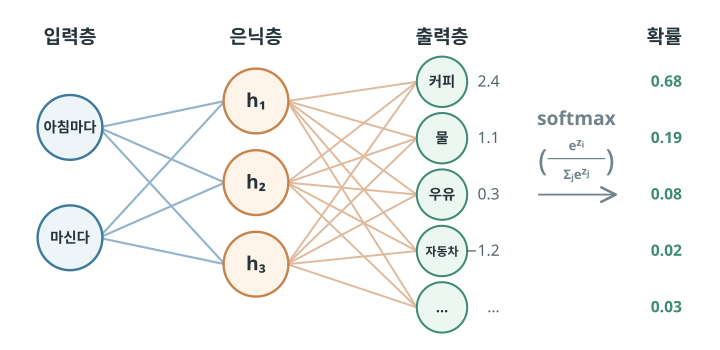
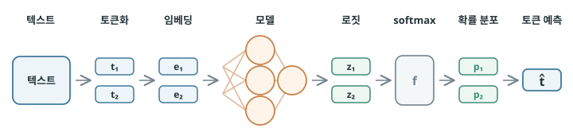

# 언어는 확률적 패턴을 따른다

## 자연어의 규칙과 패턴 {#patterns-in-natural-language}

사람이 일상에서 말하고 쓰는 한국어, 영어처럼 자연스럽게 발달한 언어를 **자연어(natural language)**라고 합니다. 프로그래밍 언어처럼 사람이 명확한 규칙을 설계한 언어와 구분하는 말입니다.

자연어는 완전히 무작위로 이어지지 않습니다. 예를 들어 “나는 아침마다 ___ 마신다”라는 문장에서 “커피를”은 자연스럽지만, “자동차를”은 어울리지 않습니다. 이처럼 문맥에 따라 어떤 단어가 등장할 가능성이 높은지가 어느 정도 결정됩니다.

문법도 언어의 중요한 패턴입니다. “나는 아침마다 커피를 마신다”는 자연스러운 문장이지만, “마신다 아침마다 나는 커피를”은 어순이 어색합니다. 이는 단어의 순서와 조사·어미의 사용에도 일정한 규칙이 있기 때문입니다.

초기 자연어 처리에서는 문법과 의미 규칙을 프로그램 안에 직접 구현해, 컴퓨터가 문장을 분석하고 지시를 이해하도록 만들려 했습니다. 하지만 자연어의 표현과 예외는 끝없이 달라지고 문맥에 따라 뜻도 바뀝니다. 예를 들어 “배가 아프다”의 ‘배’는 몸의 부위를 의미하지만, “배가 항구를 떠난다”의 ‘배’는 탈것을 의미합니다. 이처럼 같은 단어도 문맥에 따라 의미가 달라질 수 있기 때문에 사람이 언어의 모든 경우를 규칙으로 빠짐없이 정의하는 데에는 한계가 있습니다.

하지만 사람이 실제로 언어를 배우는 과정은 이와 다릅니다. 우리는 언어의 규칙을 모두 배운 뒤 말을 시작하지 않습니다. 문법을 배우기 전부터 수많은 문장을 듣고 사용하면서, 어떤 표현이 자연스러운지 어떤 단어들이 함께 쓰이는지와 같은 **언어의 패턴을 자연스럽게 익힙니다.** 문법은 이렇게 이미 사용되고 있는 언어에서 발견되는 규칙성을 정리하고 설명한 체계라고 볼 수 있습니다.

이처럼 반복해서 사용되는 언어 표현에는 어느 정도의 확률적 패턴이 있습니다. 어떤 문맥 뒤에 어떤 말이 이어질지가 하나로 정해져 있지는 않지만, 어떤 표현은 다른 표현보다 훨씬 더 자주 나타납니다. 그래서 현대 LLM의 핵심은 문법을 프로그램으로 직접 구현하는 것이 아닙니다. 방대한 텍스트에서 어떤 단어가 어떤 문맥에 자주 이어지는지 학습해 **언어에 숨어 있는 확률적 패턴을 데이터로부터 찾아내는 방식**입니다.

## 문맥으로 예측하기 {#context}

[Word2Vec](06-word-embeddings.md#learning-from-context)은 주변 단어나 가운데 단어를 바탕으로 어떤 단어가 등장할지를 예측하는 모델이라고 했습니다. 하지만 모델이 처음부터 “커피”처럼 하나의 답을 바로 고르는 것은 아닙니다. 먼저 후보가 되는 모든 단어에 대해 각각의 점수를 계산합니다. 이때 모델이 예측할 수 있는 단어들의 목록을 **어휘집(vocabulary)**이라고 합니다. Word2Vec은 기본적으로 이 어휘집에 없는 단어를 직접 예측할 수 없습니다.

따라서 기본적인 Word2Vec에서는 출력층의 뉴런 수가 어휘집에 포함된 단어 수와 같습니다. 예를 들어 `10,000`개의 단어가 있다면 출력층에도 `10,000`개의 뉴런이 있고, 각 뉴런은 하나의 단어에 대응합니다.

{ .neural-network-image .language-modeling-image }

“아침마다”와 “마신다”를 이용해 그 사이에 들어갈 단어를 예측한다고 해 봅시다.

출력층은 어휘집에 든 단어 수만큼 값을 만듭니다. 출력층의 각 뉴런에서 계산되는 이 값은 각 단어가 현재 문맥에 얼마나 어울리는지를 나타내는 점수이며 **로짓(logit)**이라고 부릅니다.

로짓은 후보 단어 사이의 상대적인 점수이지만, 값의 범위와 기준이 정해져 있지 않습니다. 따라서 로짓을 그대로 사용하기보다는 **확률로 변환해 사용**합니다. 이렇게 하면 각 단어가 선택될 가능성을 확률로 표현할 수 있고, 이를 실제 정답과 비교하여 모델을 학습할 수 있습니다.

이때 로짓을 확률로 바꾸기 위해 **소프트맥스(softmax)**를 [활성화 함수](03-perceptron.md#mechanical-decision-making)로 사용합니다. 소프트맥스는 모든 로짓을 함께 계산해 각 값을 `0`과 `1` 사이로 만들고, 전체 합이 `1`이 되도록 조정합니다. 점수가 높은 후보에는 더 큰 확률을, 낮은 후보에는 더 작은 확률을 주어 어떤 단어가 출력될지를 하나의 확률 분포로 나타냅니다. 예시에서는 “커피”의 확률이 `0.68`로 가장 높으므로, 모델은 “커피”가 빈칸에 들어갈 단어라고 예측합니다.

!!! info "소프트맥스는 어떻게 확률을 만들까?"
    

      

        
      

      

        
소프트맥스는 각 로짓 <code>zi</code>에 자연상수 <code>e</code>를 밑으로 하는 지수 함수 <code>ezi</code>를 적용합니다. 그러면 음수였던 점수도 모두 양수가 되고, 큰 점수와 작은 점수의 차이도 더 뚜렷해집니다. 그다음 각 값을 모든 후보의 지수 값 합으로 나눕니다. 즉, <code>pi = ezi / Σezj</code>로 계산합니다. 이렇게 하면 각 값은 확률로 변환되고, 모든 확률의 합은 <code>1</code>이 됩니다.

      

    

임베딩 모델도 처음부터 이러한 예측을 잘하는 것은 아닙니다. 학습을 반복하면서 단어의 벡터를 조금씩 조정하고 점차 더 정확한 예측을 하도록 만들어집니다. 이러한 예측이 학습 과정에서 어떻게 활용되는지 살펴보겠습니다.

실제 학습에서는 수많은 문장을 학습 데이터로 사용합니다. 참고로 이렇게 언어를 분석하거나 모델을 학습하기 위해 모아 놓은 대규모 텍스트 자료를 **코퍼스(corpus, 말뭉치)**라고 합니다. 학습 데이터에는 실제 문장이 있으므로 “아침마다”와 “마신다” 사이에 어떤 단어가 들어갔는지 이미 알고 있습니다. 모델은 이 정답과 자신이 예측한 확률 분포를 비교하면서 학습합니다. 이를 위해 예측이 실제 정답과 얼마나 다른지를 [손실 함수](03-perceptron.md#learning-goal)를 통해 계산합니다.

이때 대표적으로 사용하는 손실 함수가 **크로스 엔트로피(cross entropy)**​입니다. 크로스 엔트로피는 모델이 정답에 얼마나 적절한 확률을 부여했는지를 바탕으로 손실을 계산합니다. 학습이 반복될수록 모델은 실제 데이터에서 나타나는 패턴에 더 가까운 확률 분포를 예측하게 됩니다.

## 단어 쪼개기 {#tokens}

지금까지는 이해하기 쉽게 “단어”를 기준으로 설명했지만, 실제로 언어를 다루는 모델은 입력된 텍스트를 **토큰(token)**이라는 처리 단위로 나눕니다. 토큰은 하나의 완전한 단어일 수도 있고, 단어의 일부·띄어쓰기·기호일 수도 있습니다.
 예를 들어 “아침마다 커피를 마신다.”는 `[아침] [마다] [커피] [를] [마신] [다] [.]`처럼 여러 토큰으로 나눌 수 있습니다.

문장을 단순히 단어 단위로 나누면, 단어는 다양한 형태로 변하고 새로운 단어도 계속 생겨나기 때문에 어휘집이 지나치게 커질 수 있습니다. 그래서 언어를 다루는 모델은 자주 함께 나타나는 글자 조각을 토큰으로 만들어, 정해진 크기의 어휘집으로도 다양한 표현을 조합해 처리합니다.

예를 들어 `마시다`라는 같은 기본형에서도 `마신다`, `마셨다`, `마시겠지만`처럼 시제와 어미에 따라 다양한 표현이 만들어집니다. 이것들을 모두 개별 단어로 만들면 어휘집이 빠르게 커집니다. 앞에서 보았듯 어휘집의 크기는 출력층 뉴런의 수와 계산해야 할 후보 수에 직접 영향을 주므로, 어휘집은 효율적으로 작게 만들 필요가 있습니다. 그래서 토큰화는 단어 안에서 반복되는 표현 조각을 중복해 등록하지 않도록 자주 쓰이는 조각으로 나눕니다.

토큰을 나누는 방식은 언어의 구조에 따라 달라집니다. 영어는 띄어쓰기가 단어 경계를 비교적 잘 보여 주지만, 한국어는 조사와 어미가 붙고 한 단어 안에서도 형태가 다양하게 바뀝니다. 따라서 언어별 특성과 학습 데이터에 맞는 토큰화 방법을 사용합니다.

예를 들어 “커피를 마셨습니다”와 같은 뜻의 “I drank coffee”를 비교해 봅시다. 띄어쓰기 기준으로 보면 한국어는 `커피를`과 `마셨습니다` 두 어절이고, 영어는 `I`, `drank`, `coffee` 세 어절입니다. 하지만 토큰으로 나누면 한국어는 조사와 어미까지 나뉘어 더 잘게 쪼개집니다.

- 한국어 토큰: `[커피] [를] [마시] [었] [습니다]` → 5개 토큰
- 영어 토큰: `[I] [dr] [ank] [coffee]` → 4개 토큰

지금까지는 이해하기 쉽게 ‘단어’를 기준으로 설명했지만, 실제 모델에서는 앞에서 설명한 단어를 모두 토큰으로 바꾸어 이해하면 됩니다. 임베딩, 어휘집, 로짓, 확률 분포 역시 실제로는 모두 토큰을 기준으로 계산됩니다.

따라서 일반적인 언어 모델이 텍스트를 처리하는 흐름은 다음과 같이 정리할 수 있습니다.

{ .neural-network-image .language-modeling-image }

## Word2Vec이 남긴 것 {#word2vec-significance}

Word2Vec은 오늘날 사용하는 LLM의 핵심 구성 요소로 직접 쓰이지는 않습니다. 하지만 단어의 의미를 벡터로 학습할 수 있다는 표현 학습과 임베딩의 가능성을 널리 보여 준 대표적인 초기 모델입니다.

이후 표현 학습은 한 단어에 하나의 고정된 벡터를 부여하는 데서 더 나아갔습니다. 같은 단어라도 앞뒤 문맥에 따라 서로 다른 벡터로 표현하는 방법이 발전했고, 이러한 문맥을 반영한 표현 학습은 현대 언어 모델의 중요한 기반이 되었습니다. 앞으로 살펴볼 트랜스포머 기반 언어 모델에서도 이러한 방식으로 문맥에 따라 단어의 표현을 만들어 냅니다.

## :material-pencil: 실습 과제 {#exercises}

다음 문장이 맞으면 O, 틀리면 X를 선택하세요.

1. 자연어에서 다음에 올 표현은 완전히 무작위로 정해진다.
2. Word2Vec의 출력층은 어휘집의 후보마다 하나의 로짓을 계산한다.
3. 소프트맥스를 적용한 뒤 각 후보의 확률을 모두 더하면 `1`이 된다.
4. 하나의 단어는 언제나 하나의 토큰으로만 나뉜다.
5. 크로스 엔트로피는 모델이 예측한 확률 분포와 실제 정답의 차이를 손실로 계산한다.

??? success "정답·해설"
    1. **X** — 자연어에는 문맥에 따라 어떤 표현이 더 자주, 자연스럽게 이어지는지에 관한 확률적 패턴이 있습니다.
    2. **O** — Word2Vec은 어휘집에 든 모든 후보에 점수를 계산하고, 이 점수를 로짓이라고 합니다.
    3. **O** — 소프트맥스는 모든 로짓을 확률로 바꾸며, 전체 합이 `1`이 되도록 조정합니다.
    4. **X** — 토큰은 단어 전체일 수도 있지만, 단어의 일부·띄어쓰기·기호일 수도 있습니다.
    5. **O** — 크로스 엔트로피는 예측한 확률 분포가 실제 정답과 얼마나 다른지 계산해 학습의 손실로 사용합니다.
