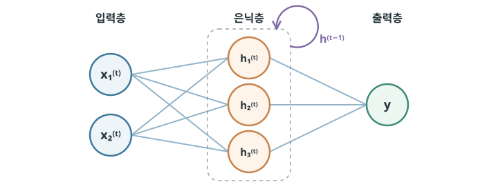
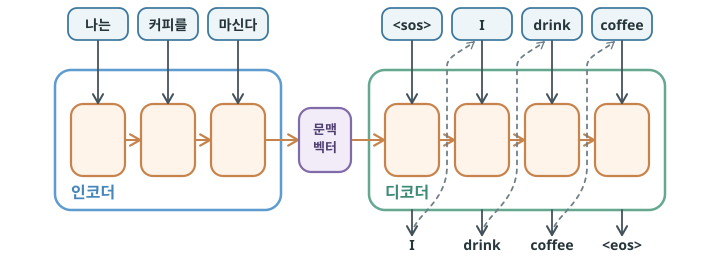
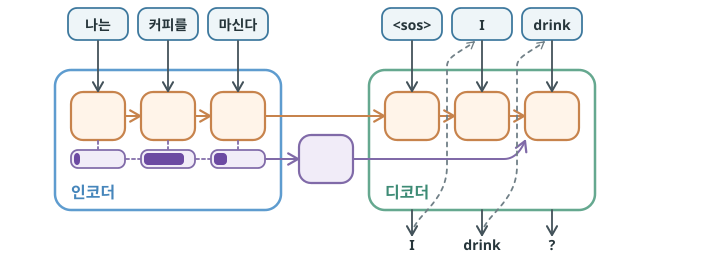
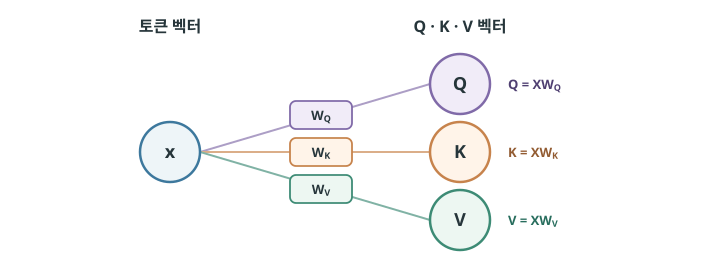
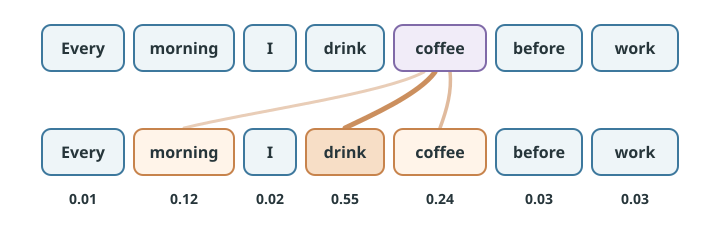

# 문맥을 연결하는 트랜스포머 {#transformer}

2017년, 구글 연구진은 현대 LLM의 역사에서 가장 중요한 논문 가운데 하나로 꼽히는 [*Attention Is All You Need*](https://arxiv.org/pdf/1706.03762)를 발표했습니다. 이 논문의 핵심은 새로운 신경망 구조, **트랜스포머(Transformer)**를 제시한 것입니다. 트랜스포머는 이후 언어뿐 아니라 이미지·음성·생물정보 등 다양한 분야에서 널리 쓰이는 범용 신경망 아키텍처의 중요한 기반이 되었습니다. 특히 오늘날의 LLM은 대부분 트랜스포머 구조를 바탕으로 합니다.

## 순서대로 읽는 RNN {#rnn}

먼저 트랜스포머가 등장하기 전에는 언어 모델에서 **RNN(Recurrent Neural Network)** 계열의 모델이 널리 사용되었습니다. Recurrent는 ‘되풀이되는’, ‘순환하는’이라는 뜻입니다. RNN은 문장을 앞에서부터 단어 하나씩 순서대로 읽습니다. 이때 매 단계에서 현재 단어와 이전 단계의 결과를 함께 사용해 새로운 결과를 만들고, 이 결과를 다시 다음 단계로 전달합니다. 이런 반복적인 구조를 통해 앞에서 읽은 정보를 뒤쪽 단어를 처리할 때까지 이어갈 수 있습니다.

{ .neural-network-image }

여기서 `t`는 문장을 읽어 가는 시간 단계입니다. 각 단계 `t`에서 RNN은 현재 입력 `xᵗ`와 이전 단계의 은닉 상태 `hᵗ⁻¹`를 함께 사용해, 현재 은닉 상태 `hᵗ`를 계산합니다. `hᵗ`에는 지금까지 읽은 입력을 요약한 정보가 담기고, 이 값이 다시 다음 단계로 전달됩니다.

이 과정은 입력을 나눈 단위의 수만큼 반복됩니다. 실제 모델은 토큰마다 반복하지만, 이해를 위해 문장을 단어 단위로 나누어 생각해 봅시다. “나는 커피를 마신다”는 세 단어이므로 RNN도 세 번 반복됩니다.

- `t = 1`: “나는”을 읽고 초기 상태 `h⁰`에서 `h¹`을 만듭니다.
- `t = 2`: “커피를”과 `h¹`을 함께 사용해 `h²`를 만듭니다.
- `t = 3`: “마신다”와 `h²`를 함께 사용해 `h³`을 만듭니다.

RNN은 특히 기계 번역에 많이 활용되었습니다. 이때는 보통 두 개의 RNN을 둡니다. **인코더(encoder)**는 입력 문장을 단어 순서대로 읽으며, 각 단계에서 지금까지 읽은 내용을 은닉 상태에 계속 반영합니다. 문장을 모두 읽고 나면 마지막 은닉 상태에는 단어의 순서와 문장 전체의 정보를 요약한 **문맥 벡터(context vector)**가 만들어집니다. 그리고 **디코더(decoder)**는 이 문맥 벡터를 바탕으로 앞에서 만든 단어를 참고하며, 번역 문장의 다음 단어를 하나씩 출력합니다. 예를 들어 한국어 문장을 읽은 뒤 영어 문장으로 번역하는 과정입니다.

{ .neural-network-image }

위 도식에서 `<sos>`와 `<eos>`는 문장의 시작과 끝을 표시하기 위해 사용하는 특수 토큰입니다. `<sos>`는 start of sequence, 즉 문장의 시작을 알리고, `<eos>`는 end of sequence, 즉 문장의 끝을 알립니다. 디코더 아래의 토큰은 해당 단계에서 다음 토큰을 예측하기 위해 넣는 입력이고, 위의 토큰은 그 결과로 예측한 출력입니다.

인코더가 만든 문맥 벡터는 입력 문장 전체를 요약한 정보입니다. 이 벡터와 `<sos>` 토큰이 디코더에 전달되면서 번역이 시작됩니다. 디코더는 이를 바탕으로 첫 토큰을 예측한 뒤, 앞 단계의 토큰을 다음 단계의 입력으로 받아 번역 문장을 하나씩 이어 갑니다. 더 이상 생성할 단어가 없다고 판단하면 `<eos>` 토큰을 출력해 번역을 끝냅니다.

## RNN의 한계 {#rnn-limitations}

RNN에는 다음과 같은 중요한 한계가 있습니다.

첫 번째로, **장기 의존성(long-term dependency)** 문제가 있습니다. RNN은 이전 은닉 상태를 다음 단계로 반복해서 전달하는 구조이기 때문에 문장이 길어질수록 앞쪽 정보가 점차 희석되거나 잊힐 수 있습니다. 그래서 멀리 떨어진 단어 사이의 관계나 긴 문맥을 충분히 반영하기 어렵습니다.

두 번째 문제는 **벡터 병목(vector bottleneck)**입니다. 초기 인코더-디코더 구조에서는 인코더가 입력 문장 전체의 정보를 하나의 고정된 크기의 문맥 벡터로 압축해 디코더에 전달합니다. 문장이 길어질수록 하나의 벡터에 담아야 할 정보가 많아지면서, 번역에 필요한 단어나 단어 사이의 관계와 같은 세부 정보가 충분히 보존되지 못할 수 있습니다. 그러면 디코더는 필요한 정보를 충분히 활용하지 못한 채 다음 단어를 예측하게 됩니다.

마지막 문제는 **병렬 처리의 어려움**입니다. RNN은 이전 단계의 은닉 상태가 계산되어야 다음 단계로 넘어갈 수 있기 때문에 여러 단어를 동시에 처리할 수 없습니다. 그래서 긴 문장일수록 계산이 차례차례 이어지고 학습 속도도 느려집니다. 대규모 텍스트 데이터를 수없이 반복해 학습해야 하는 언어 모델에서는 학습이 오래 걸리면 전체 학습에 드는 시간과 비용이 크게 늘어납니다.

## Attention Is All You Need {#attention-is-all-you-need}

이런 RNN의 한계를 해결하기 위해 나온 것이 앞서 소개한 “Attention Is All You Need”입니다.

한 가지 짚고 넘어갈 점이 있습니다. 제목 때문에 이 논문이 어텐션(attention)이라는 개념을 처음 제안했다고 생각하기 쉽지만, 그렇지 않습니다. 이보다 앞서 바다나우(Dzmitry Bahdanau)는 동료 연구자들과 함께 2014년 [“Neural Machine Translation by Jointly Learning to Align and Translate”](https://arxiv.org/pdf/1409.0473)논문에서 신경망 번역에 어텐션을 적용하는 방식을 제안했습니다.

“Attention Is All You Need”의 핵심적인 의의는 어텐션 자체를 새로 제안한 것이 아니라, **RNN의 순환 구조를 제거하고 어텐션을 중심으로 신경망 전체를 구성한 트랜스포머 구조를 제안**했다는 데 있습니다.

### Attention {#attention}

먼저 어텐션에 대해 알아보겠습니다. 어텐션은 ‘주목’ 또는 ‘집중’이라는 뜻입니다. 이름 그대로 디코더가 다음 토큰을 예측할 때, **입력 문장의 각 부분이 얼마나 중요한지 계산하고 필요한 정보에 더 집중하는 방식**입니다. 어텐션을 처음으로 제안한 바다나우는 자신이 영어를 배우던 경험에서 어텐션의 아이디어를 떠올렸다고 합니다. 외국어 문장을 이해하거나 번역할 때, 문장 전체를 한꺼번에 처리하기보다 그 순간의 해석에 필요한 단어에 집중한다는 점에서 착안한 것입니다.

기존 RNN 번역 모델은 입력 문장 전체를 하나의 고정된 문맥 벡터에 압축해야 했습니다. 반면 어텐션을 적용하면 디코더는 매 단계마다 인코더가 만든 각 단어의 정보를 다시 살펴보고, 지금 필요한 부분에 더 집중할 수 있습니다.

{ .neural-network-image }

위 그림은 디코더가 다음 단어로 `coffee`를 만들려는 순간을 나타냅니다. 이때 디코더는 입력 문장을 올바르게 번역하기 위해 “나는”, “커피를”, “마신다”에 대응하는 인코더의 은닉 벡터를 모두 다시 확인합니다. 현재 디코더의 은닉 벡터와 각 인코더의 은닉 벡터가 얼마나 관련 있는지 점수로 계산하고, 이 점수를 확률 분포로 바꿉니다. 도식에서 각 은닉 벡터 아래 블록에 진한 보라색으로 표시된 정도가 바로 각 단어를 얼마나 중요하게 참고할지를 나타내는 **어텐션 가중치(attention weight)**입니다.

예를 들어 세 입력에 대한 어텐션 가중치가 각각 `0.1`, `0.7`, `0.2`가 되었다고 해 봅시다. “커피를”에 가장 큰 가중치가 매겨졌으므로, 이 단계에서는 “커피를”의 정보가 가장 크게 반영됩니다. 각 은닉 벡터에 해당 가중치를 곱한 뒤 모두 더하면, 현재 단계에서 필요한 정보가 반영된 새로운 문맥 벡터가 만들어집니다.

`context = 0.1 × h(나는) + 0.7 × h(커피를) + 0.2 × h(마신다)`

### Self-Attention {#self-attention}

어텐션은 하나의 문맥 벡터에 모든 정보를 압축하면서 생기던 벡터 병목 문제를 해결했습니다. 하지만 인코더 자체는 여전히 RNN이므로, 입력 토큰을 앞에서부터 순서대로 읽으며 은닉 벡터를 만들어야 했고, 그래서 여전히 병렬 처리가 어렵고 멀리 떨어진 단어 사이의 관계를 학습하기 어렵다는 한계가 있었습니다.

그래서 “Attention Is All You Need”는 여기서 한 걸음 더 나아갔습니다. 애초에 RNN으로 문맥을 만들 필요가 있을까? 단어들이 서로를 직접 참고하게 하면 되지 않을까?라는 발상에서 출발해, RNN의 순환 구조를 없애고 어텐션을 중심으로 정보를 처리하는 새로운 구조를 제안했습니다.

그래서 트랜스포머에서는 문장의 각 토큰이 처음부터 다른 모든 토큰을 직접 참고하며 문맥을 반영한 새로운 벡터를 만듭니다. 이렇게 자기 자신을 포함한 문장 내부의 토큰들에 어텐션을 적용하는 방식을 **셀프 어텐션(self-attention)**​이라고 합니다.

셀프 어텐션의 핵심은 문장 안의 각 토큰이 다른 토큰들과의 관련도를 계산하고, **관련이 높은 토큰의 정보를 더 많이 반영해 새로운 표현을 만드는 것**​입니다. 토큰 사이의 거리에 관계없이 서로 직접 정보를 주고받을 수 있기 때문에 멀리 떨어진 토큰 사이의 관계도 효과적으로 학습할 수 있습니다. 또한 토큰을 순서대로 처리할 필요가 없어 병렬 처리가 가능하다는 장점도 있습니다.

### Q·K·V {#query-key-value}

셀프 어텐션의 구조를 알아보겠습니다. 셀프 어텐션이 실제로 어떻게 작동하는지 이해하려면 Q·K·V(Query, Key, Value)라는 핵심 개념​에 대해 알아야 합니다.

셀프 어텐션은 문맥이 반영된 새로운 벡터를 만들기 위해, 문장 안에서 각 토큰이 다른 토큰과 어떤 관계를 가지는지 파악합니다. 이때 하나의 토큰 벡터를 Query, Key, Value라는 세 가지 역할의 벡터로 변환해 사용합니다.

Query, Key, Value는 각각 다음과 같은 역할을 합니다.

1. **쿼리(Query)**​는 “현재 토큰이 어떤 정보를 찾는가”를 나타냅니다.
2. **키(Key)**​는 “각 토큰이 어떤 정보를 가지고 있는가”를 나타내며, Query와 비교하는 데 사용됩니다.
3. **값(Value)**​은 “참고 대상으로 선택됐을 때 어떤 정보를 전달하는가”를 나타냅니다.

이 세 벡터는 원래 토큰 벡터에 각각 서로 다른 가중치 행렬 <code>WQ</code>, <code>WK</code>, <code>WV</code>를 곱해 만듭니다.

{ .neural-network-image }

그렇다면 이 벡터들은 어떻게 사용될까요? 먼저 각 토큰의 Q를 문장 내 모든 토큰의 K와 비교해 서로 얼마나 관련이 있는지를 나타내는 점수를 계산합니다. 이때 Q와 K를 [내적](05-high-dimensional-learning.md#learning-and-vectors)하여 점수를 구하고, 값이 지나치게 커지는 것을 막기 위해 K 벡터의 차원인 `dₖ`의 제곱근으로 나눕니다. 마지막으로 [소프트맥스](07-probabilistic-language-modeling.md#context)를 적용해 모든 값의 합이 1이 되도록 변환합니다. 이렇게 얻은 값이 각 토큰을 얼마나 참고할지를 나타내는 **어텐션 가중치(attention weight)**입니다.

  

    Attention(Q, K, V) = softmax(
    QKᵀ√dₖ
    )V
  

여기서 `QKᵀ`의 위 첨자 `T`는 K 행렬의 행과 열을 바꾸는 전치(transpose)를 뜻하며, 이렇게 전치된 K와 Q를 곱하면 각 Q와 모든 K의 내적을 한 번에 계산할 수 있습니다.

{ .neural-network-image }

앞서 살펴본 과정을 간단한 문장으로 확인해보겠습니다.

예를 들어 “coffee”를 기준으로 문맥이 반영된 새로운 벡터를 만든다면 `Q(coffee)`를 문장 내 모든 토큰의 K와 각각 비교합니다. 이때 `K(drink)`와의 관련성 점수가 가장 높고 `K(coffee)`와 `K(morning)`도 비교적 높은 점수를 받았다면, 소프트맥스를 거친 뒤 `drink`에는 가장 큰 어텐션 가중치가, `coffee`와 `morning`에는 그보다 작은 가중치가 부여됩니다.

이후 각 토큰의 V에 해당 어텐션 가중치를 곱한 뒤 모두 더합니다. 따라서 관련성이 높은 `drink`의 V는 더 많이, 나머지 토큰의 V는 관련성에 따라 서로 다른 비율로 반영됩니다. 그 결과 “coffee”의 새로운 벡터에는 문장 전체에서 “coffee”와 관련된 정보가 중요도에 따라 함께 반영됩니다. 이처럼 각 토큰의 표현을 **문맥에 맞는 새로운 표현으로 계속 변환(transform)한다**는 의미에서 트랜스포머라는 이름을 이해할 수 있습니다.

그렇다면 모델은 어떤 토큰을 중요하게 참고해야 하는지 어떻게 알 수 있을까요? 이 역시 학습을 통해 결정됩니다.

학습이 진행되면서 <code>WQ</code>와 <code>WK</code>도 손실을 줄이는 방향으로 계속 조정됩니다. 그 결과 모델이 문제를 해결하는 데 서로 참고할 필요가 있는 토큰끼리는 높은 관련성 점수가, 그렇지 않은 토큰끼리는 낮은 점수가 나오도록 Q와 K를 만드는 방법을 학습하게 됩니다.

그런데 여기서 한 가지 문제가 생깁니다. 토큰이 `n`개라면 각 토큰이 다른 모든 토큰을 확인해야 하므로 비교 횟수는 `n × n`, 즉 입력 길이의 제곱에 비례해 증가합니다. 그렇다면 문장이 수천, 수만 개의 토큰으로 길어진다면 모델은 과연 어디까지 참고해야 할까요?

이때 모델이 한 번에 처리할 수 있는 토큰의 범위를 **문맥 창(context window)**이라고 합니다. 기본적인 셀프 어텐션에서는 이 문맥 창 안의 모든 토큰이 서로를 참고합니다. 따라서 문맥 창이 커질수록 더 많은 정보를 함께 참고할 수 있지만, 어텐션 계산량도 빠르게 증가합니다.

!!! info "트랜스포머의 혁신"
    테슬라 AI 조직을 이끌었던 안드레 카파시(Andrej Karpathy)는 [스탠퍼드 CS25 강의](https://www.youtube.com/watch?v=XfpMkf4rD6E)에서 “Attention Is All You Need”보다 “Transformer: A general-purpose, efficient, optimizable computer”(범용적이고 효율적이며 최적화하기 좋은 컴퓨터)가 더 어울리는 제목이었을 것이라고 말했습니다. 그만큼 트랜스포머는 Attention이라는 한 요소가 아니라, 전체 구조 자체가 혁신적이고 중요한 모델입니다.

## :material-pencil: 실습 과제 {#exercises}

다음 문장이 맞으면 O, 틀리면 X를 선택하세요.

1. “Attention Is All You Need”는 어텐션이라는 개념을 처음 제안한 논문이다.
2. RNN은 이전 단계의 은닉 상태를 사용하므로 토큰을 순서대로 처리해야 한다.
3. 셀프 어텐션에서는 한 토큰이 자기 자신의 정보도 참고할 수 있다.
4. Query와 Key의 내적값이 클수록, 두 토큰의 관련성 점수도 높게 계산된다.
5. 트랜스포머의 셀프 어텐션은 문장에서 멀리 떨어진 토큰끼리도 직접 관계를 계산할 수 있다.

??? success "정답·해설"
    1. **X** — 바다나우를 비롯한 연구자들이 앞서 신경망 기반 기계번역에 어텐션 메커니즘을 제안했습니다.
    2. **O** — 이전 은닉 상태가 계산되어야 다음 단계로 갈 수 있어 병렬 처리에 제약이 있습니다.
    3. **O** — 셀프 어텐션은 자기 자신을 포함한 문장 안의 모든 토큰을 참고할 수 있습니다.
    4. **O** — Query와 Key의 내적값이 클수록, 현재 토큰이 찾는 정보와 해당 토큰이 더 잘 맞는다고 볼 수 있습니다.
    5. **O** — 두 토큰이 충분한 크기의 문맥 창 안에 함께 포함되어 있다면, 셀프 어텐션은 거리와 관계없이 직접 비교할 수 있습니다.
