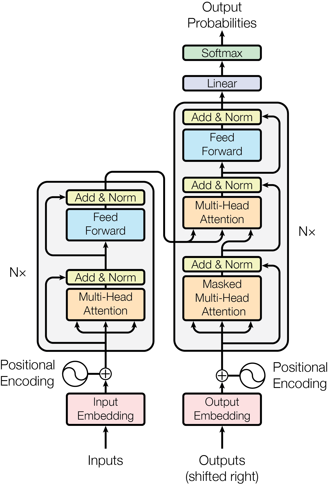
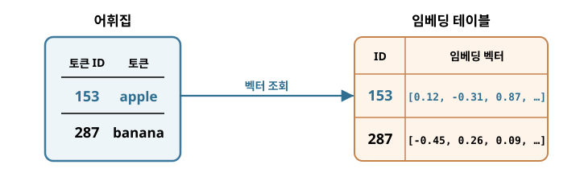
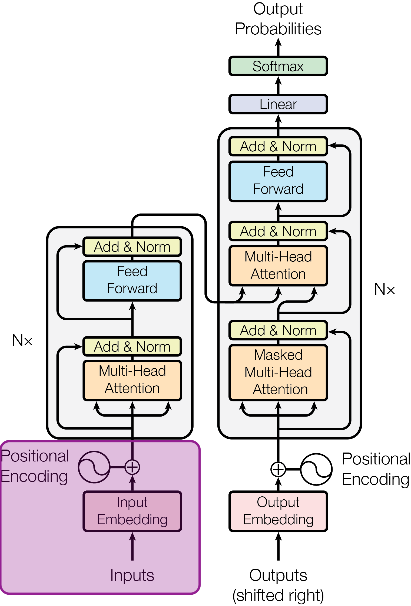
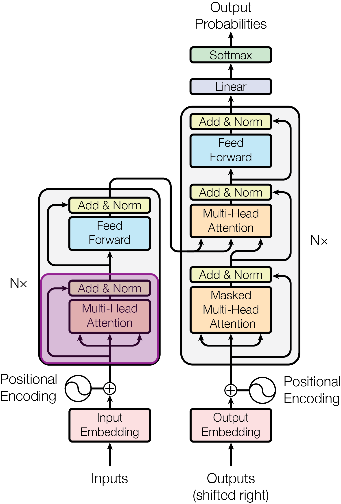
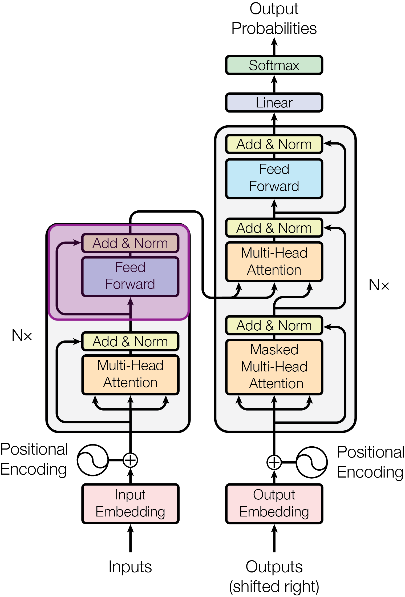
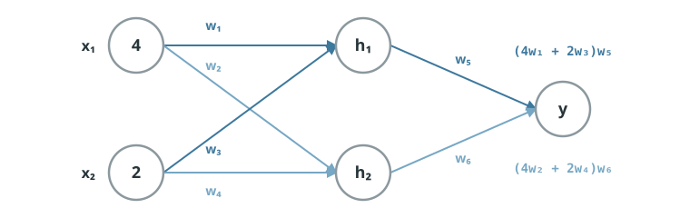
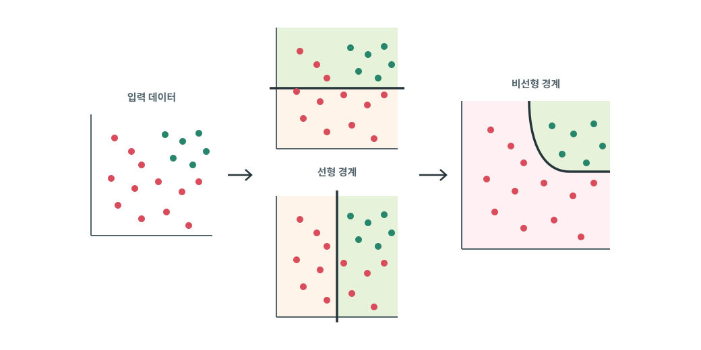

# 트랜스포머 뜯어보기: 인코더

앞 장에서는 셀프 어텐션을 통해 각 토큰이 문장 안의 다른 토큰을 직접 참고하고, 문맥이 반영된 새로운 벡터를 만드는 과정을 살펴봤습니다. 하지만 실제 트랜스포머는 셀프 어텐션뿐만 아니라 다양한 요소로 이루어져 있습니다. 이 장에서는 내부 구조를 하나씩 살펴보면서 트랜스포머를 깊이 있게 이해해 봅시다.

## 트랜스포머의 구조 {#transformer-architecture}

{ .neural-network-image .transformer-encoder-image style="width: min(100%, 22rem);" }

<em><a href="https://arxiv.org/html/1706.03762v7">Vaswani et al., “Attention Is All You Need” (2017), Figure 1</a></em>

이 그림은 “Attention Is All You Need” 논문에 제시된 트랜스포머의 전체 구조입니다.

트랜스포머는 크게 인코더(encoder)와 디코더(decoder)로 구성됩니다. 왼쪽의 인코더는 입력 토큰 사이의 관계를 파악해 문맥이 반영된 표현을 만들고, 오른쪽의 디코더는 이 표현과 앞서 생성한 토큰을 바탕으로 다음 토큰을 예측합니다.

그림에서 네모 박스로 묶인 부분을 각각 **인코더 블록(encoder block)**과 **디코더 블록(decoder block)**이라고 합니다. 트랜스포머는 이러한 블록을 여러 층 반복해서 쌓은 구조이며, 그림의 `N×` 표시는 각 블록이 `N`번 반복된다는 뜻입니다.

초기 트랜스포머 역시 이러한 구조를 통해 기계 번역을 수행했으며, 원 논문에서는 영어-독일어와 영어-프랑스어 번역 과제를 통해 성능을 검증했습니다.

먼저 인코더가 입력을 어떻게 처리하는지 살펴보겠습니다.

## 입력 임베딩 {#input-embedding}

{ .neural-network-image .transformer-encoder-image }

트랜스포머가 문장을 처리하려면 먼저 모델이 사용할 토큰의 목록인 **[어휘집(vocabulary)](07-probabilistic-language-modeling.md#context)**을 준비합니다. 어휘집에 토큰이 `n`개 있다고 해 봅시다. 각 토큰에는 구분을 위한 고유한 **토큰 ID**가 대응됩니다. 토큰 ID는 단지 토큰을 식별하는 번호이며, 토큰의 의미나 다른 토큰과의 관계를 담지는 않습니다.

이 토큰들을 모델이 처리할 수 있는 형태로 바꾸기 위해 **임베딩 테이블(embedding table)**을 사용합니다. 임베딩 테이블은 각 토큰 ID에 대응하는 숫자 벡터를 가지고 있습니다. 논문의 모델에서는 약 37,000개의 토큰을 각각 512차원의 벡터로 표현했습니다.

예를 들어 apple이라는 토큰도 512개의 숫자로 이루어진 벡터로 표현됩니다.

`apple → [0.21, -0.53, 0.14, ..., 0.72]` (총 512개)

이렇게 각 토큰을 표현한 벡터를 **[임베딩 벡터(embedding vector)](06-word-embeddings.md#meaningful-vectors)**라고 합니다. 트랜스포머에서는 입력 토큰을 이러한 임베딩 벡터로 변환하는 과정을 **입력 임베딩(input embedding)**이라고 합니다.

## 입력 표현 {#input-representation}

{ .neural-network-image .transformer-encoder-image style="width: min(100%, 22rem);" }

앞에서 각 토큰을 임베딩 벡터로 표현했습니다. 하지만 임베딩 벡터만으로는 해당 토큰이 문장의 어느 위치에 놓여 있는지 알 수 없습니다. 셀프 어텐션은 모든 토큰을 한꺼번에 처리하기 때문에, 토큰의 순서 정보를 별도로 알려 주어야 합니다.

이를 위해 각 토큰의 위치를 나타내는 **위치 인코딩(positional encoding)**을 입력 임베딩에 더합니다. 예를 들어 “Dog bites man”과 “Man bites dog”는 `dog`, `bites`, `man`이라는 같은 토큰을 사용하지만, 토큰의 순서가 달라 의미도 달라집니다. 위치 인코딩은 모델이 이러한 순서의 차이를 구분하도록 돕습니다.

이렇게 입력 임베딩과 위치 인코딩을 더한 벡터가 입력 표현(input representation)이 되어, 인코더 블록으로 전달됩니다.

## 다중 헤드 어텐션 {#multi-head-attention}

{ .neural-network-image .transformer-encoder-image style="width: min(100%, 22rem);" }

인코더 블록은 먼저 **다중 헤드 어텐션(multi-head attention)**으로 입력 표현을 처리합니다. 다중 헤드 어텐션은 셀프 어텐션을 여러 갈래로 나누어 병렬로 수행하는 방식이며, 각각의 갈래를 헤드(head)라고 부릅니다. 각 헤드는 서로 다른 Q, K, V 가중치를 사용하므로, 하나는 주어와 동사의 관계, 다른 하나는 대명사가 가리키는 대상, 또 다른 하나는 멀리 떨어진 단어 사이의 관계처럼 **서로 다른 패턴에 주목하도록 학습**될 수 있습니다.

이제 이 값은 다음 Add & Norm으로 넘어갑니다. 그런데 도식을 보면 입력이 멀티 헤드 어텐션을 거치지 않고 왼쪽으로 빠져 Add & Norm으로 바로 연결되는 경로가 하나 더 있습니다. 이것이 **잔차 연결(residual connection)**입니다.

잔차 연결은 어떤 층에 들어온 **입력을 해당 층의 출력에 그대로 더해 주는 방식**입니다. 새롭게 계산된 값으로 기존 정보를 완전히 덮어쓰지 않고 원래 입력을 함께 전달함으로써, 층이 깊어져도 정보와 기울기가 잘 전달되어 모델을 안정적으로 학습할 수 있도록 돕습니다.

Add & Norm에서는 먼저 잔차 연결을 통해 전달된 원래 입력과 멀티 헤드 어텐션의 출력을 더합니다(Add). 그다음 더한 결과에 **정규화(normalization)**를 적용합니다. 여기서 사용하는 레이어 정규화는 각 토큰 벡터의 값 분포를 평균 0, 분산 1을 기준으로 맞추는 연산입니다. 통계에서 말하는 표준화에 더 가까운 연산이지만, 신경망에서는 관습적으로 정규화라고 부릅니다. 이를 통해 값의 **분포가 지나치게 흔들리는 것을 줄이고 학습을 안정적으로** 진행할 수 있습니다.

## 피드 포워드 신경망(FFN) {#feed-forward-network}

{ .neural-network-image .transformer-encoder-image style="width: min(100%, 22rem);" }

이렇게 정규화된 값은 다음 **피드 포워드 신경망(Feed-Forward Network, FFN)**으로 넘어갑니다. FFN은 작은 **[다층 신경망(MLP)](04-multilayer-perceptron.md#stacking-perceptrons)**입니다.

앞의 셀프 어텐션이 토큰 사이의 관계를 파악하고 정보를 주고받는 과정이라면, FFN은 그렇게 얻은 **각 토큰의 벡터를 다시 변환하고 가공하는 과정**입니다.

!!! info "왜 피드 포워드라고 부를까?"
    FFN 안에서는 입력이 입력층에서 은닉층을 거쳐 출력층으로 **한 방향으로만** 전달됩니다. 이전 단계로 되돌아가거나 순환하는 연결이 없기 때문에 피드 포워드(Feed-Forward) 신경망이라고 부릅니다.

셀프 어텐션만으로는 토큰 사이의 관계를 반영할 수는 있지만, 그 결과를 충분히 복잡한 형태로 변환하는 데 한계가 있습니다. FFN은 모든 토큰에 동일한 신경망을 적용해 **비선형 변환**을 수행함으로써, 어텐션을 통해 얻은 정보를 더 풍부한 표현으로 만들어 줍니다.

여기서 비선형 변환이란, 쉽게 말하면 **그래프를 꺾는 것**을 뜻합니다. 논문에 나오는 트랜스포머의 FFN에는 ReLU라는 [활성화 함수](03-perceptron.md/#mechanical-decision-making)가 들어 있습니다. ReLU는 값이 `0`보다 작으면 `0`으로 바꾸고, `0` 이상이면 그대로 통과시켜 그래프에 꺾이는 지점을 만듭니다.

만약 활성화 함수가 없다면 층을 아무리 쌓아도 모든 계산은 계속 선형성을 가집니다. **선형성(linearity)**이란 입력의 변화가 출력에 비례해, 그래프에서 일직선 형태로 나타나는 성질입니다.

{ .neural-network-image .transformer-encoder-image }

예를 들어 입력값이 **4와 2**이고, 은닉층에 두 개의 노드가 있다고 해봅시다. 전체 계산 과정은 다음과 같습니다.

  
<code>y = (4w₁ + 2w₃)w₅ + (4w₂ + 2w₄)w₆</code>

  
<code>&nbsp;&nbsp;= 4w₁w₅ + 2w₃w₅ + 4w₂w₆ + 2w₄w₆</code>

  
<code>&nbsp;&nbsp;= 4(w₁w₅ + w₂w₆) + 2(w₃w₅ + w₄w₆)</code>

  
<code>&nbsp;&nbsp;= 4W₁ + 2W₂</code>

여기서 `w₁w₅ + w₂w₆`은 첫 번째 입력값 `4`에 곱해지는 하나의 값입니다. 각 `w`는 이미 정해진 가중치이므로, 이들을 곱하고 더한 결과도 하나의 숫자가 됩니다. 이 값을 `W₁`으로 정의할 수 있습니다. 마찬가지로 `w₃w₅ + w₄w₆`도 두 번째 입력값 `2`에 곱해지는 하나의 값이므로 `W₂`로 정의할 수 있습니다.

이 치환은 새로운 값을 근사하거나 계산을 바꾸는 것이 아닙니다. 같은 값을 더 짧게 표현한 것뿐이므로, 전체 식은 정확히 `y = 4W₁ + 2W₂`와 같습니다. 즉 여러 층을 거쳤더라도 입력값 4와 2에 **가중치 `W₁`, `W₂`를 한 번 적용한 것과 같은 선형 변환**이 됩니다.

그래서 MLP에는 층 사이에 ReLU와 같은 활성화 함수를 넣습니다. 활성화 함수가 중간중간 비선형성을 추가하면, 입력과 출력 사이의 관계는 더 이상 하나의 직선으로 표현되지 않고 복잡한 형태를 띠게 됩니다.

{ .neural-network-image .transformer-encoder-image }

예를 들어 위와 같은 데이터 분포를 MLP에 통과시키면, 각 뉴런은 위쪽인가 오른쪽인가처럼 단순한 선형 경계를 기준으로 입력을 나눕니다. 이렇게 나눈 결과에 활성화 함수를 적용하고 이를 조합하면, 마지막 그래프처럼 하나의 직선으로는 만들 수 없는 **복잡한 형태의 경계**도 만들 수 있습니다. 즉, 여러 층과 활성화 함수는 입력 공간을 조금씩 나누고 조합해 더 복잡한 패턴을 구분할 수 있게 합니다.

트랜스포머의 FFN도 이러한 구조를 이용해, 셀프 어텐션을 통해 얻은 정보를 **비선형적으로 변환하여 더 복잡한 특징을 학습**합니다.

이렇게 변환된 결과는 다시 Add & Norm을 거칩니다. 앞에서와 마찬가지로 FFN에 들어가기 전의 입력을 잔차 연결을 통해 더하고(Add), 그 결과를 레이어 정규화(Norm)합니다.

이처럼 다중 헤드 어텐션부터 마지막 Add & Norm까지의 과정이 하나의 인코더 블록을 구성합니다. 원 논문의 트랜스포머에서는 이러한 인코더 블록을 6개 쌓아 구성했습니다.

## :material-pencil: 실습 과제 {#exercises}

다음 문장이 맞으면 O, 틀리면 X를 선택하세요.

1. 임베딩 벡터의 차원 수는 하나의 토큰을 표현하는 숫자의 개수이다.
2. 위치 인코딩은 같은 토큰으로 구성된 문장이라도 어순이 다름을 구분하도록 돕는다.
3. 다중 헤드 어텐션의 각 헤드는 모두 같은 Q, K, V 가중치를 사용한다.
4. 잔차 연결은 블록에서 변환된 결과에 원래 입력을 다시 더해주는 방식입니다.
5. 활성화 함수 없이 선형 층만 여러 개 쌓으면, 전체 계산은 하나의 선형 변환으로 정리된다.

??? success "정답·해설"
    1. **O** — 예를 들어 512차원 임베딩 벡터는 숫자 512개로 하나의 토큰을 표현합니다.
    2. **O** — 위치 인코딩이 토큰의 순서 정보를 더해 줍니다.
    3. **X** — 각 헤드는 서로 다른 Q, K, V 가중치를 학습해 서로 다른 관계에 주목할 수 있습니다.
    4. **O** — 원래 입력을 변환된 결과에 다시 더해, 층이 깊어져도 기존 정보와 학습 신호가 잘 전달되도록 합니다.
    5. **O** — 그렇기 때문에 MLP에서는 층 사이에 활성화 함수를 추가해 비선형성을 만들고, 더 복잡한 패턴을 학습할 수 있게 합니다.
