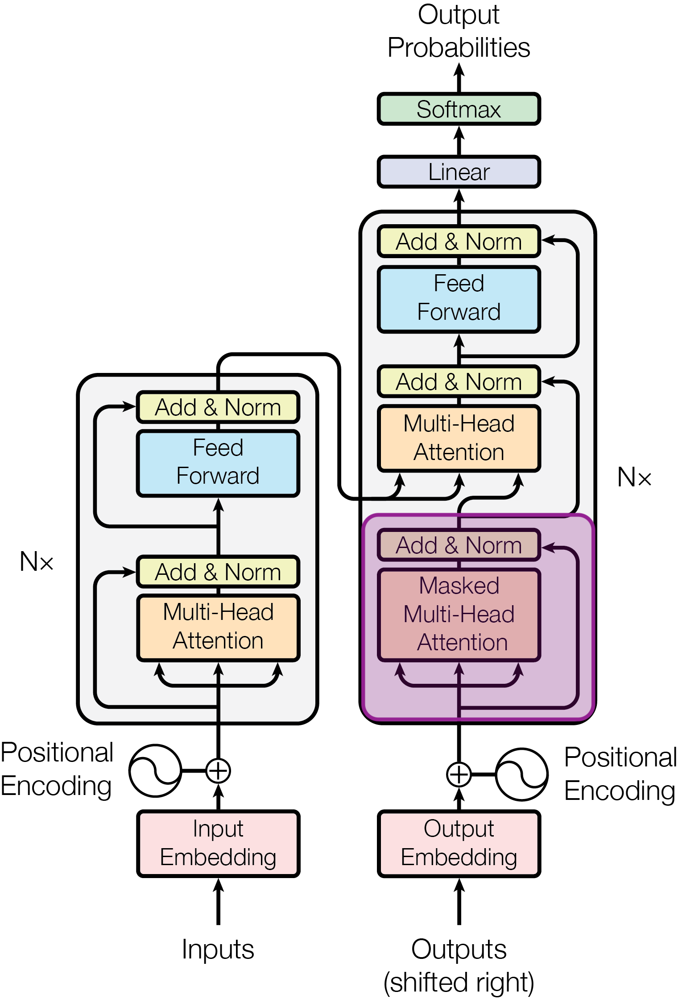
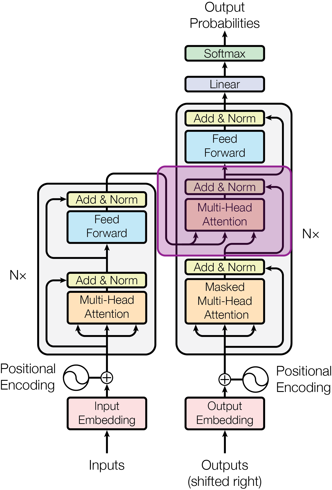
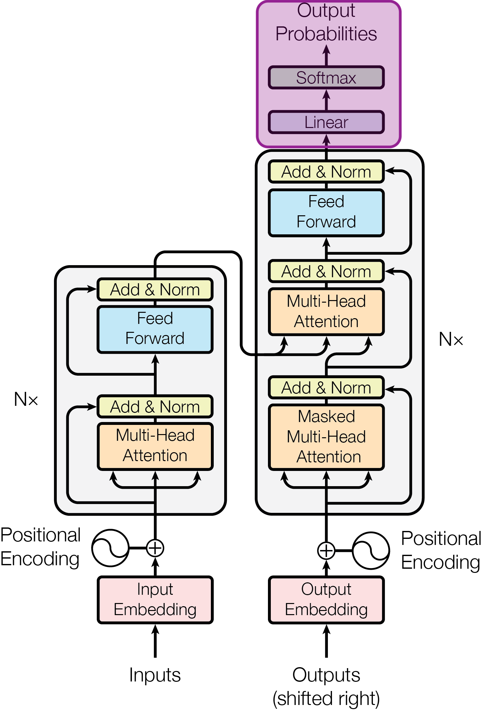

# 트랜스포머 뜯어보기: 디코더 {#transformer-decoder}

이번에는 트랜스포머의 디코더에 대해 알아보겠습니다.

{ .neural-network-image style="width: min(100%, 22rem);" }

<em><a href="https://arxiv.org/html/1706.03762v7">Vaswani et al., “Attention Is All You Need” (2017), Figure 1</a></em>

## 출력 임베딩 {#output-embedding}

디코더도 인코더와 마찬가지로 토큰을 숫자 벡터로 바꾼 뒤 처리합니다. 다만 인코더에는 번역할 원문 토큰을 넣는 반면, 디코더에는 번역문의 앞부분을 입력으로 넣습니다.

예를 들어 한국어 문장 “나는 커피를 마신다”의 정답 번역이 `I drink coffee`라고 해 봅시다. 학습할 때는 정답 문장을 그대로 디코더에 넣지 않고, 시작을 나타내는 `<BOS>` 토큰을 앞에 추가해 한 칸 오른쪽으로 이동한 형태로 입력합니다. BOS는 Beginning of Sequence의 약자로, 시퀀스의 시작을 나타내는 특별한 토큰입니다.

`정답: I → drink → coffee`\\
`입력: <BOS> → I → drink`

이를 **Shifted Right**라고 합니다. 이렇게 하면 디코더는 `<BOS>`를 보고 `I`를, `<BOS> I`를 보고 `drink`를, `<BOS> I drink`를 보고 `coffee`를 예측하도록 학습합니다.

이러한 디코더 입력 토큰도 토큰 ID를 거쳐 임베딩 벡터로 변환됩니다. 이를 **출력 임베딩(output embedding)**이라고 합니다. 여기서 ‘출력’은 번역문의 토큰이라는 의미이며, 만들어진 임베딩 벡터 자체는 디코더의 입력으로 사용됩니다.

마지막으로 인코더와 마찬가지로 위치 인코딩을 더해 토큰의 순서 정보를 반영한 뒤, 디코더 블록으로 전달합니다.

## 마스크드 다중 헤드 어텐션 {#masked-multi-head-attention}

{ .neural-network-image style="width: min(100%, 22rem);" }

디코더 블록의 첫 번째 층은 **마스크드 다중 헤드 어텐션(masked multi-head attention)**입니다. 원래 셀프 어텐션은 각 토큰이 모든 토큰과의 관계를 계산하지만, 마스크드 어텐션은 **현재 위치보다 뒤에 있는 토큰과의 어텐션을 계산하지 못하도록 막습니다.**

예를 들어 `<BOS> I drink coffee`를 학습할 때, `drink` 위치에서 어텐션을 계산하면 `<BOS>`, `I`, `drink`까지만 참고할 수 있고, 뒤에 있는 `coffee`는 참고하지 못하도록 마스크를 씌웁니다. 마스킹을 한다는 것은 미래 토큰의 어텐션 점수에 음의 무한대(-∞)로 바꿔, 소프트맥스를 거친 값이 0이 되도록 만드는 것을 의미합니다. 이렇게 미래 토큰을 어텐션 계산에서 제외해, 디코더가 **아직 생성하지 않은 정답을 미리 보고 학습하는 것을 막습니다.**

이렇게 마스킹된 상태에서 다중 헤드 어텐션을 수행한 뒤, 인코더와 마찬가지로 Add & Norm을 거칩니다.

## 크로스 어텐션 {#cross-attention}

{ .neural-network-image style="width: min(100%, 22rem);" }

그다음은 **크로스 어텐션(cross-attention)**입니다. 크로스 어텐션은 **디코더가 인코더의 정보를 참고하는 과정**입니다.

도식을 보면 인코더에서 나온 출력과 디코더의 마스크드 셀프 어텐션을 거친 출력이 함께 Multi-Head Attention으로 들어옵니다. 이처럼 인코더와 디코더의 정보가 서로 교차해 어텐션을 수행하기 때문에 크로스 어텐션이라고 부릅니다.

앞서 셀프 어텐션에서는 Q, K, V가 모두 같은 입력에서 만들어졌지만, 크로스 어텐션에서는 서로 다른 입력을 바탕으로 만들어집니다.

- **Q**: 마스크드 셀프 어텐션을 거친 **디코더의 표현**
- **K, V**: 인코더가 만든 **입력 문장의 표현**

이를 통해 디코더는 현재까지 생성한 내용을 바탕으로 **입력 문장의 어떤 부분에 주목해야 하는지** 계산합니다.

예를 들어 `coffee`를 생성할 때는 입력 문장 “나는 커피를 마신다”에서 “커피를”에 더 높은 어텐션을 주어 필요한 정보를 참고할 수 있습니다.

크로스 어텐션을 거친 결과는 Add & Norm을 거쳐 FFN으로 전달됩니다. Add & Norm과 FFN의 구조와 역할은 앞서 살펴본 인코더와 동일합니다.

## 다음 토큰 예측 {#next-token}

{ .neural-network-image style="width: min(100%, 22rem);" }

크로스 어텐션과 피드 포워드 신경망을 거친 디코더의 최종 출력은 각 위치에서 다음에 올 토큰을 예측하는 데 사용됩니다.

먼저 Linear 층에서는 디코더의 출력 벡터를 바탕으로, 어휘집에 있는 각 토큰의 [로짓](07-probabilistic-language-modeling.md/#context)을 계산합니다. 로짓은 각 토큰이 다음에 올 가능성을 나타내는 점수입니다. 예를 들어 어휘 사전에 `37,000`개의 토큰이 있다면, 각 토큰에 하나씩 점수를 부여해 `37,000`개의 로짓을 출력합니다. 가령 coffee는 `4.2`, tea는 `2.1`, apple은 `0.7`과 같은 식입니다.

예를 들어 어휘 사전에 37,000개의 토큰이 있다면, Linear 층은 각 토큰에 하나씩 점수를 부여해 37,000개의 로짓을 출력합니다. 가령 `coffee`는 `4.2`, `tea`는 `2.1`, `apple`은 `0.7`과 같은 식입니다. **점수가 높을수록 다음 토큰으로 선택될 가능성이 높습니다.**

그다음 소프트맥스가 이 로짓들을 0과 1 사이의 확률로 변환합니다. 모든 확률을 더하면 1이 되며, 확률이 높을수록 해당 토큰이 다음 토큰으로 선택될 가능성이 높습니다.

예를 들어 `<BOS> I drink`까지 생성했다면, coffee에는 높은 확률이, 다른 토큰에는 상대적으로 낮은 확률이 부여될 수 있습니다. 이 확률 분포에서 토큰 하나를 선택해 다음 입력에 추가하고, 같은 과정을 반복하면서 문장을 한 토큰씩 생성합니다.

## 트랜스포머의 범용성 {#transformer-versatility}

테슬라 AI 조직을 이끌었던 안드레 카파시(Andrej Karpathy)는 [스탠퍼드 CS25 강의](https://www.youtube.com/watch?v=XfpMkf4rD6E)에서 논문의 제목인 “Attention Is All You Need”보다 “Transformer: A general-purpose, efficient, optimizable computer”(범용적이고 효율적이며 최적화하기 좋은 컴퓨터)가 더 어울리는 제목이었을 것이라고 말했습니다.

그만큼 트랜스포머는 특정 분야에 한정되지 않고 **다양한 종류의 데이터를 처리할 수 있는 범용적인 구조**입니다. 처음에는 기계 번역과 같은 자연어 처리에 활용되었지만, 이후 이미지, 음성, 영상, 로보틱스 등 다양한 분야로 활용 범위가 확장되었습니다. 텍스트가 아니더라도 이미지를 작은 조각으로 나누거나 음성과 영상을 일정한 단위의 시퀀스로 표현하면, 트랜스포머의 구조를 그대로 활용할 수 있기 때문입니다.

## :material-pencil: 실습 과제 {#exercises}

다음 문장이 맞으면 O, 틀리면 X를 선택하세요.

1. 디코더의 출력 임베딩에는 정답 번역문 앞에 `<BOS>` 토큰을 붙여 입력한다.
2. 마스크드 다중 헤드 어텐션은 현재 위치보다 뒤에 있는 토큰을 참고하지 못하도록 한다.
3. 크로스 어텐션에서는 디코더의 표현으로 Q를 만들고, 인코더의 출력으로 K와 V를 만든다.
4. Linear 층의 출력은 모든 값을 더하면 1이 되는 다음 토큰의 확률 분포이다.
5. 트랜스포머는 이미지, 음성, 영상 등 시퀀스로 표현할 수 있는 다양한 데이터에도 활용할 수 있다.

??? success "정답·해설"
    1. **O** — 이렇게 한 칸 오른쪽으로 옮기는 것을 Shifted Right라고 합니다.
    2. **O** — 미래 토큰의 어텐션 점수를 가려, 아직 생성하지 않은 정답을 미리 볼 수 없도록 합니다.
    3. **O** — 디코더가 무엇을 찾을지 나타내는 Q를 만들고, 인코더의 출력이 K와 V가 되어 입력 문장의 정보를 제공합니다.
    4. **X** — Linear 층은 토큰별 점수인 로짓을 출력합니다. Softmax를 거쳐야 확률 분포가 됩니다.
    5. **O** — 데이터를 토큰 또는 시퀀스 형태로 표현할 수 있으면, 트랜스포머 구조를 다양한 분야에 적용할 수 있습니다.
