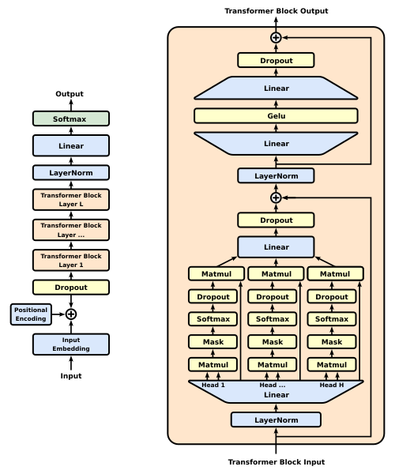
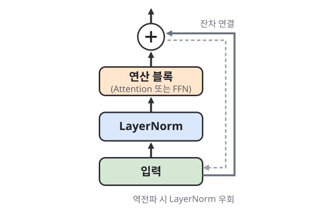
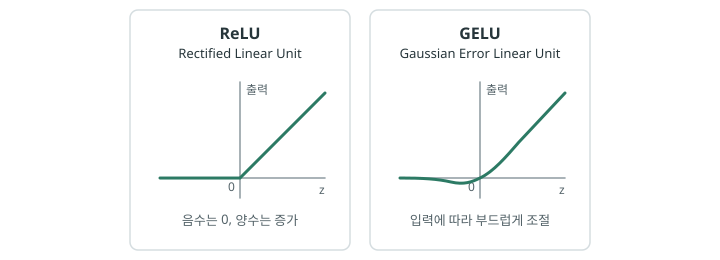

# 대화하는 트랜스포머

지금까지 초기 트랜스포머의 구조와 동작 방식을 살펴봤습니다. 이제 우리가 실제로 사용하는 **대규모 언어 모델(LLM)**을 이해할 준비가 되었습니다. 트랜스포머가 어떻게 현대 LLM으로 발전했는지, 그리고 LLM은 어떤 구조로 어떻게 동작하는지 알아봅시다.

## 디코더 기반 언어 모델: GPT {#gpt}

초기 트랜스포머는 번역을 위해 인코더와 디코더를 함께 사용했습니다. 이후 연구자들은 트랜스포머를 **언어 모델(language model)**에도 적용하기 시작했습니다. 언어 모델이란 **앞에 나온 단어들을 바탕으로 다음에 어떤 단어가 나올지 예측하는 모델**입니다. 이러한 예측을 반복하면 새로운 문장을 만들어낼 수 있습니다.

!!! info "기계 번역과 언어 모델"
    **기계 번역**은 원문과 지금까지 생성한 번역문을 바탕으로, 번역문의 다음 토큰을 예측합니다. 원문을 처리하는 인코더와 이를 참고해 번역문을 생성하는 디코더가 함께 필요합니다. (예: `나는 커피를 마신다 + I drink` → `?`)

    **언어 모델**은 앞에 나온 토큰만 바탕으로 다음 토큰을 예측합니다. 별도의 원문을 처리할 필요가 없으므로, 디코더만으로도 구성할 수 있습니다. (예: : `I drink` → `?`)

언어 모델은 기계 번역과 달리 별도의 원문을 입력받아 처리할 필요가 없기 때문에 연구자들은 인코더를 제외하고 디코더만 사용하는 구조를 생각하게 되었습니다.

이러한 **디코더 온리(Decoder-only) 트랜스포머를 대표하는 모델**이 GPT입니다. GPT는 **Generative Pre-trained Transformer**의 약자로, 이름 그대로 대규모 텍스트를 이용해 먼저 학습(Pre-training)한 뒤 텍스트를 생성하는 트랜스포머 모델입니다.

2018년 OpenAI가 발표한 GPT-1을 시작으로 GPT-2와 GPT-3를 거치며 모델의 규모와 성능은 크게 향상되었습니다. 오늘날 대부분의 생성형 LLM 역시 세부적인 차이는 있지만, GPT와 마찬가지로 디코더 온리 트랜스포머를 기반으로 다음 토큰을 예측하는 기본 원리를 공유합니다. 따라서 현대 LLM의 구조와 동작 방식을 이해하려면 먼저 GPT의 구조를 살펴볼 필요가 있습니다.

GPT의 전체적인 구조를 살펴보겠습니다. 여기서는 GPT-2의 구조를 기준으로 설명하겠습니다. GPT-2는 이후 생성형 LLM으로 이어지는 디코더 온리 트랜스포머의 기본적인 구조를 잘 보여줍니다. 왼쪽은 GPT의 전체적인 데이터 처리 흐름을 보여주고, 오른쪽은 그 안에서 반복되는 트랜스포머 블록 하나의 내부 구조를 자세히 보여줍니다.

{ .neural-network-image .chatgpt-image style="width: min(100%, 34rem);" }

<em><a href="https://en.wikipedia.org/wiki/File:Full_GPT_architecture.svg">Full GPT architecture, CC0</a></em>

먼저 왼쪽의 GPT 전체 구조를 보면, 기존 트랜스포머와 달리 인코더가 없고 디코더만 남아 있습니다. 따라서 인코더의 출력과 디코더의 정보를 결합하는 크로스 어텐션(Cross-Attention)도 존재하지 않습니다.

그렇다고 해서 GPT에 입력이 없는 것은 아닙니다. GPT의 디코더에는 다음 토큰을 예측하기 위한 텍스트가 직접 입력됩니다. 예를 들어 “나는 매일 아침마다”라는 문장이 주어지면, 이 문장이 토큰으로 나뉘어 디코더에 입력됩니다. 디코더는 지금까지 입력된 토큰을 바탕으로 다음에 올 토큰을 예측합니다.

기존 트랜스포머에서는 번역할 원문과 생성할 번역문이 서로 다른 입력이었습니다. 원문은 인코더가 처리하고, 디코더는 그 결과와 지금까지의 번역문을 바탕으로 다음 토큰을 예측했습니다. 반면 GPT에는 이러한 구분이 없습니다. 사용자가 입력한 문장과 GPT가 생성한 문장이 **하나의 연속된 텍스트처럼** 디코더에서 처리됩니다.

앞의 예시에서 GPT가 다음 토큰으로 “커피를”을 예측했다고 해보겠습니다. 이렇게 생성된 “커피를”은 기존 입력 뒤에 이어지고, GPT는 “나는 매일 아침마다 커피를”이라는 문맥을 바탕으로 다시 다음 토큰인 “마신다”를 예측합니다.

이처럼 지금까지 주어진 토큰과 자신이 생성한 토큰을 바탕으로 다음 토큰을 하나씩 이어서 생성하는 방식을 **자기회귀(Autoregressive) 방식**이라고 합니다.

## GPT의 트랜스포머 블록 {#gpt-transformer-block}

GPT의 트랜스포머 블록은 앞서 살펴본 트랜스포머의 디코더와 기본적인 구조는 비슷합니다. 다만 그림을 보면 몇 가지 처음 보는 요소들이 등장합니다.

먼저 도식의 **MatMul**은 행렬 곱(Matrix Multiplication)을 뜻합니다. 앞서 각 토큰 벡터에 가중치 행렬을 곱해 Q, K, V를 만들었던 연산에 해당합니다. GPT도 같은 방식으로 여러 토큰의 벡터를 한꺼번에 변환합니다.

### Dropout {#dropout}

다음으로 노란색 박스로 표시된 **Dropout**이 있습니다. Dropout은 앞서 살펴본 트랜스포머 구조에는 별도로 표시되지 않았지만, 실제로는 여러 부분에 사용되었습니다. GPT도 마찬가지로 모델의 여러 부분에 Dropout을 적용합니다.

Dropout이란 학습 과정에서 일부 뉴런의 출력을 무작위로 0으로 만들어 일시적으로 사용하지 않는 기법입니다. 신경망을 학습하다 보면 특정 뉴런이나 특징에 대한 의존도가 지나치게 높아질 수 있습니다. 그러면 모델이 학습 데이터의 특정 패턴에 지나치게 맞춰져, 오히려 새로운 데이터에 대한 예측 성능이 떨어질 수 있습니다. 이러한 현상을 모델이 학습 데이터에 지나치게 맞춰진다는 의미에서 **과적합(Overfitting)**이라고 합니다.

Dropout은 학습할 때마다 일부 뉴런을 무작위로 제외함으로써 특정 뉴런에만 의존하지 못하게 합니다. 이는 축구에서 오른발만 주로 사용하던 선수가 훈련할 때 일부러 오른발 사용을 제한하고 왼발로 패스와 슈팅을 연습하는 것과 비슷합니다. 익숙한 오른발에만 의존하지 못하게 함으로써, 평소 잘 사용하지 않던 왼발도 함께 발달시키는 것입니다. 그 결과 모델은 다양한 뉴런과 특징을 활용하도록 학습하게 되어 과적합을 줄일 수 있습니다.

### Pre-LN {#pre-ln}

그다음으로 **LayerNorm(Layer Normalization)**이 있습니다. 이는 앞서 트랜스포머에서 살펴본 Add & Norm의 Norm에 해당하는 레이어 정규화입니다.

다만 GPT-2에서는 정규화를 적용하는 위치가 달라졌습니다. 원래 트랜스포머에서는 Attention이나 FFN 연산을 수행한 뒤 정규화했습니다. 반면 GPT-2에서는 Attention과 FFN에 들어가기 전에 먼저 정규화합니다. 이렇게 정규화를 각 연산의 앞에 배치하는 구조를 **Pre-LN(Pre-Layer Normalization)**이라고 합니다.

{ .neural-network-image .chatgpt-image style="width: min(100%, 34rem);" }

Pre-LN이라는 이름은 순전파를 기준으로 정규화를 Attention이나 FFN보다 먼저 수행한다는 뜻입니다. 이렇게 정규화를 앞에 배치하면, 잔차 연결에는 정규화를 거치지 않고 앞쪽 층과 이어지는 지름길이 만들어집니다.

따라서 역전파 과정에서 기울기는 이 지름길을 따라 앞쪽 층까지 더 직접적으로 전달될 수 있습니다. 이 덕분에 여러 층을 거치는 동안 기울기가 지나치게 작아지거나 커지는 영향을 줄일 수 있습니다. 그 결과 층을 깊게 쌓아도 기울기 신호가 비교적 잘 보존되어 학습이 안정적입니다.

### GELU {#gelu}

다음으로 FFN에서는 기존 트랜스포머의 ReLU 대신 **GELU(Gaussian Error Linear Unit)**라는 활성화 함수를 사용합니다. 트랜스포머에서 사용한 ReLU가 음수 값을 0으로 잘라내는 방식이라면, GELU는 입력값의 크기에 따라 출력을 부드럽게 조절합니다. 이를 통해 신경망에 비선형성을 추가하면서도 입력값의 변화에 따라 출력값이 부드럽게 변화하도록 합니다.

{ .neural-network-image .chatgpt-image }

## ChatGPT {#chatgpt}

지금까지 GPT의 기본적인 구조와 동작 원리를 살펴보았습니다. GPT는 대규모 텍스트를 학습하고, 주어진 문맥을 바탕으로 다음 토큰을 예측해 문장을 생성할 수 있습니다.

하지만 GPT가 단순히 문장을 생성하는 것을 넘어 **사용자의 지시를 따르고 자연스럽게 대화를 나누도록** 하려면 추가적인 학습이 필요합니다. 이를 위해 사람이 작성한 모범 답변을 학습시키거나, 여러 답변 중 사람이 더 선호하는 답변을 바탕으로 모델을 조정하는 방법이 사용되기 시작했습니다.

이러한 방법을 적용한 대표적인 모델이 OpenAI의 InstructGPT입니다. InstructGPT는 기존 GPT-3에 **지도 미세조정(SFT, Supervised Fine-Tuning)**과 **인간 피드백을 통한 강화학습(RLHF)**을 적용해, 사용자의 지시를 더 잘 따르도록 만든 모델입니다.

먼저 지도 미세조정은 모델에게 좋은 답변의 예시를 직접 보여주는 과정입니다. 사람이 작성한 지시-답변 형태의 데이터를 이용해 모델을 추가로 학습합니다. 예를 들어 “프랑스의 수도를 알려줘”라는 지시에 “프랑스의 수도는 파리입니다”라고 답하는 예시를 학습시키는 것입니다. 이러한 예시를 반복해서 학습하면서 모델은 사용자의 지시가 주어졌을 때 어떤 방식으로 답해야 하는지 익히게 됩니다.

하지만 좋은 답변의 예시를 보여주는 것만으로는 충분하지 않습니다. 하나의 질문에도 다양한 답변이 가능하며, 그중 어떤 답변이 더 유용하고 적절한지를 모델이 판단할 수 있어야 합니다. 이를 위해 사람의 선호를 학습에 반영하는 인간 피드백을 통한 강화학습(RLHF)이 사용됩니다.

RLHF에서는 먼저 하나의 질문에 대해 모델이 여러 개의 답변을 생성하고, 사람이 어떤 답변을 더 선호하는지 비교하고 평가합니다. 예를 들어 같은 질문에 대해 두 개의 답변이 있다면, 사람이 더 정확하고 유용한 답변을 선택하는 식입니다.
이렇게 수집한 사람의 선호 데이터를 이용해 어떤 답변을 사람이 더 선호할지 평가하는 **보상 모델(Reward Model)**을 학습합니다. 이후 GPT는 이 보상 모델로부터 더 높은 점수를 받는 방향으로 추가 학습됩니다.

즉, SFT가 “이렇게 답하면 된다”라는 좋은 답변의 예시를 보여주는 과정이라면, RLHF는 “이 답변보다 저 답변이 더 좋다”라는 사람의 선호를 알려주는 과정이라고 볼 수 있습니다. 이를 통해 모델은 단순히 지시를 따르는 것을 넘어, 사람이 더 선호하는 방식으로 답변하도록 조정됩니다.

이후 이러한 접근법을 대화에 맞게 발전시켜 2022년 공개한 것이 ChatGPT입니다. 초기 ChatGPT는 GPT-3.5 계열의 모델을 기반으로, 사람이 사용자와 AI의 역할을 나누어 작성한 대화 데이터를 이용해 지도 미세조정하고, 여기에 RLHF를 적용했습니다. 이를 통해 사용자의 지시를 따르는 것뿐만 아니라, 이전 대화의 맥락을 바탕으로 자연스럽게 대화를 이어갈 수 있도록 만들어졌습니다.

정리하면 GPT와 ChatGPT의 핵심 구조는 모두 디코더 온리 트랜스포머입니다. 이전 토큰을 바탕으로 다음 토큰을 예측하는 기본 원리는 같지만, ChatGPT는 여기에 지시-답변 데이터와 사람의 선호를 반영하는 추가 학습을 더해 대화에 더 적합하도록 조정한 모델입니다.

## 거대 언어 모델의 탄생 {#llm}

이러한 발전을 조금 더 큰 관점에서 바라보면, 오늘날의 **거대 언어 모델(LLM, Large Language Model)**은 완전히 새로운 원리에서 갑자기 등장한 기술이 아닙니다. 앞서 살펴본 트랜스포머와 여러 학습 방법을 기반으로, 많은 데이터와 연산 자원을 투입해 규모를 키운 결과입니다.

1장에서 머신러닝의 학습을 **데이터, 모델, 학습 방법**이라는 [세 가지 요소](01-machine-learning.md/#three-elements-of-learning)로 나누어 살펴봤습니다. ChatGPT의 발전 역시 이 세 요소의 결합으로 바라볼 수 있습니다. 트랜스포머라는 강력한 모델 구조가 등장했고, 사전학습과 미세조정, RLHF와 같은 학습 방법이 발전했으며, 인터넷의 성장과 함께 축적된 방대한 텍스트 데이터를 활용할 수 있게 되었습니다.

결국 오늘날의 LLM은 데이터, 모델, 학습 방법이라는 세 요소가 절묘하게 맞물려 탄생한 결과물이라고 볼 수 있습니다.

## :material-pencil: 실습 과제 {#exercises}

다음 문장이 맞으면 O, 틀리면 X를 선택하세요.

1. GPT는 앞서 생성한 토큰을 다시 입력에 포함해 다음 토큰을 예측한다.
2. GPT는 인코더의 출력을 참고하기 위해 크로스 어텐션을 사용한다.
3. Pre-LN은 Attention이나 FFN 연산을 수행하기 전에 LayerNorm을 적용한다.
4. 지도 미세조정에서는 사람이 작성한 지시-답변 예시를 이용해 모델을 추가로 학습한다.
5. RLHF에서는 사람이 어떤 답변을 더 선호하는지에 대한 피드백을 학습에 반영한다.

??? success "정답·해설"
    1. **O** — 생성한 토큰을 입력에 이어 붙이며 다음 토큰을 반복해서 예측하는 자기회귀 방식입니다.
    2. **X** — GPT는 인코더가 없는 디코더 온리 구조이므로 크로스 어텐션도 사용하지 않습니다.
    3. **O** — LayerNorm을 각 연산 앞에 둔 구조를 Pre-LN이라고 합니다.
    4. **O** — 사람이 작성한 지시-답변 데이터를 이용해, 사용자의 지시에 답하는 방식을 학습합니다.
    5. **O** — 사람의 선호 데이터를 이용해 더 좋은 답변을 선택하는 방향으로 모델을 조정합니다.
