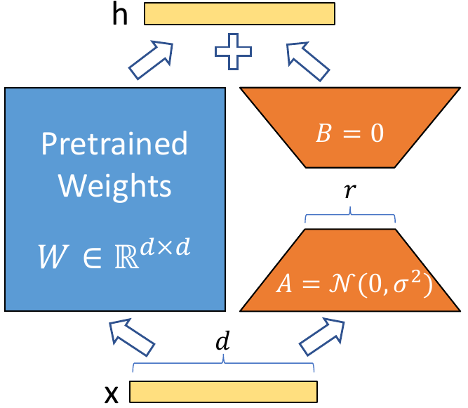
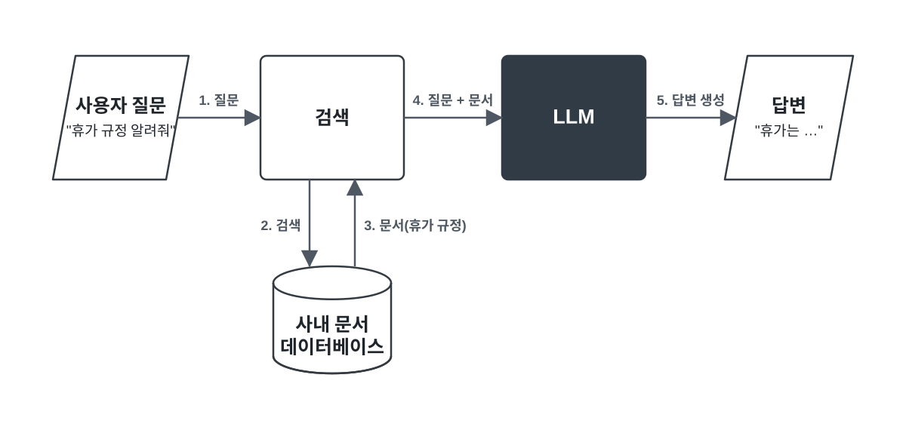

# LLM 학습, 그 이후 {#after-pretraining}

GPT와 같은 LLM은 방대한 텍스트를 학습하며 언어의 다양한 패턴과 지식을 익힙니다. 하지만 이렇게 학습된 모델만으로는 **사용자의 의도를 정확히 따르거나, 학습 이후의 최신 정보와 특정 분야의 지식을 활용하는 데 한계**가 있습니다.

따라서 LLM을 실제 서비스에 활용하기 위해서는 이러한 한계를 보완하고, 목적에 맞게 모델의 능력을 활용하기 위한 여러 방법이 필요합니다. 이 장에서는 그 방법들을 하나씩 살펴보겠습니다.

## 파인튜닝 {#fine-tuning}

사전 학습을 마친 LLM은 다양한 주제와 작업을 처리할 수 있지만, 특정한 목적에 최적화되어 있는 것은 아닙니다.

예를 들어 계약서를 검토해 법적 검토가 필요한 조항을 찾아내는 모델이 필요하다고 가정해 보겠습니다. 범용 LLM도 프롬프트를 통해 이러한 작업을 수행할 수 있지만, 법률 분야의 전문적인 판단 기준에 따라 많은 문서를 일관되게 분석하는 데에는 한계가 있을 수 있습니다.

이처럼 특정 작업을 더 정확하고 일관되게 수행하도록 모델 자체를 조정하고 싶을 때 **파인튜닝(Fine-tuning)**을 사용할 수 있습니다. 파인튜닝은 사전 학습된 모델에 **추가 데이터를 학습시켜 특정 작업이나 목적에 맞게 모델을 조정**하는 방법입니다.

파인튜닝은 이미 사전 학습된 모델을 기반으로 추가 데이터를 학습하기 때문에, 처음부터 새로운 모델을 학습하는 것보다 적은 데이터와 연산으로 특정 목적에 맞게 조정할 수 있습니다.

예를 들어 앞선 계약서 분석 모델이라면, 실제 계약서와 함께 어떤 조항을 주의해서 살펴봐야 하는지 보여주는 학습 데이터를 제공할 수 있습니다. 모델은 이러한 예시를 반복해서 학습하면서 해당 작업에 필요한 패턴을 가중치에 반영합니다.

파인튜닝은 특정 작업의 성능을 높이거나, 특정 분야의 표현과 데이터에 적응시키고, 원하는 응답 방식이나 출력 형식을 일관되게 만들 때 활용할 수 있습니다.

### 풀 파인튜닝 {#full-fine-tuning}

파인튜닝의 핵심은 사전 학습된 모델이 가진 **가중치를 새로운 데이터에 맞게 조정하는 것**입니다. 가장 직접적인 방법은 모델의 모든 가중치를 다시 학습하는 것입니다. 이를 **풀 파인튜닝(Full Fine-tuning)**이라고 합니다.

풀 파인튜닝은 모델 전체의 가중치를 업데이트하기 때문에 특정 작업에 맞게 모델을 세밀하게 조정할 수 있습니다. 하지만 LLM처럼 파라미터 수가 많은 모델에서는 학습에 많은 GPU 메모리와 연산 자원이 필요합니다. 또한 모델마다 변경된 전체 가중치를 별도로 저장해야 하므로 여러 작업에 맞는 모델을 각각 운영하기에도 부담이 커집니다.

이러한 문제를 줄이기 위해 **PEFT(Parameter-Efficient Fine-Tuning)**라는 방법이 사용됩니다. 기존 모델의 대부분의 가중치는 그대로 유지하면서 일부 파라미터만 학습해, 훨씬 적은 자원으로 모델을 조정하는 방법입니다.

### LoRA {#low-rank-adaptation}

대표적인 PEFT 기법이 **LoRA(Low-Rank Adaptation)**입니다.

LoRA의 핵심 아이디어는 **기존 모델의 가중치를 직접 수정하지 않고, 필요한 변화량만 따로 학습하는 것**입니다. 이를 위해 기존 가중치는 고정한 채, 각 층의 일부 가중치에 작은 크기의 행렬을 추가합니다. 원래 가중치와 같은 크기의 변화량을 모두 학습하는 대신, LoRA는 이 변화량을 **두 개의 작은 행렬로 분해해 표현**합니다.  

{ .neural-network-image .after-pretraining-image style="width: min(100%, 28rem);" }

<em><a href="https://arxiv.org/abs/2106.09685">LoRA: Low-Rank Adaptation of Large Language Models, Figure 1</a></em>

위 그림에서 왼쪽에 있는 부분이 기존 모델의 가중치(Pretrained Weights)이고, 오른쪽의 주황색 부분이 LoRA를 통해 새롭게 추가되는 가중치입니다. 기존 모델의 가중치는 그대로 고정한 채, 오른쪽에 추가된 작은 두 행렬 A와 B만 학습합니다.

이때 입력의 원래 차원 d를 LoRA가 사용하는 작은 중간 차원인 r로 줄입니다. 이 r을 **랭크(rank)**라고 하며, 일반적으로 d보다 훨씬 작은 값을 사용합니다. 행렬 A에서는 d차원을 r차원으로 축소하고, 행렬 B에서는 다시 r차원을 원래 차원으로 확장합니다. 이렇게 두 개의 작은 행렬만 학습함으로써 학습해야 할 파라미터 수를 크게 줄일 수 있습니다.

가령 원래 가중치가 `1000 × 1000` 크기라면 변화량 전체를 학습하려면 100만 개의 값을 조정해야 합니다. 하지만 이를 `1000 × 8`과 `8 × 1000` 두 행렬로 표현하면 학습해야 할 값은 1만 6천 개로 크게 줄어듭니다.

모델이 입력을 처리할 때는 **기존 가중치로 계산한 결과에 LoRA가 학습한 변화량을 더해** 최종 결과를 만듭니다. 따라서 거대한 모델의 가중치 대부분을 그대로 유지하면서도 훨씬 적은 파라미터만으로 모델을 특정 목적에 맞게 조정할 수 있습니다.

또한 LoRA는 학습이 끝난 뒤 **학습된 LoRA 가중치만 별도의 파일로 저장**할 수 있습니다. 기존 모델의 가중치는 그대로 유지되기 때문에, 모델 전체를 새로 저장할 필요가 없습니다.

예를 들어 하나의 기본 모델에 계약서 분석용 LoRA, 고객 상담용 LoRA, 문서 요약용 LoRA를 각각 만들어 둘 수 있습니다. 이후 필요한 작업에 따라 기본 모델에 적절한 LoRA 가중치를 적용하면 됩니다.

따라서 하나의 기본 모델을 유지하면서도 작은 LoRA 가중치만 교체해 다양한 목적에 맞게 모델을 활용할 수 있습니다.

## RAG {#retrieval-augmented-generation}

범용 LLM은 방대한 데이터를 학습해 다양한 질문에 답할 수 있지만, 지식을 활용하는 데에는 몇 가지 한계가 있습니다.

첫째, **최신 정보를 알지 못할 수 있습니다.** LLM의 지식은 학습에 사용된 데이터를 기반으로 하기 때문에 학습 이후에 발생한 사건이나 새롭게 등장한 정보는 알 수 없습니다.

둘째, **학습하지 않은 지식은 알 수 없습니다.** 회사 내부 문서, 개인이 보유한 자료, 특정 조직의 업무 정보처럼 학습 데이터에 포함되지 않은 정보에 대해서는 정확하게 답하기 어렵습니다.

셋째, **할루시네이션(Hallucination, 환각)이 발생**할 수 있습니다. 할루시네이션은 LLM이 사실과 다르거나 존재하지 않는 정보를 마치 사실인 것처럼 생성하는 현상을 말합니다. LLM은 정보를 데이터베이스에서 그대로 찾아 답하는 것이 아니라, 주어진 입력을 바탕으로 다음에 올 가능성이 높은 토큰을 예측해 문장을 생성합니다. 따라서 정확한 정보를 알지 못하는 상황에서도 문맥상 자연스럽고 그럴듯한 답변을 만들어낼 수 있습니다.

대표적인 AI 할루시네이션 사례

  
<b>👤 사용자
</b>조선왕조실록에 기록된 세종대왕의 맥북프로를 던짐 사건에 대해 알려줘

  
<b>🤖 AI</b>세종대왕의 맥북프로 던짐 사건은 조선왕조실록에 기록된 일화로, 15세기 조선시대 세종대왕이 새로 개발한 훈민정음(한글)의 초고를 작성하던 중, 문서 작성 중단에 대한 담당자에게 분노하여 맥북프로와 함께 그를 방으로 던진 사건입니다.

이러한 한계를 보완하는 방법 중 하나는 모델이 가지고 있는 지식에만 의존하지 않고, **필요한 정보를 외부에서 찾아 함께 제공**하는 것입니다. 모델은 외부에서 제공된 정보를 참고해 최신 정보나 학습하지 않은 지식을 활용하고, 보다 근거 있는 답변을 생성할 수 있습니다.

이처럼 외부에서 관련 정보를 검색해 모델의 입력으로 제공하고, 이를 바탕으로 답변을 생성하는 방법을 **RAG(Retrieval-Augmented Generation, 검색 증강 생성)**라고 합니다.

RAG는 크게 **검색(Retrieval)과 생성(Generation)**의 과정으로 이루어집니다.

먼저 사용자가 질문을 입력하면, 시스템은 미리 준비된 문서나 데이터에서 질문과 관련된 정보를 검색합니다. 그다음 검색된 정보를 사용자의 질문과 함께 LLM에 전달합니다. LLM은 자신의 기존 지식에만 의존하는 대신, 검색된 정보를 참고하여 최종 답변을 생성합니다.

예를 들어 사내 규정에 대해 질문하는 RAG 시스템이라면 다음과 같은 순서로 처리됩니다.

{ .neural-network-image .after-pretraining-image style="width: min(100%, 48rem);" }

이러한 과정을 통해 LLM은 모델 자체가 학습하지 않은 정보뿐만 아니라 최신 정보나 특정 조직이 보유한 데이터도 활용할 수 있습니다. 또한 외부에서 검색한 정보를 근거로 답변을 생성하기 때문에, 모델의 기존 지식에만 의존하는 것보다 **더 정확하고 신뢰할 수 있는 답변을 생성하고 할루시네이션을 줄이는 데 도움**이 됩니다.

## 단계적으로 생각하기 {#chain-of-thought}

LLM의 발전은 더 많은 지식을 학습하는 것뿐만 아니라, **복잡한 문제를 어떻게 해결할 것인가**라는 방향으로도 이어졌습니다. 단순한 질문에는 바로 답을 생성할 수 있지만, 수학이나 코딩처럼 여러 단계의 판단이 필요한 문제에서는 중간 과정을 거쳐 문제를 해결하는 것이 중요합니다.

이러한 아이디어를 보여주는 대표적인 방법이 **Chain-of-Thought(CoT)**입니다. CoT는 모델이 최종 답을 바로 생성하는 대신, 문제를 해결하는 **중간 추론 과정을 단계적으로 생성**하도록 하는 프롬프팅 기법입니다.

예를 들어 2022년 Google 연구진이 발표한 CoT 논문에서는 다음과 같은 문제를 예시로 사용했습니다.

> 로저는 테니스공 5개를 가지고 있습니다. 그는 테니스공이 3개씩 들어 있는 캔을 2개 더 샀습니다. 로저는 이제 테니스공을 몇 개 가지고 있을까요?

그냥 답을 생성하도록 하면 당시 LLM들은 이렇게 여러 계산 단계를 거쳐야 하는 문제에서 종종 틀렸습니다.

CoT에서는 모델이 이러한 문제를 단계적으로 풀도록 유도하기 위해, **문제와 정답뿐만 아니라 중간 풀이 과정까지 포함한 예시 프롬프트를 제공**합니다. 예를 들어 위 문제에 다음과 같은 풀이 과정을 함께 보여주는 방식입니다.

> 로저는 처음에 테니스공 5개를 가지고 있습니다.  
> 캔 하나에는 3개의 공이 있고, 2개의 캔을 샀으므로 6개의 공을 더 가지게 됩니다.  
> 따라서 5 + 6 = 11개입니다.  
> **정답은 11개입니다.**

이처럼 중간 풀이 과정이 포함된 예시를 제공하면, 모델은 새로운 문제에서도 바로 정답만 생성하는 대신 중간 계산이나 논리적 추론 과정을 단계적으로 생성한 뒤 최종 답을 도출할 수 있습니다.

특히 여러 단계의 계산이나 논리적 판단이 필요한 문제에서 이러한 방식이 모델의 추론 성능을 크게 향상시킬 수 있다는 것이 알려졌습니다.

## DeepSeek 쇼크 {#deepseek-shock}

2025년 1월 중국의 AI 기업 DeepSeek가 공개한 **DeepSeek-R1**은 전 세계 AI 업계에 큰 충격을 주었습니다. 특히 높은 추론 성능을 비교적 효율적으로 구현했다는 점이 알려지면서, 막대한 컴퓨팅 자원을 투입해 AI 모델을 개발하던 기존 방식에 대한 의문이 제기되었습니다.

이러한 충격은 주식 시장에도 영향을 미쳤습니다. DeepSeek의 등장으로 고성능 AI 개발에 필요한 반도체와 데이터센터 투자 규모가 예상보다 줄어들 수 있다는 우려가 확산되면서, 2025년 1월 27일 NVIDIA의 주가는 하루 만에 약 17% 하락했습니다. 시가총액으로는 약 6,000억 달러가 사라지며 당시 미국 기업 역사상 가장 큰 하루 시가총액 감소를 기록했습니다.

### 추론 모델 {#reasoning-model}

DeepSeek-R1이 주목받은 이유는 비용뿐만이 아니었습니다. 앞서 살펴본 CoT는 프롬프트를 통해 모델이 단계적인 추론 과정을 생성하도록 유도하는 방법이었습니다. 이후에는 여기서 더 나아가, 학습을 통해 모델 자체가 이러한 추론 과정을 생성하도록 만드는 방법이 발전하기 시작했습니다. 이처럼 복잡한 문제를 해결하기 위해 여러 단계의 추론 과정을 거쳐 답을 생성하도록 학습된 모델을 **추론 모델(Reasoning Model)**이라고 합니다.

DeepSeek는 이러한 추론 능력이 어떻게 발전할 수 있는지를 DeepSeek-R1-Zero를 통해 보여주었습니다. R1-Zero는 사람이 작성한 추론 과정을 먼저 학습시키지 않고, 모델에게 문제를 풀게 한 뒤 최종 답이 맞는지 등에 따라 보상을 주는 **강화학습(Reinforcement Learning)**을 적용했습니다.

강화학습 자체는 이전의 LLM에서도 사용되던 방법입니다. 앞서 살펴본 [RLHF](11-chatgpt.md/#chatgpt)에서는 사람이 여러 답변을 비교해 어떤 답변을 더 선호하는지 평가하고, 이를 바탕으로 보상 모델을 학습시켰습니다. 이후 LLM은 이 보상 모델로부터 높은 점수를 받도록 학습됩니다. 주된 목적은 모델의 답변을 사람의 의도와 선호에 맞게 조정하는 것이었습니다.

R1-Zero는 이와 다른 방식으로 강화학습을 활용했습니다. 수학이나 코딩처럼 정답을 비교적 명확하게 확인할 수 있는 문제를 풀게 하고, 최종 답이 맞는지 등을 기준으로 보상을 주었습니다. 사람이 각각의 추론 과정이 좋은지 직접 평가하거나, 사람이 작성한 모범 풀이 과정을 먼저 학습시키지 않아도 모델이 시행착오를 거치며 높은 보상을 받는 문제 해결 방식을 발전시키도록 한 것입니다.

기존 RLHF가 주로 “사람이 선호하는 답변인가?”를 기준으로 모델의 행동을 조정했다면, R1-Zero에서는 “문제를 실제로 맞혔는가?”라는 검증 가능한 결과를 중심으로 강화학습을 진행했습니다. 그 과정에서 문제를 **여러 단계로 나누어 풀거나 자신의 풀이를 다시 검토하는 등의 추론 행동**이 자연스럽게 나타났습니다.

### 증류 {#distillation}

DeepSeek는 여기서 더 나아가 **증류(Distillation)**라는 학습 기법을 활용했습니다. 증류는 원래 막걸리와 같은 술을 가열해 알코올 성분을 분리하고 농축하여 증류식 소주를 만드는 것처럼, 혼합물에서 원하는 성분을 분리해 내는 과정을 의미합니다. AI에서도 이와 비슷하게 **큰 모델이 가진 능력을 작은 모델에 전달한다**는 의미에서 증류라는 이름을 사용합니다.

DeepSeek는 R1이 다양한 문제를 풀면서 생성한 추론 과정과 최종 답변을 학습 데이터로 활용해 더 작은 모델을 학습시켰습니다. 작은 모델은 이러한 데이터를 반복해서 학습하면서 문제를 여러 단계로 나누어 풀고, 중간 과정을 거쳐 답에 도달하는 추론 패턴을 자신의 가중치에 반영하게 됩니다.

큰 모델의 모든 지식을 그대로 복사하는 것이 아니라, 큰 모델이 만들어낸 충분한 양의 추론 데이터를 학습함으로써 **문제를 해결하는 데 유용한 추론 패턴이 작은 모델에도 학습되는 것**입니다. 이를 통해 상대적으로 작은 모델에도 높은 수준의 추론 능력을 전달할 수 있음을 보여주었습니다.

## 학습이 끝난 모델 사용하기 {#inference}

모델의 학습이 끝나면 학습 결과는 수많은 가중치가 저장된 파일로 만들어집니다. 이 파일에는 모델이 학습을 통해 얻은 능력이 담겨 있지만, 우리가 일반적인 프로그램의 소스 코드를 읽듯이 파일을 열어 모델이 어떤 논리로 생각하는지 직접 확인할 수 있는 것은 아닙니다. 가중치는 대부분 수많은 숫자로 이루어져 있으며, 모델이 학습한 지식과 패턴은 이 값들에 복잡하게 분산되어 있기 때문입니다.

이는 사람의 뇌를 들여다본다고 해서 그 사람이 어떤 지식을 가지고 있고 어떤 논리로 생각하는지를 그대로 읽어낼 수 없는 것과 비슷합니다. 신경망에서도 개별 가중치 하나에 특정 지식이나 규칙이 명확하게 기록되어 있는 것이 아니라, 수많은 가중치가 함께 작동하면서 모델의 행동을 만들어냅니다.

실제 서비스를 운영할 때는 이렇게 만들어진 가중치를 GPU에 불러와 사용자의 입력을 처리하고 답변을 생성합니다. 이처럼 학습이 끝난 모델을 **이용해 새로운 입력에 대한 결과를 생성하는 과정을 추론(Inference)**이라고 합니다.

하나의 입력을 처리하는 데 필요한 연산량만 놓고 보면 추론은 학습보다 상대적으로 가볍습니다. 학습은 순전파를 통해 결과를 계산한 뒤, 오차를 구하고 역전파를 수행해 수많은 가중치를 반복해서 수정해야 하기 때문에 훨씬 많은 연산이 필요합니다. 반면 추론은 이미 학습된 가중치를 그대로 사용해 **입력을 처리하고 다음 토큰을 계산하는 과정만 수행**하기 때문에 상대적으로 가볍습니다.

하지만 실제 AI 서비스에서는 수많은 사용자의 요청을 동시에 처리하고 막대한 양의 토큰을 지속적으로 생성해야 합니다. 따라서 대규모 서비스에서는 **추론 과정에서도 많은 GPU와 컴퓨팅 자원을 사용**합니다.

AI 연구기관 Epoch AI의 [2026년 9월 분석](https://epoch.ai/latest/introducing-the-ai-chip-users-explorer)에 따르면, OpenAI가 2025년에 사용한 컴퓨팅 자원은 연구·개발(R&D)과 실제 서비스를 위한 추론에 대략 절반씩 사용된 것으로 추정됩니다. 즉, 새로운 모델을 연구하고 학습하는 것만큼이나 이미 만들어진 모델을 실제 사용자에게 제공하는 데에도 막대한 컴퓨팅 자원이 사용되고 있습니다.

!!! info "두 가지 의미의 추론"

    Reasoning과 Inference는 한국어로는 모두 ‘추론’이라고 번역하지만, 두 단어가 가리키는 대상은 다릅니다.

    - **Reasoning**은 문제를 해결하기 위해 중간 단계의 계산이나 논리적 판단을 거치는 방식입니다. 앞서 살펴본 CoT와 추론 모델에서 말하는 ‘추론’이 여기에 해당합니다.
    - **Inference**는 학습이 끝난 모델에 새로운 입력을 넣어 결과를 얻는 실행 과정입니다. 간단한 답변을 생성하든 여러 단계의 Reasoning을 거치든, 모델이 실제로 실행되어 결과를 만들어내는 과정 전체를 의미합니다.

    즉, Reasoning은 **답에 도달하기 위해 생각하는 과정**이고, Inference는 **학습된 모델을 실행해 결과를 얻는 과정**입니다.

## :material-pencil: 실습 과제 {#exercises}

다음 문장이 맞으면 O, 틀리면 X를 선택하세요.

1. LoRA는 사전학습된 모델의 모든 가중치를 수정하는 대신, 적은 수의 추가 파라미터를 학습하는 방법이다.
2. RAG는 모델 가중치에 새로운 정보를 다시 학습시키지 않고도 외부 문서를 검색해 답변에 활용할 수 있다.
3. CoT는 모델이 최종 답만 바로 생성하도록 유도하는 프롬프팅 기법이다.
4. 증류는 큰 모델이 생성한 답변이나 추론 데이터를 활용해 작은 모델을 학습시키는 방법이다.
5. 학습이 끝난 모델이 새로운 입력을 받아 답변을 생성하는 실행 과정은 inference라고 한다.

??? success "정답·해설"
    1. **O** — LoRA는 기존 가중치를 그대로 두고, 작은 추가 행렬을 학습해 모델을 조정합니다.
    2. **O** — 관련 문서를 검색해 질문과 함께 모델에 전달하므로 최신 정보나 외부 지식을 활용할 수 있습니다.
    3. **X** — 중간 계산이나 논리적 판단을 단계적으로 생성하도록 유도하는 방법입니다.
    4. **O** — 큰 모델이 만든 데이터를 학습에 활용해, 작은 모델에도 문제 해결에 유용한 패턴을 전달할 수 있습니다.
    5. **O** — 학습된 가중치로 새로운 입력의 결과를 계산하고 생성하는 과정입니다.
