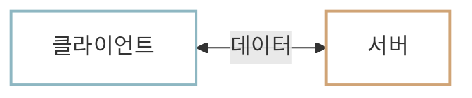
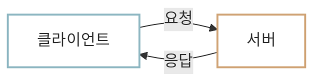

# 클라이언트-서버 모델

인터넷으로 연결된 두 컴퓨터는 데이터를 주고받습니다. 웹 서비스에서는 이때 두 컴퓨터가 맡은 역할에 따라 **클라이언트(Client)**와 **서버(Server)**로 나누어 구분합니다.

## 역할을 나누는 이유 {#why-separate-roles}

클라이언트와 서버가 역할을 나누는 가장 큰 이유는 **데이터를 중앙에서 관리**하기 위해서입니다. 만약 여러 대의 서로 다른 컴퓨터가 동일한 데이터의 복사본을 각각 보관하고 수정한다면, 어느 데이터가 최신인지 판단하기 어려워집니다. 예를 들어, 여러 컴퓨터에 서울의 현재 기온이 각각 20°C, 21°C, 22°C로 저장되어 있다면 어떤 값이 가장 최신 정보인지 판단하기 어렵습니다.

이때 서버라는 역할을 지정해 한곳에서 데이터를 관리하면, 나머지 컴퓨터는 서버에 필요한 데이터를 요청하고 항상 최신의 데이터를 받을 수 있습니다.

- `Server`는 **제공하다**라는 뜻의 `serve`에서 온 말로, 다른 컴퓨터에 데이터나 기능을 제공하는 컴퓨터라고 이해할 수 있습니다.
- 반면 `Client`는 서비스를 이용하는 **고객이나 의뢰인**을 뜻하는 말로, 서버에 데이터나 기능을 요청해 제공받는 컴퓨터라고 이해할 수 있습니다.

이처럼 서버는 많은 데이터를 저장하고 여러 요청을 동시에 처리해야 하므로 클라이언트보다 **더 큰 저장 공간과 처리 능력**이 필요합니다. 반면 클라이언트는 서버가 제공하는 데이터와 기능을 받아 사용하므로 보통은 상대적으로 적은 저장 공간과 처리 능력만으로도 동작할 수 있습니다.

!!! info "클라이언트와 서버는 프로그램"
    이해를 돕기 위해 클라이언트와 서버를 각각 컴퓨터로 표현했지만, 실제 웹 서비스에서 데이터 교환은 프로그램끼리 이루어집니다. 따라서 앞으로는 클라이언트와 서버를 컴퓨터 자체가 아니라, **서로 데이터를 주고받는 프로그램**으로 생각합시다.

## 클라이언트 {#client}

클라이언트는 서비스를 이용하는 프로그램입니다. 필요한 데이터나 기능이 있을 때 클라이언트는 서버에 이를 **요청(Request)**합니다.

웹 서비스에서 클라이언트는 보통 사용자의 기기에서 실행됩니다. 예를 들어 다음과 같은 프로그램이 대표적인 클라이언트입니다.

- 웹 브라우저: Chrome, Safari, Firefox
- 모바일 앱: 카카오톡 앱, 배달의민족 앱, 당근마켓 앱
- 데스크톱 프로그램: Slack, Notion

## 서버 {#server}

서버는 클라이언트가 보낸 요청을 처리하는 프로그램입니다. 요청에서 요구한 데이터를 찾거나 기능을 실행한 뒤, 처리 결과를 클라이언트에 돌려줍니다. 이렇게 서버가 클라이언트로 보내는 결과를 **Response(응답)**라고 합니다.

웹 서비스의 서버 프로그램은 보통 클라우드나 데이터 센터에 있는 컴퓨터에서 24시간 계속 실행됩니다. 예를 들어 다음과 같은 프로그램이 서버입니다.

- 웹 서버: 카카오톡 서버, 배달의민족 서버, 당근마켓 서버
- 데이터베이스 서버: MySQL, PostgreSQL
- AI 모델 서버: ChatGPT 등의 답변 생성을 처리하는 프로그램

## 클라이언트-서버 모델 {#client-server-model}

이처럼 클라이언트와 서버로 역할을 나누어 데이터를 요청하고 응답하는 구조를 **클라이언트-서버 모델**이라고 합니다. 오늘날 대부분의 웹 서비스는 이 구조를 바탕으로 동작합니다. 클라이언트-서버 모델에서는 항상 클라이언트가 먼저 서버로 요청을 보내고, 서버는 이에 응답합니다.

## :material-pencil: 실습 과제 {#exercises}

다음 문장이 맞으면 O, 틀리면 X를 선택해 보세요.

1. 휴대폰에 눈으로 보이는 카카오톡의 채팅 화면은 서버다.
2. 카카오톡에서 메시지를 전달하고 저장하는 작업은 데이터 센터에 있는 서버 안에서 처리된다.
3. 하나의 컴퓨터에서 클라이언트 프로그램과 서버 프로그램을 함께 실행할 수도 있다.

??? success "정답·해설"
    1. **X**. 채팅 화면처럼 서비스를 이용하는 프로그램은 클라이언트입니다.
    2. **O**. 메시지를 전달하고 저장하는 작업은 데이터 센터에 있는 카카오톡 서버가 처리합니다.
    3. **O**. 클라이언트와 서버는 컴퓨터 자체가 아니라 프로그램의 역할이므로, 하나의 컴퓨터가 두 프로그램을 함께 실행할 수 있습니다.
