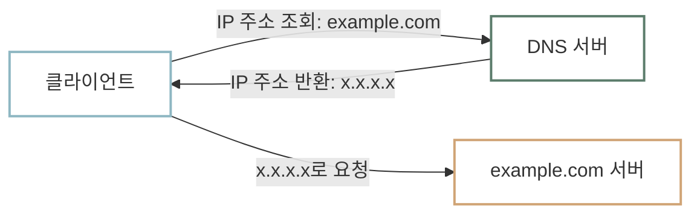

# DNS

컴퓨터끼리 통신할 때 [IP 주소](ip-port.md)를 사용한다고 이야기했습니다. 그런데 지금까지 웹 사이트에 접속할 때는 `example.com`과 같은 이름을 사용했습니다. 실제 인터넷을 사용할 때도 우리는 `naver.com`, `google.com`처럼 이름을 입력하지 `192.0.2.1` 같은 IP 주소를 외워서 입력하지는 않습니다.

## 도메인 이름 {#domain-name}

`example.com`처럼 사람이 읽고 기억하기 쉬운 인터넷 주소를 **도메인 이름(Domain Name)**이라고 합니다. IP 주소는 컴퓨터가 사용하기에는 편리하지만, 여러 숫자로 이루어져 있어 사람이 읽고 기억하기 어렵습니다. 그래서 웹 서버는 보통 사람이 기억하기 쉽게 도메인 이름을 갖습니다.

하지만 컴퓨터끼리 실제로 통신할 때는 여전히 IP 주소가 필요합니다. 따라서 도메인 이름을 IP 주소로 바꿔 주는 서비스가 필요합니다. 전화번호부에서 사람 이름으로 전화번호를 찾는 것처럼, 도메인 이름으로 IP 주소를 찾는 서비스가 바로 **DNS(Domain Name System)**입니다.



## DNS 조회 확인하기 {#inspect-dns-with-curl}

curl의 `-v` 옵션을 사용하면 도메인 이름을 IP 주소로 찾는 과정을 확인할 수 있습니다. 아래 명령어를 실행해 보세요.

=== "macOS"

    ```shell
    curl -v https://example.com
    ```

=== "Windows PowerShell"

    ```powershell
    curl.exe -v https://example.com
    ```

출력의 앞부분에서 아래와 비슷한 줄을 찾을 수 있습니다.

```text
* Host example.com:443 was resolved.
* IPv4: ...
```

`Host example.com:443 was resolved.`는 curl이 `example.com`의 IP 주소를 찾았다는 뜻입니다. 그 아래 `IPv4:` 줄에는 실제로 찾은 IP 주소가 표시됩니다. IP 주소는 네트워크 환경과 시점에 따라 다르게 표시될 수 있습니다.

## :material-pencil: 실습 과제 {#exercises}

다음 문장이 맞으면 O, 틀리면 X를 선택하세요.

1. 도메인 이름은 컴퓨터가 통신할 때 사용하는 IP 주소를 사람이 읽고 기억하기 쉽게 만든 이름이다.
2. DNS는 도메인 이름을 IP 주소로 바꿔 준다.
3. `curl -v https://example.com` 출력의 `was resolved`는 서버와 HTTP 통신을 마쳤다는 뜻이다.

??? success "정답·해설"
    1. **O** — 도메인 이름은 IP 주소를 대신해 사람이 편리하게 사용할 수 있는 이름입니다.
    2. **O** — DNS는 도메인 이름을 IP 주소로 찾아 주는 서비스입니다.
    3. **X** — `was resolved`는 HTTP 통신 전에 도메인 이름에 해당하는 IP 주소를 찾았다는 뜻입니다.
