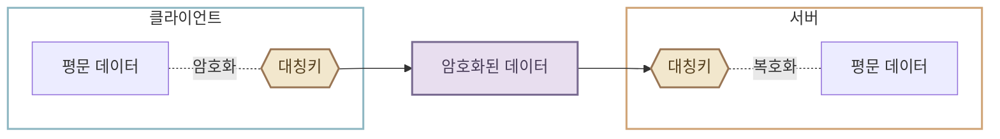
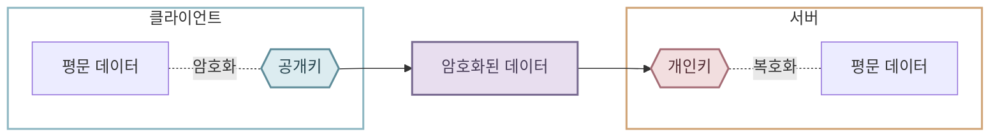

# HTTPS

지금까지 클라이언트와 서버가 HTTP로 통신하는 방법을 배웠습니다. 하지만 실제 웹 서비스에서는 대부분 HTTP 대신 HTTPS를 사용합니다. 아직 HTTP를 사용하는 오래된 웹 사이트에 접속하려고 하면, 브라우저가 주소창에 `안전하지 않음`과 같은 경고를 표시하는 모습을 볼 수 있습니다. HTTPS가 무엇이고, 왜 HTTP보다 안전한지 알아보겠습니다.

## HTTP 보안 취약점 {#http-problems}

HTTP는 전송 중인 데이터를 암호화하지 않습니다. 즉, 클라이언트가 보낸 데이터가 별도로 보호되지 않은 채 그대로 서버까지 전달됩니다. 따라서 HTTP 통신은 같은 네트워크 경로에서 데이터를 가로채 요청과 응답 내용을 몰래 읽는 **패킷 가로채기(packet sniffing) 공격**에 취약합니다. 더 나아가 내용을 바꾸거나 가짜 서버인 것처럼 속이는 **중간자 공격(Man-in-the-Middle attack, MITM)**에도 노출될 수 있습니다.

HTTP로 로그인 정보나 결제 정보처럼 민감한 데이터를 전송하면, 아이디·비밀번호 같은 값도 보호되지 않은 상태로 전달됩니다. HTTP는 원래 웹 문서를 주고받기 위해 만들어진 초기 웹 프로토콜입니다. 당시에는 오늘날처럼 금융, 쇼핑, 개인정보를 다루는 웹 서비스가 보편적이지 않았기 때문에, 전송 구간을 암호화하는 기능은 HTTP 자체에 포함되지 않았습니다.

## HTTPS란? {#what-is-https}

HTTPS(HyperText Transfer Protocol Secure)는 HTTP에 **TLS(Transport Layer Security)**라는 보안 프로토콜을 더한 방식입니다. HTTPS는 HTTP 메시지를 주고받는 기본 구조는 유지하면서, 통신 과정에 다음과 같은 보안 기능을 제공합니다.

1. **암호화**

    클라이언트와 서버 사이에 오가는 데이터를 알아보기 어려운 형태로 바꿉니다. 중간에서 데이터를 가로채더라도 내용을 읽기 어렵습니다.

2. **서버 확인**

    클라이언트는 인증서를 통해 접속한 서버가 해당 도메인의 서버인지 확인합니다. 이를 통해 가짜 서버로 연결될 위험을 줄입니다.

3. **변조 방지**

    전송 중 누군가 메시지 내용을 바꾸면 이를 감지할 수 있습니다.

## 대칭키와 비대칭키 {#encryption-methods}

암호화 방식은 데이터를 암호화하고 복호화할 때 사용하는 키의 관계에 따라 크게 **대칭키 암호화**와 **비대칭키 암호화**로 나눌 수 있습니다.

**대칭키 암호화**는 하나의 같은 키로 데이터를 암호화하고 복호화하는 방식입니다. 처리 속도가 빨라 실제 HTTP 요청과 응답 데이터를 암호화할 때 사용합니다. 다만 클라이언트와 서버가 이 키를 안전하게 공유해야 한다는 문제가 있습니다.



**비대칭키 암호화**는 공개키와 개인키라는 수학적으로 한 쌍을 이루는 두 키를 사용하는 방식입니다. 공개키는 누구에게나 공개할 수 있고, 개인키는 키의 소유자만 비밀스럽게 보관합니다. 예를 들어 클라이언트가 서버의 공개키로 데이터를 암호화해 보내면, 해당 데이터는 서버가 가진 개인키로만 복호화할 수 있습니다. 공개키가 외부에 알려져 있어도 개인키를 알아내기는 현실적인 시간 안에는 거의 불가능합니다.



!!! info "개인키가 안전한 이유"
    공개키는 개인키를 바탕으로 비교적 쉽게 만들 수 있지만, 공개키만으로 개인키를 역으로 계산하려면 매우 어려운 수학 문제를 풀어야 합니다. 필요한 계산량이 너무 크기 때문에, 현재의 컴퓨팅 성능으로는 현실적인 시간 안에 개인키를 알아내기 거의 불가능합니다.

## HTTPS 동작 원리 {#how-https-works}

HTTPS는 이 두 가지 암호화 방식을 함께 사용하는 하이브리드 방식으로 동작합니다. HTTPS 연결은 실제 HTTP 메시지를 주고받기 전에 아래 과정을 거쳐 안전한 통신을 준비합니다.

1. **브라우저가 HTTPS 연결을 요청합니다.**

    사용자가 `https://` 주소에 접속하면, 브라우저는 서버에 안전한 연결을 준비하자고 요청합니다. 이 단계에서는 아직 실제 HTTP 요청을 보내지 않습니다.

    ```mermaid
    flowchart LR
        client[웹 브라우저] -->|HTTPS 연결 요청| server[서버]

        classDef client fill:transparent,stroke:#8eb7c2,stroke-width:2px
        classDef server fill:transparent,stroke:#d0a476,stroke-width:2px
        class client client
        class server server
    ```

2. **서버가 인증서와 공개키를 보냅니다.**

    서버는 자신의 도메인 정보와 공개키가 담긴 인증서를 브라우저에 보냅니다.

    ```mermaid
    %%{init: {"flowchart": {"rankSpacing": 20}} }%%
    flowchart RL
        server[서버] ----> publicKey{{공개키}}
        publicKey ~~~ certificate@{ shape: doc, label: "인증서" }
        certificate ----> client[웹 브라우저]

        classDef client fill:transparent,stroke:#8eb7c2,stroke-width:2px
        classDef server fill:transparent,stroke:#d0a476,stroke-width:2px
        classDef certificate fill:#edf0f1,stroke:#77818a,stroke-width:2px,color:#39434a
        classDef publicKey fill:#dcecf0,stroke:#5f8d9a,stroke-width:2px,color:#294650
        class client client
        class server server
        class certificate certificate
        class publicKey publicKey
    ```

3. **브라우저가 인증서를 검증합니다.**

    브라우저는 신뢰할 수 있는 CA(Certificate Authority)가 인증서를 발급했는지, 인증서의 도메인이 접속하려는 주소와 일치하는지 등을 확인합니다.


    ```mermaid
    %%{init: {"flowchart": {"rankSpacing": 20}} }%%
    flowchart LR
        browser[웹 브라우저] ~~~ certificate@{ shape: doc, label: "인증서" }
        certificate ---->|발급자 확인| caList[(신뢰할 수 있는 CA 목록)]

        classDef browser fill:transparent,stroke:#8eb7c2,stroke-width:2px
        classDef certificate fill:#edf0f1,stroke:#77818a,stroke-width:2px,color:#39434a
        classDef caList fill:#e7ece5,stroke:#74856f,stroke-width:2px,color:#3d4a3a
        class browser browser
        class certificate certificate
        class caList caList
    ```

    !!! info "신뢰할 수 있는 CA 목록"
        신뢰할 수 있는 CA 목록은 웹 브라우저나 운영체제에 루트 인증서 형태로 미리 저장되어 있습니다. 인증서를 발급한 CA를 이 목록에서 확인할 수 없으면, 브라우저는 서버의 신원을 검증할 수 없다고 판단해 `연결이 비공개로 설정되어 있지 않습니다`와 같은 경고를 표시합니다.

4. **클라이언트와 서버가 대칭키를 안전하게 준비합니다.**

    인증서 검증이 끝나면, 클라이언트와 서버는 비대칭키 방식을 이용해 키 생성에 필요한 정보를 안전하게 교환합니다. 그리고 이 정보를 바탕으로 둘만 사용할 동일한 대칭키를 각각 생성합니다. 이 과정을 포함한 1~4단계를 TLS 핸드셰이크(Handshake)라고 합니다.

    ```mermaid
    %%{init: {"flowchart": {"nodeSpacing": 10, "rankSpacing": 20}}}%%
    flowchart TB
        subgraph serverGroup["서버"]
            direction TB
            privateKey{{개인키}}
            serverKey{{대칭키}}
            serverData[공유 비밀]

            privateKey ~~~ serverData
            serverData -->|생성| serverKey
        end

        subgraph EXCHANGE[" "]
            direction LR
            X(( )) <-->|키 생성 정보 교환| Y(( ))
        end

        subgraph clientGroup["웹 브라우저"]
            direction TB
            
            clientKey{{대칭키}}
            clientData[공유 비밀]
            publicKey{{공개키}}
            
            publicKey ~~~ clientData
            clientData -->|생성| clientKey
        end

        style X fill:none,stroke:none
        style Y fill:none,stroke:none
        style EXCHANGE fill:none,stroke:none

        classDef publicKey fill:#dcecf0,stroke:#5f8d9a,stroke-width:2px,color:#294650
        classDef privateKey fill:#f2dedf,stroke:#a66d76,stroke-width:2px,color:#542f36
        classDef key fill:#f2e7cd,stroke:#9a7655,stroke-width:2px,color:#55401e
        classDef encrypted fill:#e8deef,stroke:#796b91,stroke-width:2px,color:#463b56
        class publicKey publicKey
        class privateKey privateKey
        class clientKey,serverKey key
        class encryptedData encrypted
        style clientGroup fill:transparent,stroke:#8eb7c2,stroke-width:2px
        style serverGroup fill:transparent,stroke:#d0a476,stroke-width:2px
    ```

5. **대칭키로 HTTP 메시지를 주고받습니다.**

    준비가 끝난 뒤부터는 실제 HTTP 요청과 응답을 처리 속도가 빠른 대칭키로 암호화해 주고받습니다.

    ```mermaid
    %%{init: {"flowchart": {"rankSpacing": 20}} }%%
    flowchart LR
        subgraph clientGroup["웹 브라우저"]
            direction TB
            clientKey{{대칭키}}
            clientData[평문 데이터]

            clientData -.-|암호화| clientKey
        end

        subgraph serverGroup["서버"]
            direction TB
            serverKey{{대칭키}}
            serverData[평문 데이터]

            serverKey -.-|복호화| serverData
        end

        clientKey --> encryptedData[암호화된 데이터]
        encryptedData --> serverKey

        classDef key fill:#f2e7cd,stroke:#9a7655,stroke-width:2px,color:#55401e
        classDef encrypted fill:#e8deef,stroke:#796b91,stroke-width:2px,color:#463b56
        class clientKey,serverKey key
        class encryptedData encrypted
        style clientGroup fill:transparent,stroke:#8eb7c2,stroke-width:2px
        style serverGroup fill:transparent,stroke:#d0a476,stroke-width:2px
    ```

## :material-pencil: 실습 과제 {#exercises}

다음 문장이 맞으면 O, 틀리면 X를 선택하세요.

1. HTTPS는 HTTP와 완전히 다른 요청·응답 형식을 사용한다.
2. HTTPS는 통신 중 데이터를 암호화해, 중간에서 내용을 읽기 어렵게 만든다.
3. HTTPS를 사용하면 URL, HTTP Method, Header, Body 같은 HTTP 개념은 사용할 수 없다.

??? success "정답·해설"
    1. **X** — HTTPS는 HTTP 요청·응답 구조 위에 TLS 보안 기능을 더한 방식입니다.
    2. **O** — HTTPS는 클라이언트와 서버 사이에 오가는 데이터를 암호화합니다.
    3. **X** — HTTPS에서도 URL, HTTP Method, Header, Body 등 HTTP의 기본 개념을 그대로 사용합니다.
