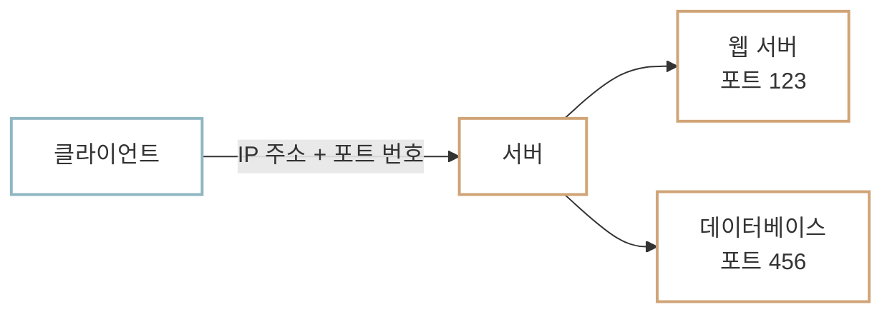

# IP와 Port

컴퓨터끼리 통신하려면 주소 체계가 필요합니다. [HTTP 메시지](http-message.md)는 편지를 보내는 과정과 비슷하다고 했습니다. 편지를 보낼 때 받는 사람의 주소를 정확히 적어야 올바른 곳에 도착하듯, 인터넷에서 메시지를 보낼 때도 목적지를 정확히 알아야 합니다.

## IP 주소 {#ip-address}

인터넷에서 컴퓨터를 찾기 위해 사용하는 주소가 **IP(Internet Protocol) 주소**입니다. IP 주소는 인터넷에 연결된 컴퓨터를 구분하는 주소이며, 메시지를 보낼 때 어느 컴퓨터로 보내야 하는지 알려 줍니다.

IP 주소는 보통 `192.168.0.1`처럼 점(`.`)으로 구분된 네 덩어리의 숫자로 표현합니다. 각 숫자는 0부터 255 사이의 값을 가질 수 있습니다. 이 형식을 **IPv4(IP version 4)**라고 하며 인터넷에서 오랫동안 가장 널리 사용되어 온 IP 주소 형식입니다.

각 자리마다 256개의 값을 사용할 수 있으므로 IPv4는 `256 × 256 × 256 × 256`, 즉 총 4,294,967,296개(약 43억 개)의 주소를 표현할 수 있습니다.

## 포트 번호 {#port-number}

그런데 실제 통신은 컴퓨터끼리만 이루어지는 것이 아니라 컴퓨터 안에서 실행 중인 프로그램끼리 이루어집니다. 따라서 IP 주소로 컴퓨터를 찾은 뒤에는 그 안의 어느 프로그램과 통신할지도 알아야 합니다. 이때 사용하는 번호가 **포트 번호(Port Number)**입니다.

아파트를 떠올려 보세요. 아파트의 주소를 안다고 해서 바로 특정 사람을 만날 수는 없습니다. 한 건물 안에 여러 세대가 살기 때문에 동과 호수까지 알아야 합니다. 컴퓨터도 마찬가지입니다. 하나의 컴퓨터 안에는 웹 서버, 데이터베이스, 메일 서버처럼 여러 프로그램이 동시에 실행될 수 있으므로 포트 번호로 정확한 프로그램을 찾아야 합니다.



즉, IP 주소는 **어느 컴퓨터인지**, 포트 번호는 **그 컴퓨터 안의 어느 프로그램인지** 알려 줍니다.

!!! info "포트 번호의 표기와 범위"
    포트 번호는 IP 주소 뒤에 콜론(`:`)을 붙여 씁니다. 예를 들어 `127.0.0.1:8000`에서 `127.0.0.1`은 IP 주소이고, `8000`은 포트 번호입니다. 포트 번호는 0부터 65535까지의 범위를 가집니다.

## 자주 사용하는 포트 번호 {#common-port-numbers}

프로토콜마다 자주 사용하는 포트 번호가 정해져 있습니다. HTTP를 사용하는 웹 서버 프로그램은 주로 80번 포트를 사용하고, HTTPS를 사용하는 웹 서버 프로그램은 주로 443번 포트를 사용합니다.

| 프로토콜 | 기본 포트 번호 | 주로 연결하는 프로그램 |
| --- | ---: | --- |
| HTTP | 80 | 웹 서버 |
| HTTPS | 443 | 보안 연결을 사용하는 웹 서버 |

## 기본 포트 사용 {#default-port-usage}

웹 브라우저에서 `https://example.com:443`을 입력해 보세요. 페이지가 열린 뒤 주소창을 보면 `:443` 부분이 사라져 있습니다. HTTPS의 기본 포트가 443이므로 브라우저가 굳이 표시하지 않는 것입니다. 마찬가지로 포트 번호 없이 `https://example.com`까지만 입력해도 실제로는 443번 포트를 이용해 통신합니다.


이번에는 curl로도 기본 포트가 어떻게 사용되는지 확인해 보겠습니다. 아래 명령어를 실행해 보세요.

=== "macOS"

    ```shell
    curl -v https://example.com
    ```

=== "Windows PowerShell"

    ```powershell
    curl.exe -v https://example.com
    ```

출력의 앞부분에서 아래와 비슷한 줄을 찾을 수 있습니다.

```text
* Connected to example.com (...) port 443
```

요청시 주소 앞에 `https://`라는 프로토콜을 지정했기 때문에, 포트 번호를 따로 적지 않아도 curl은 HTTPS의 기본 포트인 443번으로 요청을 보냅니다. 그래서 출력에 `port 443`이 표시됩니다.

## :material-pencil: 실습 과제 {#exercises}

다음 문장이 맞으면 O, 틀리면 X를 선택하세요.

1. IP 주소만 알면 한 컴퓨터 안에서 실행 중인 특정 프로그램까지 찾을 수 있다.
2. HTTPS의 기본 포트 번호는 443이다.
3. `https://example.com`처럼 주소에 포트 번호가 보이지 않아도 브라우저는 포트 번호를 사용해 통신한다.

??? success "정답·해설"
    1. **X** — IP 주소는 컴퓨터를 찾는 주소입니다. 그 컴퓨터 안의 특정 프로그램을 찾으려면 포트 번호도 필요합니다.
    2. **O** — HTTPS를 사용하는 웹 서버는 기본적으로 443번 포트를 사용합니다.
    3. **O** — HTTPS의 기본 포트인 443은 생략할 수 있지만, 실제 통신에는 사용됩니다.
